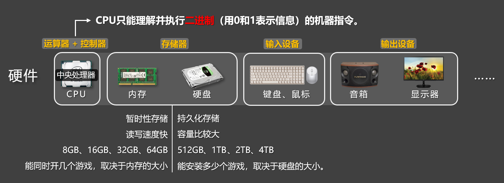
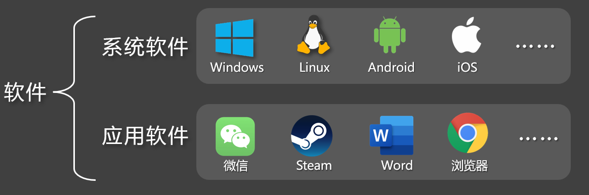
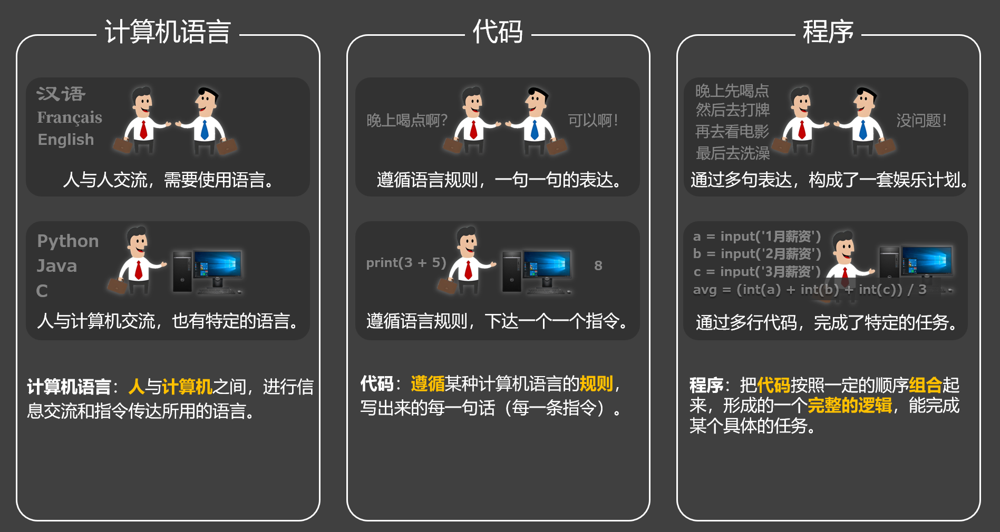
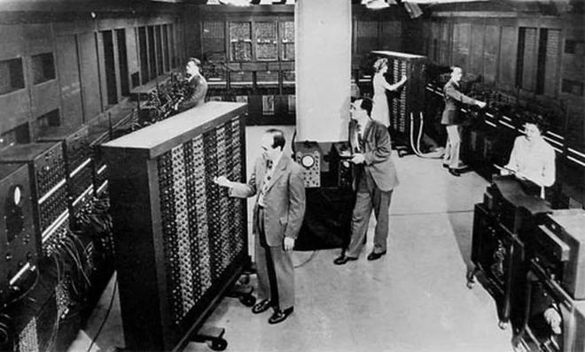
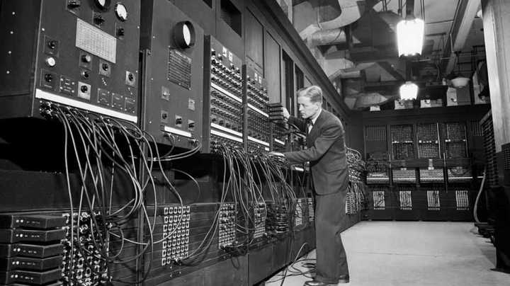
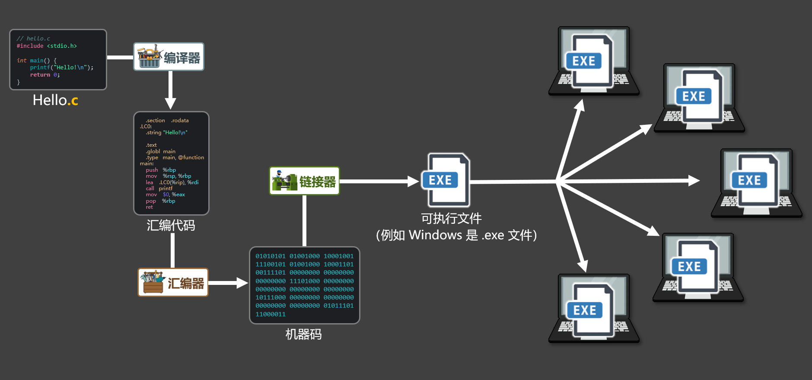
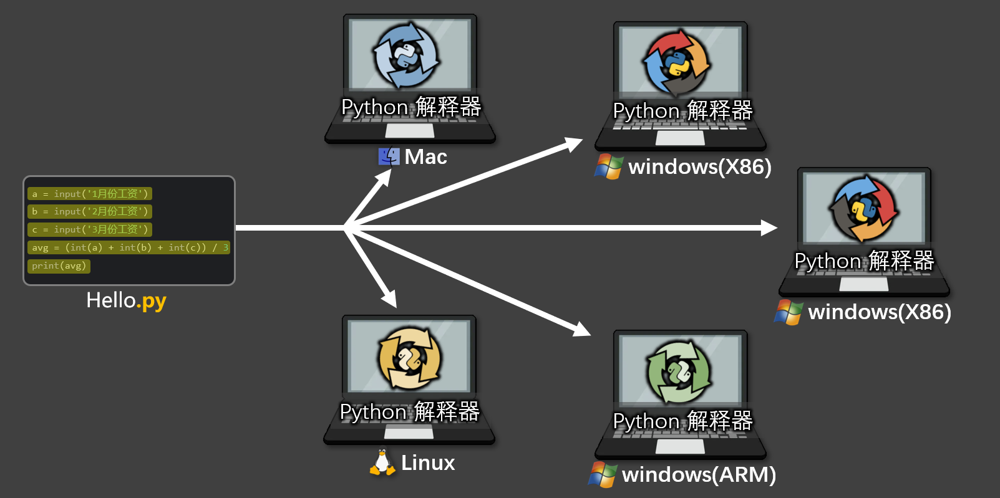

# 第 1 章 必备基础知识
## 计算机组成
### 硬件
 计算机硬件主要由五个部分组成，分别是：运算器、控制器、存储器、输入设备、输出设备。

::: tip
**📋备注**:『运算器』和『控制器』一起组成了**中央处理器（CPU）**。

:::




::: warning
📢**注意**：计算机的 CPU 只能理解并执行**二进制（用 0和1表示信息）**的**机器指令**。

:::

::: info
**内存**VS**硬盘**：

+ 硬盘：持久化存储，读写速度不如内存快，但容量通常比较大（500GB、1TB、2TB 等）。
+ 内存：暂时性存储，读写速度快，但容量通常不如硬盘大（8GB、16GB、32GB、64GB 等）。

**通俗理解**：能安装多少个游戏，取决于硬盘的大小；能同时开几个游戏，取决于内存的大小。

:::

| 运算器 | 运算器（简称：ALU），专门负责执行各种『算术运算』和『逻辑运算』，它需要与控制单元、寄存器等紧密配合。 |
| :---: | --- |
| 控制器 | 计算机的控制中心，它指挥计算机各部分协调地工作，保证计算机按照预先规定的任务，有条不紊地进行操作及处理。 |
| 存储器 | 计算机中的“资料库”，它既保存程序指令，又保存数据，各个硬件在需要访问或更新数据时，都会与它打交道，有了存储器，计算机才有“记忆”。 |
| 输入设备 | 向计算机输入数据和信息的设备，是计算机与外界通信的桥梁。 |
| 输出设备 | 用于输出计算机执行任务的结果，把各种结果数据或信息以：数字、字符、图像、声音等形式表示出来。 |


### 软件
计算机软件主要分为：系统软件、应用软件。




| 系统软件 | 直接管理和控制计算机硬件的软件，为应用软件提供运行平台，它负责协调硬件资源（如内存、处理器）并提供通用服务，例如：文件管理、设备控制、任务调度。 |
| :---: | --- |
| 应用软件 | 用于执行特定任务的软件，满足用户的具体需求，如：文档编辑、数据分析、娱乐等，它依赖系统软件提供的资源和服务。 |


## 计算机语言、代码、程序



### **计算机语言**
计算机语言是人类与计算机进行『**交互**』和『**指令传达**』所使用的一种形式化语言。比如：人与人之间，需要使用各种语言进行交流，那人与计算机之间，同样也需要语言进行沟通。

### **代码**
代码是在计算机语言规则的约束下，编写出来的一组指令，具体描述了要让计算机去执行的操作。简言之就是：计算机语言是规则，代码是基于这些规则，所编写出来的一行一行的指令。

### **程序**
代码按照特定的顺序和逻辑组合后，就是程序；程序通常用于完成某种特定的任务或功能。如果说程序是一道菜，那代码就是做这道菜的某个步骤。

## 计算机语言简史
### 第一代语言：机器语言
计算机问世的初期，人们只能通过『**机器语言**』（又称机器码）来操作计算机，所谓机器语言，就是`0`和 `1`组成的二进制内容。而且在当时，录入和修改信息通常都需要：拨动开关、或插拔连线、或使用打孔纸带来输入指令。





机器语言虽然能充分利用硬件性能，但所有操作都必须通过二进制来完成，所以编程的过程极为繁琐，且容易出错，对程序员的理解能力和耐心，都要求极高。

> 例如：在`x86`的 CPU 架构下，使用机器码编写`1 + 1`的运算代码如下：
>

```python
10110000 00000001 00000100 00000001
```

### 第二代语言：汇编语言
用机器语言编程，程序员很难理解每一条指令的含义，为了解决这个问题，『**汇编语言**』应运而生，它将机器语言中的二进制指令，转化为更容易记忆的助记符（如`MOV`、`ADD`、`LOAD`等），从而让程序员能以近似“英文简写”的方式进行编程，简单说就是：『**汇编语言**』是对『**机器语言**』的“人性化翻译”，汇编语言**显著降低了编程的门槛**，也为后续高级语言的诞生，打下了基础。

> 例如：在`x86`的 CPU 架构下，使用『**汇编语言**』编写`1 + 1`的运算代码如下：
>

```python
mov al, 1
add al, 1
```

::: warning
📢**注意**：『**汇编语言**』需要翻译成『**机器码**』，才能交给 CPU 执行，因为 CPU 只认二进制指令。

:::

### 第三代语言：高级语言
相对『**机器语言**』和『**汇编语言**』而言，『**高级语言**』更接近人类的自然语言，它允许程序员使用英语来编写程序，并向程序员屏蔽了大部分的底层细节，语言中的符号和算式，也和日常的数学算式差不多，它更容易被掌握，常见的『**高级语言**』有：C、C++、Java、PHP、Go、Rust、JavaScript、Python 等。

> 例如：下面的 Python 代码，可以输出`"Hello, world!"`
>

```python
print("Hello, world!")
```

> 例如：下面的 Java 代码，可以输出`"Hello, world!"`
>

```python
public class Main {
    public static void main(String[] args)
System.out.println(1 + 1);
}
}
```

::: warning
📢**注意**：计算机不能直接执行『**高级语言**』，同样需要将其转换为『**机器语言**』才能被计算机执行。

:::

## 『**编译型语言**』与『**解释型语言**』
对于高级语言来说，我们会根据其转换成二进制指令过程的不同，可将其分为：『**编译型**』和『**解释型**』

### **编译型语言**
将程序翻译成计算机能理解的二进制内容，并且通常会**生成一个可执行文件**，例如在 windows 系统上生成的可执行文件是`.exe`文件，常见的『**编译型**』语言有：C、C++、Go、Rust 等。




编译型语言的特点：

::: info
+ 优势：同一运行平台，代码只需编译一次，且执行效率高。
+ 劣势：跨平台性差，大型项目编译时间较长，开发效率略低。

:::

### 解释型语言
将程序一句一句的翻译为：计算机可以执行的指令，整个过程通常**不生成可执行文件**，常见的解释型语言有：Python、Php、JavaScript 等。




解释型语言的特点：

::: info
+ 优势：跨平台性好，无需编译，开发调试灵活高效。
+ 劣势：每次运行都需要解释，执行效率较低。

:::

### 二者对比
| |**编译型语言**|**解释型语言** |
| --- | --- | --- |
| **举例** | C、C++、Go、Rust 等 | Python、JavaScript、Ruby 等 |
| **执行流程** | 运行前把所有程序一次性翻译成机器码，并生成可执行文件。 | 运行时靠对应的解释器，把代码一句一句翻译成机器码执行。 |
| **是否生成可执行文件** | 是，一次编译多处运行。 | 否，每次都要靠解释器翻译后再运行。 |
| **运行速度** | 快 | 慢 |
| **是否跨平台** | 否，需要针对平台编译。 | 是，只要该平台下有解释器，就能运行。 |
| **适合场景** | 系统底层、性能要求较高的场景。 | 脚本、数据分析、AI 应用、Web开发等。 |
