# 第 2 章 初识 Python
## Python 概述
### Python 的起源

::: tip
Python 的作者 Guido van Rossum 来自荷兰（国内爱称：龟叔），拥有数学与计算机背景，他发现用： C、Fortran 等语言写程序太费劲，而 Shell 虽然轻松，但功能却很有限。

1989 年圣诞节，龟叔开始动手编写一种既能像 C 那样全面操控系统，又能像 Shell 一样好上手的解释器，并以他喜爱的喜剧《Monty Python’s Flying Circus》为灵感，命名为“Python”。

:::

::: info
Python 的设计哲学是“优雅、明确、简单”，Python 提倡：最好只有一种方法来做一件事，它的第一个公开版本于 1991 年问世，如今已成为全球最受欢迎的编程语言之一。

:::

### Python 的特点
**Python 的优点**：

**Python 的缺点**：

### 为何 AI 领域广泛使用 Python ？
主要原因是 Python 具备如下的特点：

::: info
1. 简洁直观的开发体验。
2. 丰富强大的框架生态。
3. 与底层语言高效协作。
4. 社区活跃且人才充足。
5. 业内大厂 + 主流推动。

:::

### Python 的版本
+ 1991年：`Python 0.9.0`发布。
+ 1994年：`Python 1.0`正式发布（进入正式版阶段）。
+ 2000年：`Python 2.0`发布。
+ 2008年：`Python 3.0`**发布，与**`Python 2`**不兼容**。
+ 2010年：`Python 2.7`发布，作为`Python 2.x`的最后主版本，被广泛使用多年。

......

+ 2020年：`Python 2`官方停止维护，同时`Python 3.9`发布。
+ 2021年：`Python 3.10`发布。
+ 2022年：`Python 3.11`发布，平均性能提升`10%-60%`。
+ 2023年：`Python 3.12`发布，进一步优化性能和类型提示。
+ 2024年：`Python 3.13`发布。
+ 2025年：持续迭代。

## 搭建 Python 开发环境
📢本小节涉及很多设置和操作，建议各位参考视频，来完成配置。

### 安装 Python 解释器
::: details 1️⃣进入官网，点击 Downloads，选择对应的操作系统。

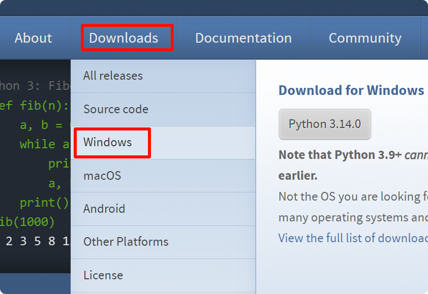
:::
::: details 2️⃣选择版本，点击链接下载，我们这里的版本是 3.13.4。

:::
::: details 3️⃣双击下载好的文件，开始安装（强烈建议以管理员身份运行）。

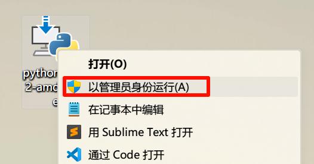

:::
::: details 4️⃣保持默认，点击 Next。

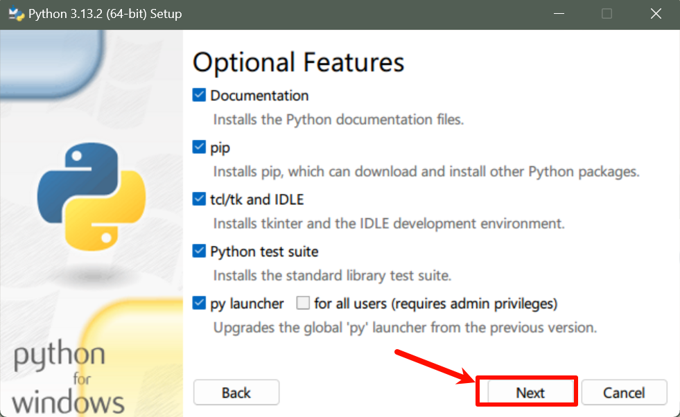
:::
::: details 5️⃣修改安装路径，其他保持默认，点击 Install 开始安装。

:::
::: details 6️⃣禁用系统路径长度限制

建议点击 Disable path length limit，这样可以禁用系统的路径长度限制，以避免因路径过长而导致的错误，随后点击 Close，完成安装。

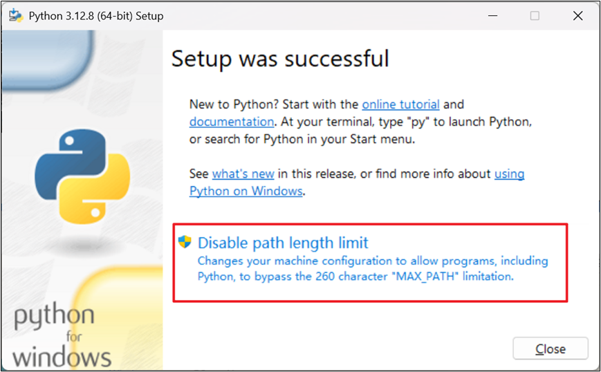
:::
::: details 7️⃣检查是否安装成功，同时按下 Win 键和 R ，输入 cmd ，点击确定，进入命令提示符。

:::
::: details 8️⃣输入python --version，若能打印出 Python 版本，则表示安装成功。

:::
### 一个简单的打印效果
**①** 在终端中输入`python`并回车

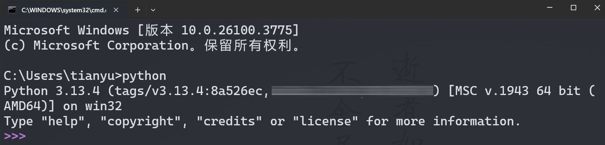

**②** 随后输入：`print(100)`，随后回车，终端中呈现`100`

::: tip
**📋备注**：作为初学者，各位暂时不用纠结上述代码的含义，先跟着操作就可以，后面会仔细讲解。

:::

### **安装 PyCharm**
> 集成开发环境（简称：IDE；英文名：Integrated Development Environment ）是用于提供程序开发环境的应用程序，一般包括代码编辑器、编译器、调试器和图形用户界面等工具。集成了代码编写功能、分析功能、编译功能、调试功能等多种功能，本课程中 Python 的 IDE 我们使用主流的工具： PyCharm。
>

::: info
PyCharm 官方地址：[https://www.jetbrains.com/pycharm/download](https://www.jetbrains.com/pycharm/download)

:::

**具体安装步骤如下**：

1️⃣进入官网，点击左下角 Download 下载 PyCharm 安装包（此处下载的是完整版安装包）。

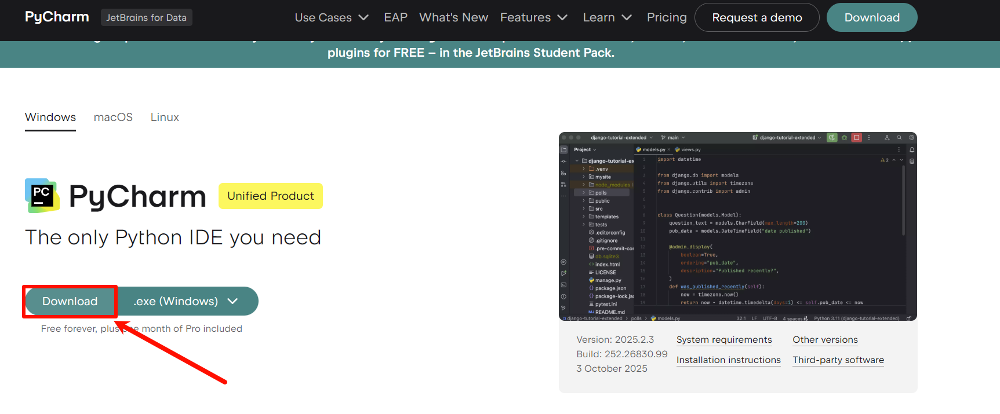

::: tip
**📋备注**：Pycharm 已经没有专业版了，现在的叫：完整版（也叫：统一版），完整版中包含：付费功能+ 免费功能，付费功能可以免费试用 30 天，到期不付费的话，软件依然可以打开，并且免费的功能也都能正常使用，所以此处推荐各位下载完整版。如果不想使用完整版，也可以下载社区版，具体下载方式，请参考视频教程。

:::

2️⃣以管理员身份运行安装包文件，点击下一步进行安装

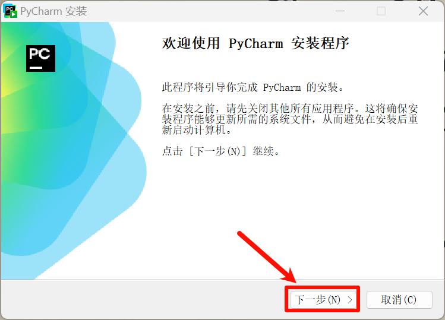

3️⃣修改安装目录，点击下一步。

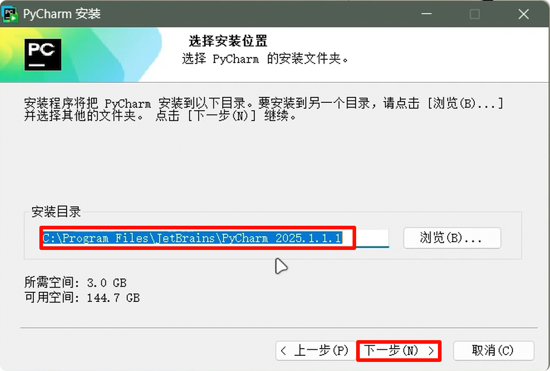

4️⃣勾选对应的安装选项，之后点击下一步。

5️⃣点击安装。

6️⃣安装完成。

### 设置 PyCharm
#### 一、设置中文UI
初次运行会弹出语言选择框，选择中文语言包即可

提示是否共享数据，若共享就会将部分使用数据发送给 `Jetbrains`公司优化产品，我这里选择不共享。

#### **二、创建项目**
1️⃣点击新建项目

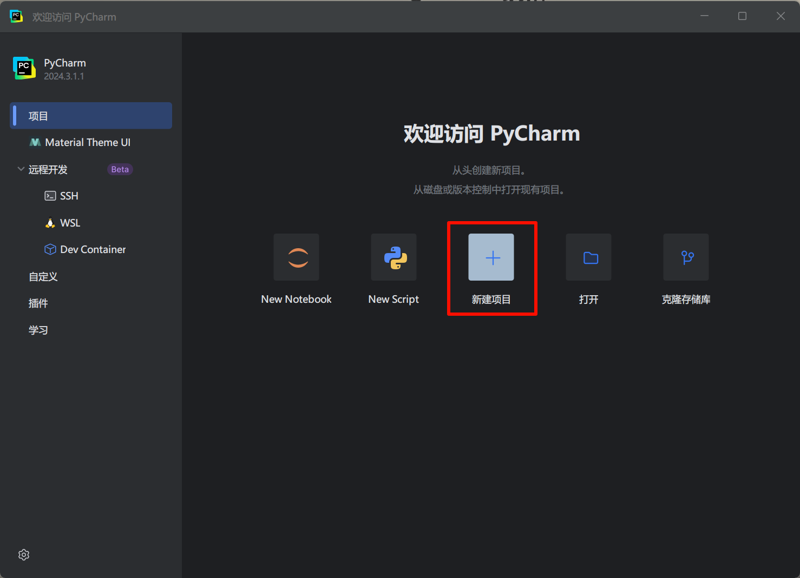

2️⃣设置项目名称，项目路径，解释器类型，Python版本。

::: warning
**📢注意**：不同的 pycharm 版本，这里看到的界面可能会略有不同。

:::

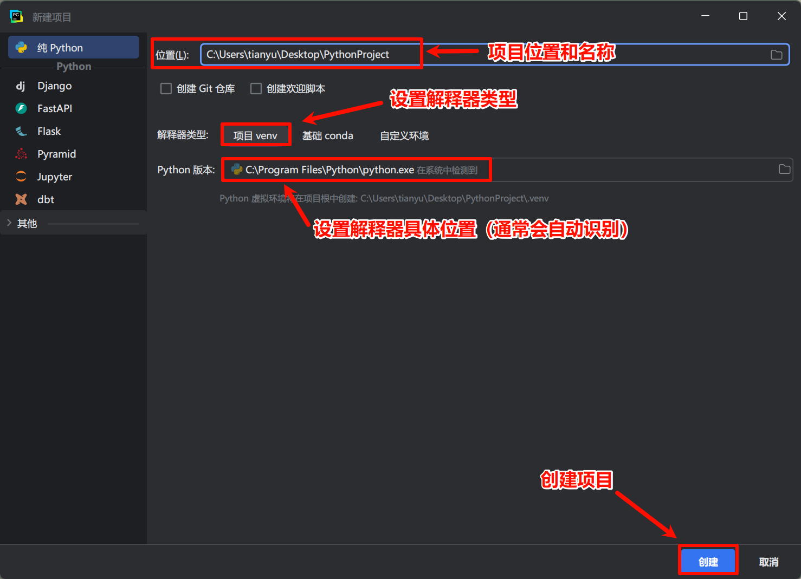

3️⃣一个 Python 项目创建成功。

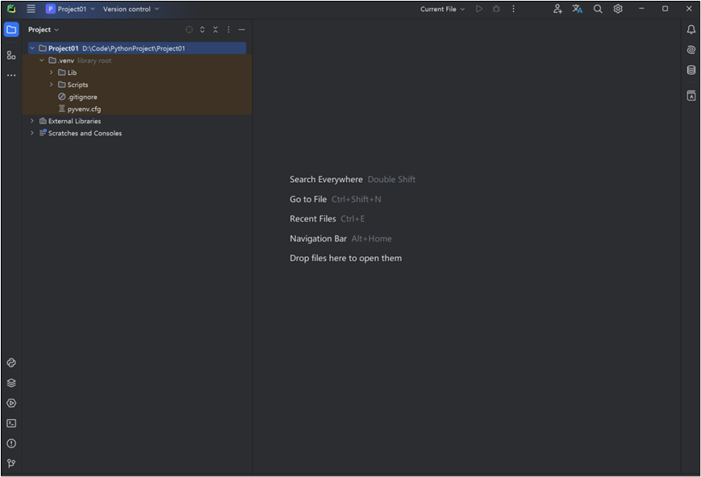

4️⃣若出现如下提示，点击【排除文件夹】即可

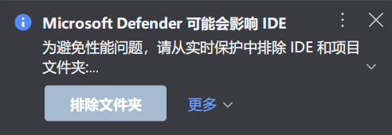

#### **三、字体设置**
1️⃣参考下图调整编辑器字体

2️⃣若出现如下提示，则表示当前字体遵循主题设置，需要点击蓝色文字，跳转到配色方案中进行调整。

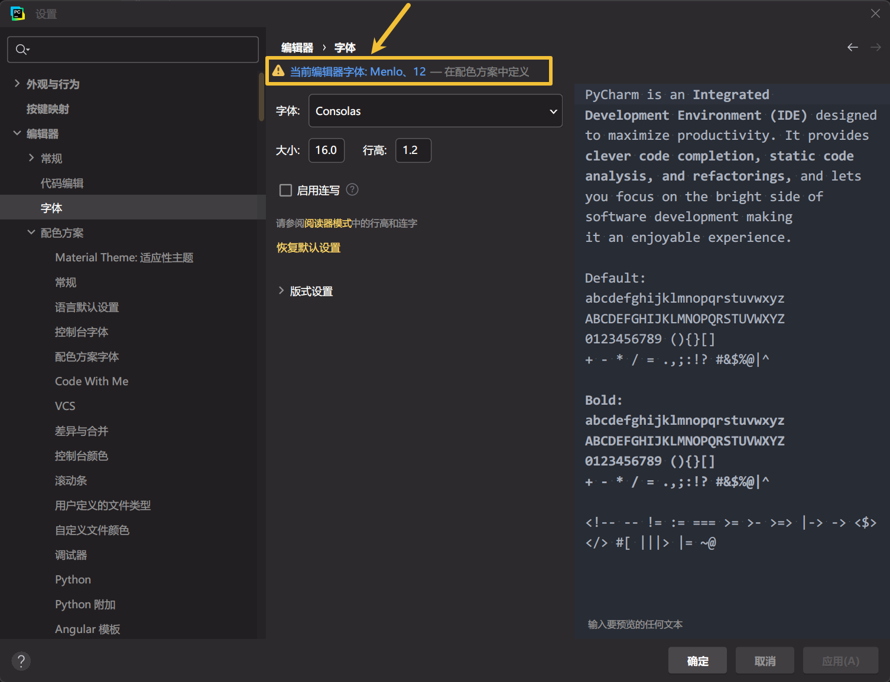

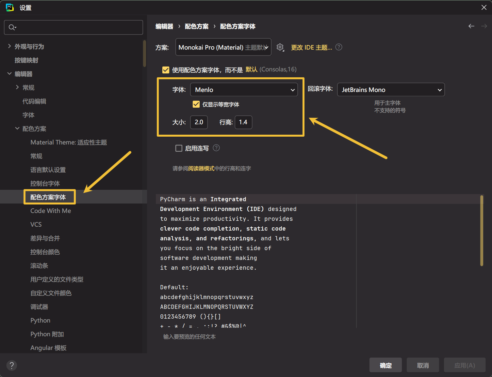

#### **四、主题设置**
1️⃣打开设置面板。

2️⃣依次选择：外观 → 主题。

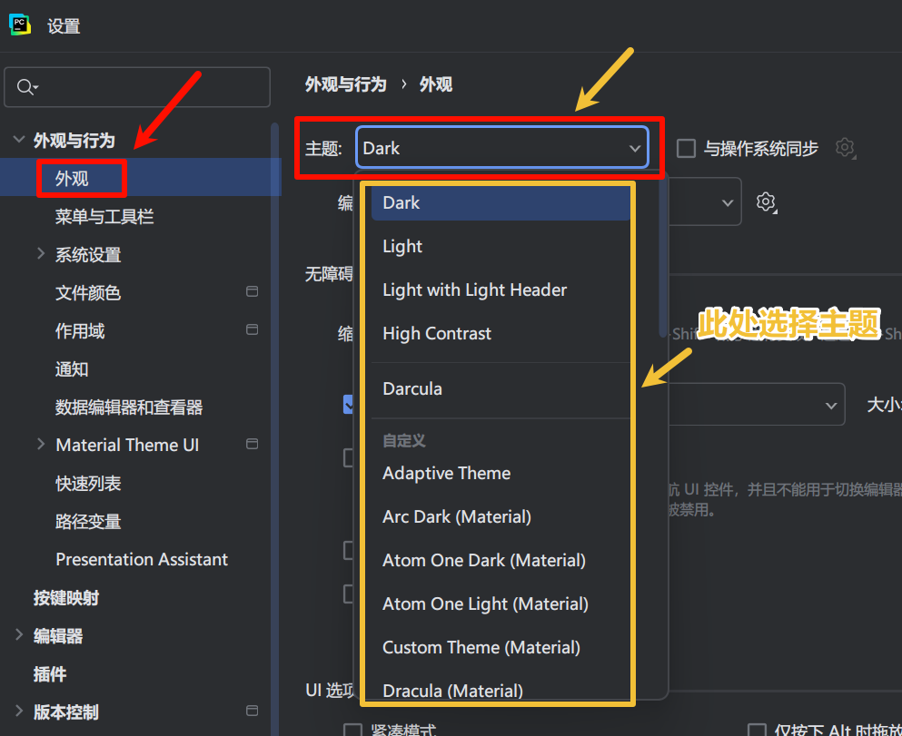

3️⃣滑动到最后，点击获取更多主题，可以从主题商店中安装新主题。

#### **五、默认快捷键**
PyCharm 中常用的默认快捷键如下：

| **快捷键**|**对应操作** |
| --- | --- |
| **Ctrl + /** | 行注释（可选中多行） |
| **Ctrl + Alt + L** | 代码格式化 |
| **Ctrl + C** | 复制当前行 / 复制选定的代码 |
| **Ctrl + D** | 重复当前行 / 重复选定的代码 |
| **Ctrl + Z** | 撤销 |
| **Ctrl + Y** | 删除当前行   /   反撤销(重做) |
| **Ctrl + X** | 复制当前行 / 剪切选定的代码 |
| **Shift + Enter** | 换行（光标不在结尾处也可换行） |

#### **六、自定义快捷键**
除了默认的快捷键，我们还可以配置自己喜欢的快捷键，例如：我们可以设置`ctrl`+ 鼠标滚轮，来快速调整字体大小，具体设置步骤如下：

1️⃣按照图示方式，找到对应设置：

2️⃣选择：添加鼠标快捷方式

3️⃣弹出如下窗口后，按住`ctrl`键的同时，将鼠标滚轮向下滚动（当然向上也可以，根据个人习惯来）

4️⃣随后窗口中会自动识别当前按下的按键和鼠标动作，随后点击确定即可。

5️⃣再以同样的方式，设置让字体变大的快捷键

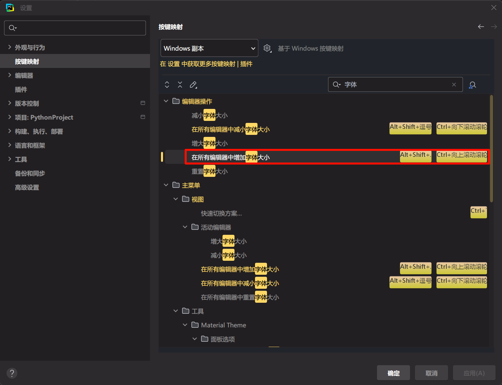

::: tip
**📋备注**：大家可以根据自己的喜好，设置其他功能的快捷键，具体设置方式和注意点，请看视频教程。

:::

## **运行 Python 程序的几种方式总结**
运行 Python 程序，有常见的以下三种方式：

+ 第一种方式：命令行（终端）模式
+ 第二种方式：脚本模式
+ 第三种方式：集成开发环境（IDE）模式

> 备注：第三种方式，其实是第二种方式的图形化操作，本质上算是一种模式。
>

### **命令行模式**
1. 同时按下 Win 键和 R ，随后输入`cmd` ，打开终端（命令行）。
2. 在终端（命令行）中输入`python`，进入 Python 交互模式。
3. 输入`print(100)`，按下回车，控制台会打印：`100`。

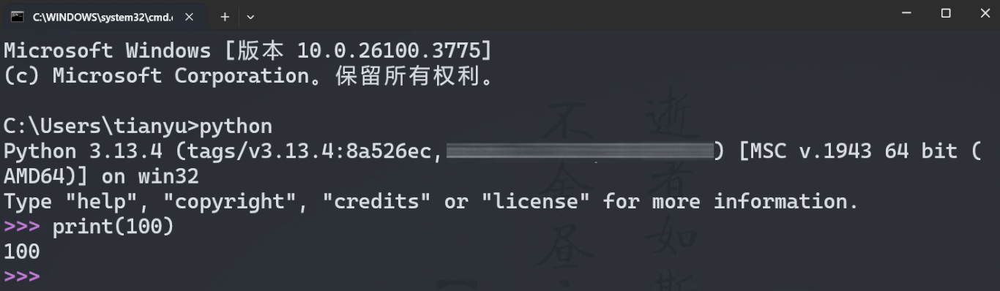

### **脚本模式**
1. 在桌面上新建一个`code`文件夹，随后新建一个文本档，将其重命名为`test.py`

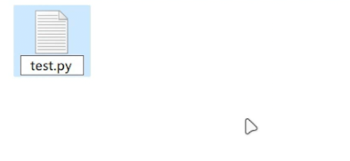

2. 使用记事本打开`test.py`，在其中写好代码并保存。

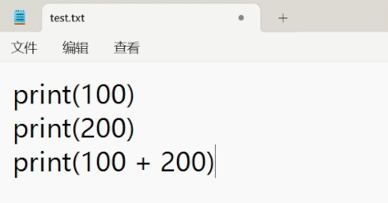

3. 找到`test.py`所在的文件夹

4. 在资源管理器上方输入`cmd`并回车，就会打开命令提示符并进入当前路径。

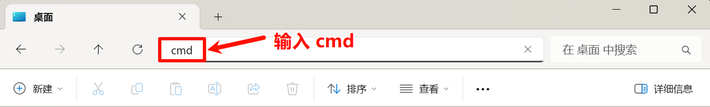

5. 在命令提示符中输入`python test.py`执行程序，就会看到打印的内容。

### **IDE模式**
1. 鼠标右键工程文件夹，选择新建 python 文件。

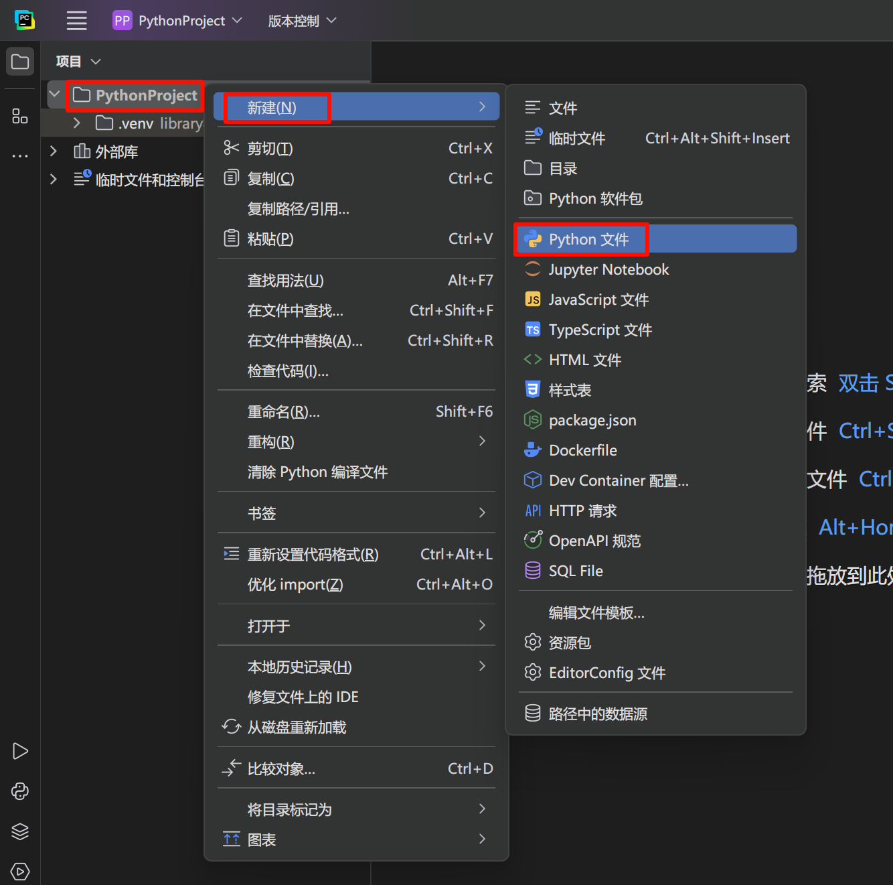

2. 输入文件名，确认后按下回车

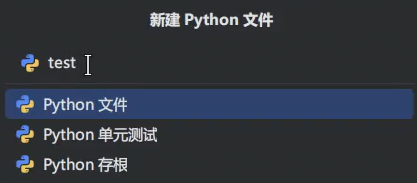

3. 输入`print(100)`，随后在文件空白处点击鼠标右键，选择：`运行test`。

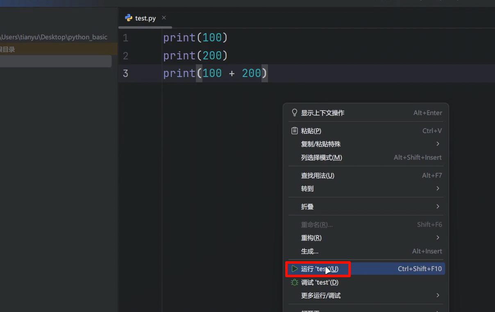
