# 第 3 章 Python 核心基础
## 字面量
### 概述
来看这样一个场景：老师让学生把：姓名、年龄、体重写在纸上，纸上的文字，就是学生想要表达的内容，这些内容不需要计算、也不需要转换，就是字面上的含义，一看就能理解。


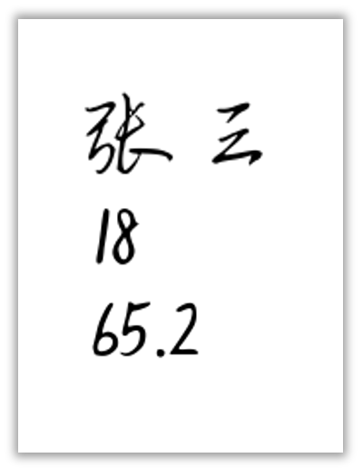
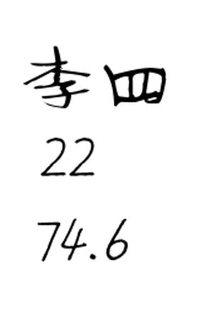
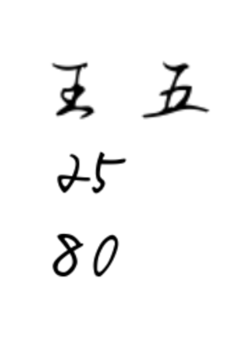

在程序中，也有上述这些“写出来就能被理解”的内容，这些内容在程序中叫做**字面量**，即：字面量就是直接写在代码中的“具体值”。

### 写法
下面代码中的内容，都是字面量。

```python
'张三'
18
65.2

'李四'
22
74.6

'王五'
25
80
```

::: info
以上代码中的 `'张三'`、`'李四'`、`'王五'` 均为字符串。所谓字符串，就是由“字符”组成的“串”。例如，字符串 `'张三'` 由 `'张`' 和 `'三'` 两个字符构成。

从本质上看，字符串属于文本类型，可以由任意数量的字符组成——无论是中文、英文、数字，还是各种符号。此处我们只需对字符串的概念有初步认识，后续课程中将对其进行详细讲解。

:::

::: warning
📢**注意**：字符串必须要放到引号中，使用：单引号、双引号、三个单引号、三个双引号都可以，但必须是英文的引号。

:::

::: tip
**📋备注**：写在 Python 文件头部的字符串，会被自动识别成 docstring（文档字符串），文档字符串的主要作用是：对当前 Python 文件进行说明，且文档字符串必须用三个双引号。

:::

```python
"""这是我写的第一个Python文件"""

'张三'
18
65.2
```

## 变量与常量
### **变量**
::: details 1️⃣**前情回顾**

在上一节中，我们通过字面量的形式，记录了张三的体重，例如：

```python
65.2
```

现在需要打印一些体重相关的内容，代码如下：

```python
print('张三的体重是', 65.2)
print('对于', 65.2, '这个体重，张三觉得不满意')
print('张三决定开始减肥，希望体重比', 65.2, '还要小')
```

::: info

**📌小贴士**：

1. 使用`print(内容)`可以输出内容（也叫：打印内容）这里说的“打印”不是打印在纸上，而是指：把内容呈现在控制台上。
2. 使用`print(内容1, 内容2, 内容3)`可以输出多个内容，不同内容之间用逗号做分隔，输出的多个内容默认会在同一行，且输出的多个内容之间会有一个空格。
:::

::: tip

📋**备注**：`print()`还有很多使用细节和技巧，后面会逐步介绍。
:::

我们会发现，代码中的`65.2`被使用了 3 次，当要修改张三的体重为`64.2`时，就需要手动修改 3 个地方，修改起来会很麻烦，就像下面这样：

```python
print('张三的体重是', 64.2)
print('对于', 64.2, '这个体重，张三觉得不满意')
print('张三决定开始减肥，希望体重比', 64.2, '还要小')
```
:::
::: details **2️⃣什么是变量？**

变量是数据的“代号”它可以和数据建立绑定关系，通过变量可以使用数据，或更新数据，之所以叫变量，是因为：它和某个值的绑定关系，可以随时改变。

例如：在上述代码中，我们可以把体重值和某个『**变量**』建立一个『**绑定关系**』，以后用到体重的时候，直接“呼唤”这个变量就可以了。
:::
::: details 3️⃣**具体语法**

语法为：`变量名 = 值`，例如下面代码中的：`name`、`age`、`weight`都是变量。

```python
name = '张三'
age = 18
weight = 65.2
```

::: warning

📢**注意**：变量名不需要加引号！
:::
:::
::: details 4️⃣**示例代码**

使用`weight`变量存储体重值，并在后续代码中，多次使用`weigth`变量。

```python
weight = 65.2

print('张三的体重是', weight)
print('对于', weight, '这个体重，张三觉得不满意')
print('张三决定开始减肥，希望体重比', weight, '还要小')
```

需要修改体重时，通过`weight`就可以修改，修改后再去使用`weight`时，就是修改后的值了。

```python
weight = 65.2
weight = 64.2

print('张三的体重是', weight)
print('对于', weight, '这个体重，张三觉得不满意')
print('张三决定开始减肥，希望体重比', weight, '还要小')
```
:::
::: details 5️⃣**几个关键点**

::: info

1. 在数学中，像`1 + 1 = 2`这样的等式表示：等号左边的`1 + 1`是具体的运算过程，等号右边的`2`是该运算的结果。
2. 在代码`age = 18`中，等号表示：将等号**右侧的值**与**左侧的变量**建立**绑定关系**。因此，当程序中需要表示年龄`18`时，可以使用变量`age`；同样，也可以通过`age`来修改该数值。
3. `age = 18`这一行代码也被称为“赋值语句”，意思是将右侧的`18`赋给变量`age`。
4. 在 Python 中，变量的创建与赋值是同时完成的。也就是说，当程序中出现一个变量时，它必须立即与某个值建立绑定关系。
5. 变量名不应过于随意，命名时需要遵守一定的规则（具体命名规则将在下一小节讲解）。
:::
:::
### **标识符命名规则**
::: details 1️⃣**什么是标识符？**

在程序中我们给： 变量、函数、类.....所起的**名字**，统称为**标识符**，即：在程序中所有我们可以自己起的名字，都是标识符。
:::
::: details **2️⃣标识符命名规则如下**：

::: info

1. 只能包含：数字、字母、下划线，且**不能**以数字开头，**不能**包含空格。
2. 区分大小写，即`Name`和`name`是两个不同的标识符。
3. **不能**使用关键字（关键字的解释在下面⬇️）。
4. 标识符尽量**不要**与内置函数同名。
5. 标识符虽然没有长度限制，但应追求：简洁清晰，具有描述性。
:::
:::
::: details **3️⃣Python 中的关键字**

所谓“关键字”，是指那些：已被 Python 语言预先保留、具有特定含义和功能的标识符。这些关键字被系统征用，因而不能再作为变量名、函数名或其他标识符使用。

```python
False     	None      	True      	and       	as
assert    	async     	await     	break     	class
continue  	def       	del       	elif      	else
except    	finally   	for       	from      	global
if        	import    	in        	is        	lambda
nonlocal  	not       	or        	pass      	raise
return    	try       	while     	with      	yield
```

::: tip

📋**备注**：上述关键字暂不作详细说明。随着课程的推进，我们会在实际讲解中逐步接触并使用这些关键字，届时再进行深入解释。初学者无需在此阶段强行记忆（这也并不现实），随着使用频率的增加，便会在后续学习中自然掌握。
:::
:::
::: details **4️⃣常见的三种命名风格**

::: info

1. **大驼峰**（UpperCamelCase）: 每个单词的首字母大写，例如：`UserName`
2. **小驼峰**（lowerCamelCase）: 首词的首字母小写，后面单词首字母大写，例如：`userName`
3. **蛇形**（snake_case）：单词间用下划线连接，例如：`user_name`

💡Python 中推荐使用『蛇形（snake_case）』写法。
:::

举几个例子：

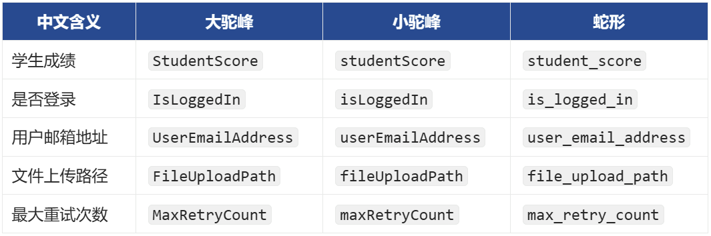
:::
### 常量
::: details 1️⃣**什么是常量？**

在程序中一旦被赋值，就**不希望**被修改的量（区别于变量）。
:::
::: details 2️⃣**具体语法**

Python 中一般约定使用**全大写**变量名来表示常量，涉及到多个单词时，用下划线做分隔。

```python
ADULT_AGE = 18
MONTHS_IN_YEAR = 12
MAX_USERS = 1200
PASSING_SCORE = 60
MAX_USERS = 1300
```
:::
::: details **3️⃣Python 中没有强制的常量机制**

当强制对常量进行修改时，最终也能改掉，但要自觉不改，这是 Python 程序员之间的约定。

```python
MONTHS_IN_YEAR = 12
print(MONTHS_IN_YEAR)

MONTHS_IN_YEAR = 13
print(MONTHS_IN_YEAR)
```
:::
## **注释**
### 概述
注释是对代码的**备注**和**解释**，在代码执行的时，通常不起任何作用。

### **注释的作用**
注释的核心作用如下：

::: info
1. 提高代码的可读性，通常用来辅助程序员快速理解代码的逻辑。
2. 屏蔽掉暂时不需要的代码。

:::

::: warning
📢**注意**：在代码中编写清晰易懂的注释，是程序员的基本素养之一！

:::

### **单行注释**
在 Python 中`#`后的一行内内容，会被视为注释。

```python
# name 是张三的名字
name = '张三'
# age 是张三的年龄
age = 18
# weight 是张三的体重（单位：kg）
weight = 65.2

print(name, age, weight)  # 这是一句打印
```

关于注释的书写格式：

::: info
1. Python官方建议：在`#`和注释的内容之间加一个空格，在代码和`#`之间加两个空格。
2. 上述的规则属于 Python 编码规范，规范的具体内容，我们会在课程中逐渐给各位渗透。

:::

### **多行注释**
多行注释又称“块注释” ，Python 中的多行注释使用的是一组三引号（单引号，双引号都可以）**。**

::: details 1️⃣多行注释可以换行，但不能嵌套。

```python
"""
我是一些注释
我还是一些注释
"""
```
:::
::: details 2️⃣多行注释本质是一个多行字符串。

::: warning

**📢注意**：Python 中并没有真正的多行注释语法，所谓多行注释的本质其实还是字符串。
:::

```python
print(
    """
    Hello World
    Hello world
    """
)
```
:::
###  文件编码注释
文件编码又称“字符编码”，文件编码注释写在 Python 文件的首行，是一种特殊的注释。

它的作用是：指定当前文件的字符编码。

```python
# coding=utf-8
print('你好啊！')
```

## 字符编码
### 概述
计算机对数据会进行两个常见的操作，分别是：存储数据、读取数据。

- 存储数据时，计算机会进行**编码**。
- 读取数据时，计算机会进行**解码**。


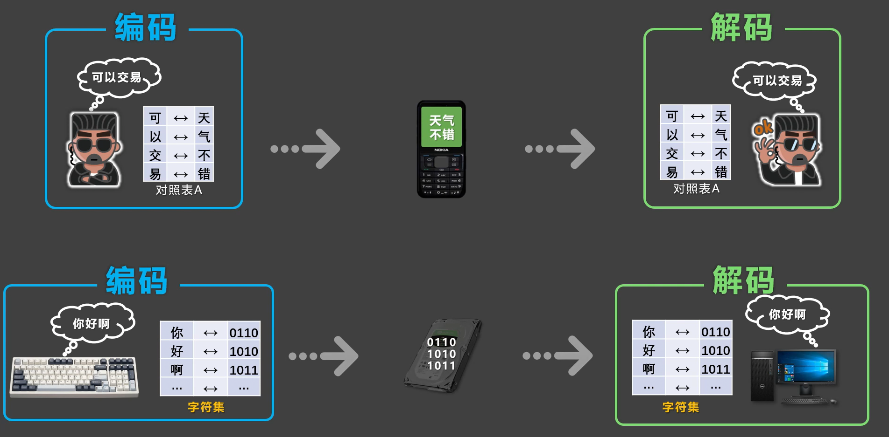

::: tip
编码与解码，会遵循一定的规范，这个规范就是**字符编码**，并且编码与解码，必须遵循相同的编码规范，若所用的规范不一致，就会出现乱码。

:::

```python
# coding=iso-8859-1
print('你好啊！')  # ä½ å¥½å•Šï¼
```

### 常见编码方式
::: info
1. `ASCII`：大写字母、小写字母、数字、一些符号，共计 28个字符。

2. `ISO 8859-1`：在`ASCII`基础上扩展，支持西欧语言，共计 256 个字符。

3. `GB2312`：中国国家编码标准，收录约 6763 个简体中文常用汉字和符号。

4. `GBK`：兼容`GB2312`，进一步扩展，支持简繁体中文和其他汉字，共收录 2 万多个字符。

5. `UTF-8`：国际通用的编码格式，也叫“**万国码**”，支持世界所有语言的字符，包括：中文、英文、阿拉伯文、日文、韩文等，向下兼容`ASCII`，是现代互联网最常用的编码格式。

:::

::: tip
✅**最佳实践**：实际开发中，几乎都采用`UTF-8`编码保存文件。

:::

::: tip
**📋备注**：在 Python3 中，可以不写文件编码声明，因为 Python3 默认就使用`UTF-8`编码。

:::

## 数据类型
### 概述
就像生活中的物品，都有自己所属的分类一样，数据也有自己所属的『**数据类型**』。

例如之前写过的这段代码：

```python
'张三'
18
65.2

"李四"
22
74.6
```

在上述代码中：

::: info
✅`'张三'`、`"李四"`这两个字面量，属于『**字符串**』类型。

✅`18`、`22` 这两个字面量，属于『**整数**』类型。

✅`65.2`、`74.6`这两个字面量，属『**浮点数**』类型。

:::

三种最常见的数据类型：

| 类型名称 | 英文名 | 举例 | 说明 |
| :---: | :---: | --- | --- |
| **整型** | `int` | `5`, `-3`, `0`, `2025` | 整数（不带小数点的数） |
| **浮点型** | `float` | `3.14`, `-0.01` | 带小数点的数 |
| **字符串** | `string` | `"Hello"`, `'Python'` | 文本，要用引号包起来 |


::: tip
📋**备注**：数据类型不只上述的这三种，还有很多种，我们暂且先知道以上这三种即可，其他数据类型会在后续章节中逐步讲解。

:::

### 查看数据类型
通过`type()`可以查看数据类型，`type()`会返回当前数据的具体类型。

```python
# 使用变量接收 type() 返回的类型
result1 = type('张三')
result2 = type(18)
result3 = type(72.5)

print(result1) # <class 'str'> 注意此处返回的不是string，是 string 的简写：str
print(result2) # <class 'int'>
print(result3) # <class 'float'>
```

::: warning
📢**注意**：在**Python 中：变量无类型，数据有类型**。

例如`a = 10`，其中`a`是没有类型的，但`a`所关联的数据`10`是有类型的，`10`是整型，我们经常说`a`是整型，其实是一种不太严谨的表述，严谨的表述应该是：`a`所对应的数据`10`是整型。

:::

也可以把变量交给`type()`，最终返回的是：变量所对应的数据的类型。

```python
name = '张三'
age = 18
weight = 72.5

# 使用变量接收type()返回的类型
result1 = type(name)
result2 = type(age)
result3 = type(weight)

# 打印这三个数据类型
print(result1)  # <class 'str'>
print(result2)  # <class 'str'>
print(result3)  # <class 'float'>
```

当然也可以不使用变量接收，直接打印`type()`的结果

```python
name = '张三'
age = 18
weight = 72.5

# 打印这三个数据类型
print(type(name))  # <class 'str'>
print(type(age))  # <class 'str'>
print(type(weight))  # <class 'float'>
```

### 整型
::: details 1️⃣**什么是整型？**

所谓整型就是没有小数点的数字， Python 中的整型，可以是**任意大小**的整数，包括负整数。
:::
::: details 2️⃣**分隔符**

当书写很大的数时，可使用下划线将数字分组，使其更清晰易读；Python 自动忽略数字之间的下划线，并且这种写法也适用于浮点数，但要注意：此种写法只有 Python3.6 及以上版本才支持。

```python
num1 = 10_000_000
print(num1)
```
:::
::: details 3️⃣**整型上限值**

Python 中存储整数上限值的大小取决于：计算机的内存和处理能力，我们先来认识一下『幂运算符』，代码如下：

```python
a = 3 ** 2  # 表示3的平方
b = 2 ** 3  # 表示2的3次方

print(a)  # 9
print(b)  # 8
```

通过幂运算，构建一个很大的数，随后打印它，我们会发现：代码报错了。

```python
a = 9 ** 9999  # 9的9999次方
print(a)  # 打印x
```

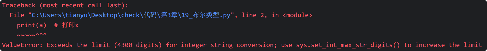

上面报错中提及了`"Exceeds the limit (4300 digits)"`，但这并不代表 Python 最大只能表示`4300`位的数，比如我们把`print`删掉，会发现代码正常运行，并且此时的`a`也是可以正常参与数学运算的。

```python
a = 9 ** 9999  # 9的9999次方
b = a + 100
```

那加上了`print(a)`为什么报错呢？原因如下：

::: info

调用`print(a)`时，Python 底层会把`a`的类型转换成『字符串类型』再输出，而从 Python3.11 起，Python 对超大整数转换字符串的长度进行了限制，默认位数是`4300`位。
:::

**💡扩展知识（了解即可）**：

通过如下代码，可以解除字符串转换时的`4300`位限制，如下代码中包含模块相关内容，我们还没有讲到，所以不必纠结下面代码的具体含义，只需要先知道：`4300`位的限制可以修改即可。

```python
import sys
sys.set_int_max_str_digits(0) # 设置为0表示不作任何限制

x = 9 ** 9999  # 9的9999次方
print(x)  # 打印x
```
:::
### 浮点型
::: details 1️⃣**什么是浮点型？**

所谓浮点型，就是带小数点的数字，比如：`3.14`、`-0.5`、`2.0`都是浮点数。
:::
::: details 2️⃣**浮点型的表示方式**

1. 直接写

```python
# 浮点型就是带有小数点的数字。
weight = 65.2
balance = 1425.58
out_temp = -25.2
price = 120.0
```

1. 科学计数法

```python
# 浮点型的科学计数法表示。
speed_of_sound = 3.4e+2  # 3.4乘以10的2次方。
world_population = 7.8e9  # 7.8乘以10的9次方。
distance_sun_earth = 1.496E8  # 1.496乘以10的8次方。
speed_of_light = 2.998E+8  # 2.998乘以10的8次方。

one_ml = 1e-3  # 1乘以10的-3次方。
one_mg = 1E-3  # 1乘以10的-3次方。
```
:::
### 字符串
#### 1️⃣**字符的四种定义方式**
| 写法 | 示例 | 适用场景 |
| --- | --- | --- |
| 单引号 | `'你好，尚硅谷'` | 单行字符串（不能直接换行，换行需要使用圆括号） |
| 双引号 | `"你好，尚硅谷"` | |
| 三个单引号 | `'''你好，尚硅谷'''` | 多行字符串（可以直接换行） |
| 三个双引号 | `"""你好，尚硅谷""""` | |


下面代码所表示的都是字符串：

```python
# 单引号和双引号的写法是等价的，二者都不能直接换行（要用圆括号才能换行），单引号用的多。
message1 = '尚硅谷，让天下没有难学的技术!'
message2 = "尚硅谷，让天下没有难学的技术!"

# 三个单引号的写法，可以直接换行，并且可以作为多行注释使用。
message3 = '''尚硅谷，让天下没有难学的技术!'''

# 三个双引号的写法，可以直接换行，也可以作为多行注释使用，还能作为文档字符串使用。
message4 = """尚硅谷，让天下没有难学的技术!"""
```

#### **2️⃣字符串的格式化输出**
::: details **写法 1**：直接用加号进行拼接，写起来很麻烦，而且只能是字符串之间拼接。

```python
name = '张三'
gender = '男'
weight = 65.2
age = 12

info1 = '我叫' + name + '，我是' + gender + '生'
```
:::
::: details **写法 2**：使用占位符。

具体规则：

- `%s`占位字符串
- `%f`占位浮点数
- `%i`占位整数
- `%d`占位十进制的整数
- `%s`是万能的（如果我们提供的数据不是字符串，那 Python 就会把数据转成字符串）。

```python
name = '张三'
gender = '男'
weight = 65.2
age = 12

info2 = '我叫%s，我是%s生，我体重是%f，年龄是%d' % (name, gender, weight, age)
```
:::
::: details **写法 3**：使用 f-string，这是目前 Python 最推荐的方式。

```python
name = '张三'
gender = '男'
weight = 65.2
age = 12

info3 = f'我叫{name}，我是{gender}生，我体重是{weight}，年龄是{age}'
```
:::
#### 3️⃣**占位符精度控**
在占位符前方，可以使用`m.n`的形式来指定精度，具体规则见下图：


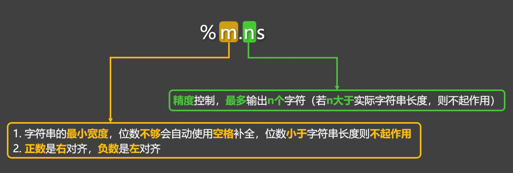


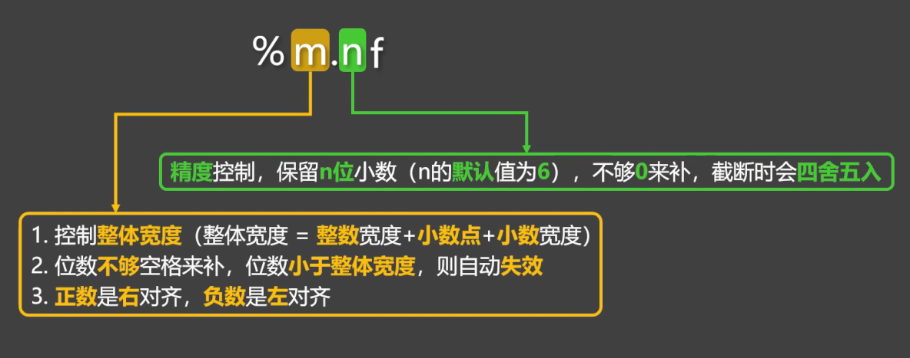


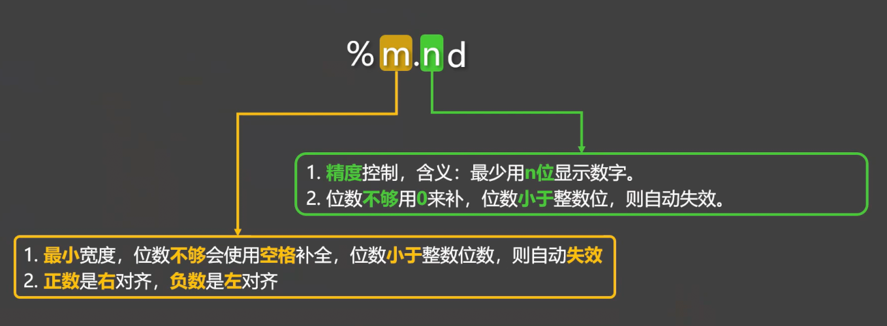

示例代码：

```python
info = '我叫%-4.1s，性别是%3.2s，体重是%-9.3f，年龄是%-6.4d' % (name, gender, weight, age)
```

#### 4️⃣**转义字符**
在字符串中，有些字符不能直接写（换行、制表符、引号等）这时就要使用转义字符。

例如下面的`message`字符串中包含了一个单引号，但如果就这样直接写，就会报错

```python
print('在Python中，可以使用'包裹一个字符串')
```

使用转义字符后，即可正常输出：

```python
print('在Python中，可以使用\'包裹一个字符串')
```

常见的转义字符梳理：

| 转义字符 | 表示的含义 |
| --- | --- |
| `\'` | `'` |
| `\"` | `"` |
| `\n` | 换行 |
| `\\` | `\` |
| `\b` | 删除前一个字符 |
| `\r` | 使光标回到本行开头，覆盖输出 |
| `\t` | 表示水平制表符（让光标跳转到下一个制表位） |


测试代码：

```python
# 使用 \' 输出 '
print('在Python中，可以使用\'包裹一个字符串')

# 使用 \" 输出 "
print("在Python中，可以使用\"包裹一个字符串")

# 使用 \n 进行换行
print('注册会员需要以下信息：\n姓名\n年龄\n手机号')

# 使用 \\ 输出 \
print('D:\\nice')

# 使用 \b 删除前一个字符
print('helloo\b')

# 使用 \r 使光标回到本行开头，覆盖输出
print('67%\r68%')

# 使用 \t 表示水平制表符（让光标跳转到下一个制表位）
# 一个制表位到底是几位，是不确定的，但我们可以通过在字符串后面加.expandtabs()来指定位数。
print('1234123412341234')
print('ab\tcd.expandtabs(4)')
print('abc\td.expandtabs(4)')
print('abcd\ta.expandtabs(4)')
print('我是\t中文.expandtabs(4)')

print('12341234123412341234')
print('姓名\t性别\t年龄')
print('张三\t男\t\t18')
print('李四\t女\t\t25')
print('王五\t男\t\t32')
```

## 数据类型转换
### 概述
何为数据类型转换？—— 把一种类型的数据，变成另一种类型。

### 为什么要数据类型转换
例如下面这些场景中，我们得到的数据类型，和最终要用的数据类型是不一致的，那就需要类型转换：

::: info
1. 用户输入的内容是都是字符串，若需要进行数学运算，就必须进行数据类型转换。
2. 对文件进行写入操作时，要将其他类型的数据转为字符串。
3. 从数据库中读取出的内容都是字符串若需要进行数学运算，也需要数据类型转换

......

:::

### 具体转换方式
通过以下函数，可以对数据类型进行转换

| **函数**|**说明**|**示例** |
| --- | --- | --- |
| **int(x)** | 将x转换为一个整数 |
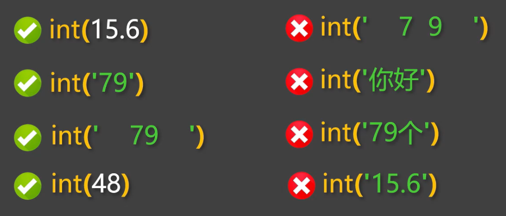 |
| **float(x)** | 将x转换为一个浮点数 |
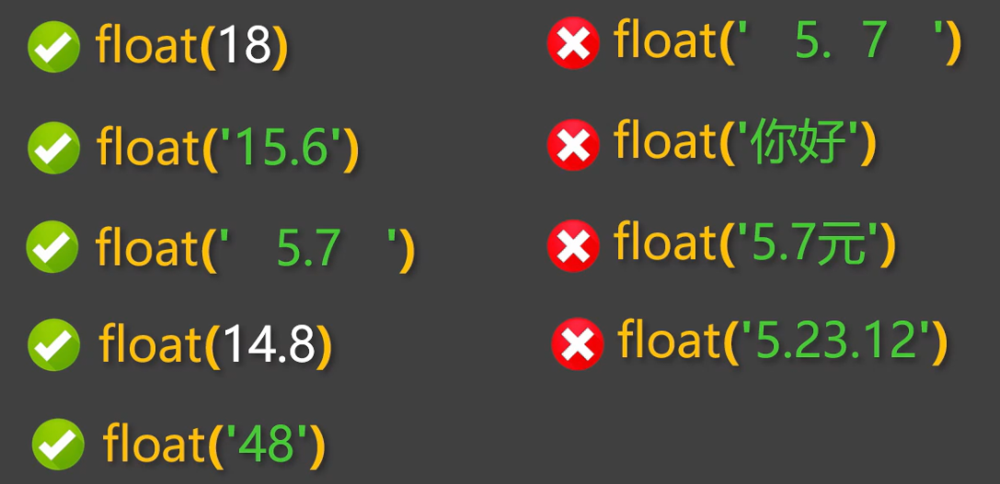 |
| **str(x)** | 将对象x转换为一个字符串 |
 |


## **运算符**
### **算数运算符**
常用的算数运算符如下：


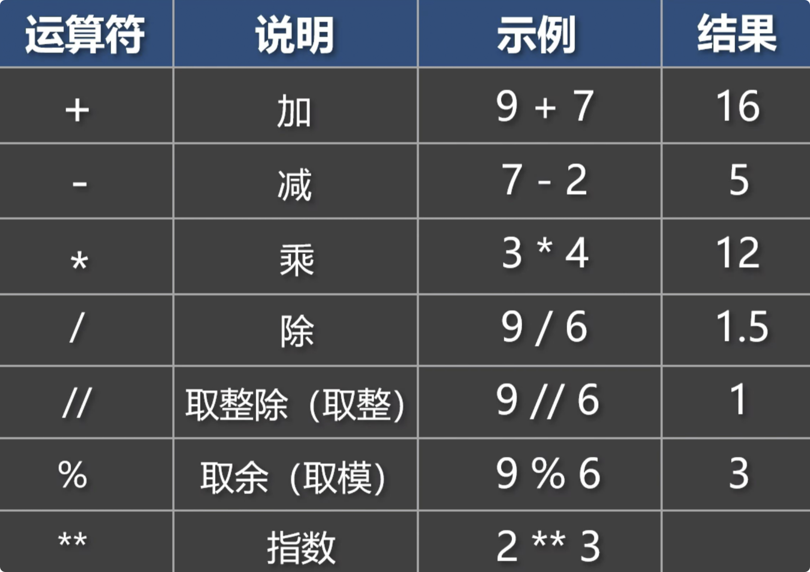

测试代码

```python
# 加
print(9 + 7)
# 减
print(7 - 2)
# 乘
print(3 * 4)
# 除
print(9 / 3)
# 取整
print(9 // 6)
# 取余
print(9 % 6)
# 指数
print(2 ** 3)
```

### **赋值运算符**
常用的赋值运算符如下：


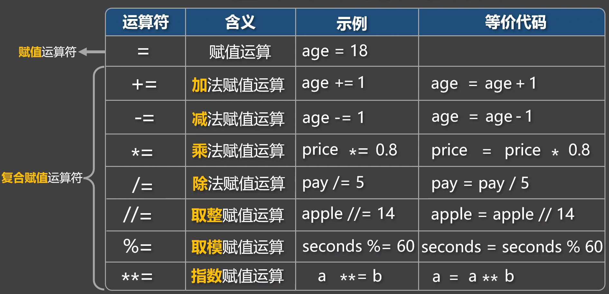

测试代码：

```python
age = 18
print(age)

price = 52
print(price)
```

```python
age = 18

# 加法复合运算符
age += 1  # 等价于：age = age + 1
print(age)

# 减法复合运算符
age = 18
age -= 1  # 等价于：age = age - 1
print(age)

# 乘法复合运算符
price = 100
discount = 0.8
price *= discount  # 等价于：price = price * discount
print(price)

# 除法复合运算符
pay = 100
num = 5
pay /= 5  # 等价于：pay = pay / num
print(pay)

# 取整赋值运算符
apple = 31
num = 14
apple //= num  # 等价于：apple = apple // num
print(apple)

# 取模赋值运算符
seconds = 386
minutes = 60
seconds %= minutes  # 等价于：seconds = seconds % minutes
print(seconds)

# 指数赋值运算符
a = 2
b = 3
a **= b  # 等价于：a = a ** b
print(a)
```

### **比较运算符**
常用的比较运算符如下：


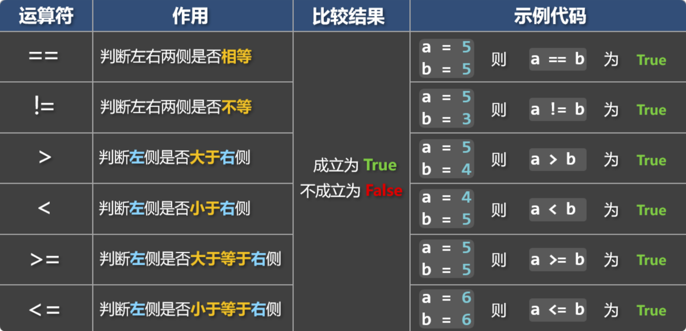

::: tip
📋**备注**：True 和 False 是布尔类型，会在下一小节讲，暂且先知道：True 表示真，False 表示假。

:::

```python
# 使用==判断左右两侧是否相等
a = 5
b = 7
c = '5'
result = a == c
print(result)

# 使用!=判断左右两侧是否不等
a = 5
b = 7
c = '5'
result = a != c
print(result)

# 使用>判断左侧是否大于右侧
a = 9
b = 7
c = '5'
result = a > b
print(result)

# 使用<判断左侧是否小于右侧
a = 3
b = 7
c = '5'
result = a < b
print(result)

# 使用>=判断左侧是否大于等于右侧
a = 6
b = 7
c = '5'
result = a >= b
print(result)

# 使用<=判断左侧是否小于等于右侧
a = 9
b = 7
c = '5'
result = a <= b
print(result)

# 以上这些比较运算符，同样适用于字符串
msg1 = 'abc'
msg2 = 'abc666'
print(msg1 == msg2)

msg1 = 'abc'
msg2 = 'abc'
print(msg1 != msg2)
```

::: info
**📌小贴士**：

+ 字符串进行比较时，是依次比较每个字符的 Unicode 编码。
+ Unicode 编码是一种全球通用的字符编码标准，它会给每个字符都分配一个“身份证号”。

:::

具体比较规则是：

::: info
1. 从左到右，依次比较两个字符串中的字符。
2. 先比较第一个字符：
    - 如果两个字符不相等，就直接根据它们的 Unicode 码值比较大小。
    - 如果相等，则继续下一步。
3. 继续比较下一个字符，依次往后进行，直到遇到不相等的字符为止。
4. 当出现不相等的字符时，比较它们的 Unicode 码大小，后续的字符将不再参与比较。


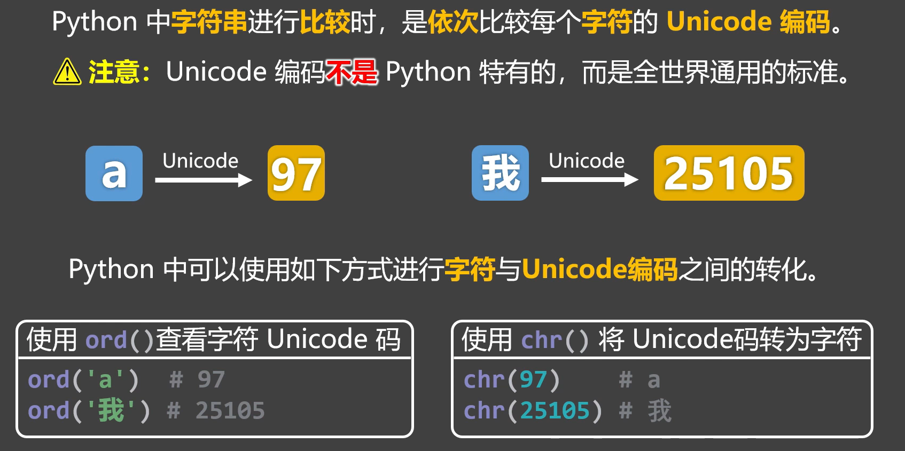

:::

```python
# 使用ord()查看指定字符的Unicode编码
print(ord('a'))
print(ord('我'))

# 使用chr()将Unicode编码转为字符
print(chr(97))
print(chr(25105))

msg1 = 'abc'
msg2 = 'xyz'
msg3 = '我爱你'
msg4 = '中国'
msg5 = 'abc'
msg6 = 'abcdef'
print(msg3 <= msg1)
```

### 布尔类型
我们之前讲的这些类型：字符串、整型、浮点型，这些类型中，每一种类型都有无限多的具体值。


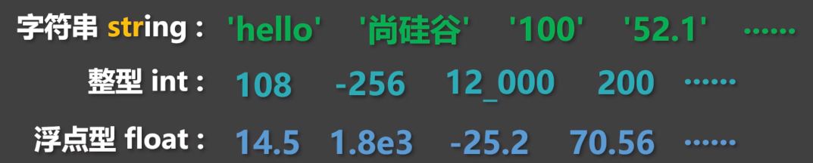

但布尔类型的具体值，只有两个，分别是：`True`和`False`，其中：`True`表示真，`False`表示假。


布尔值常用于表示：条件是否成立、事件是否发生、操作是否成功、等逻辑状态。

::: warning
📢**注意**：`True` 和 `False` 的首字母必须大写。

:::

```python
# 自己定义的布尔值
a = True
b = False

# 靠程序执行得到的布尔值
c = 5 > 3
d = 7 < 2

print(type(a), a)  # True
print(type(b), b)  # Flase
print(type(c), c)  # True
print(type(d), d)  # Flase
```

布尔类型是`int`类型的子类型，底层的本质是用`1`表示`True`，用`0`表示`False`。

```python
# 布尔类型是int类型的子类型，底层的本质是用1表示True，用0表示False
print(int(True))   # 1
print(int(False))  # 0

print(4 + True)   # 5
print(8 - False)  # 8

print(True + True)   # 2
print(True - False)  # 1

print(7 > True)    # True
print(False <= 0)  # True
```

Python中除`0`以外的任何数，转为布尔值后都为 True

```python
# 使用bool()将指定内容转为布尔类型
print(bool(1))  # True
print(bool(0))  # False

print(bool(300))  	# True
print(bool(25.6))  	# True
print(bool(1.8e3))  # True
print(bool(12_000)) # True
print(bool(-10))  	# True
```

Python中除空字符串以外的任何字符串，转为布尔值都是 True

```python
print(bool('hello')) # True
print(bool('0'))	 # True
print(bool('18.5'))	 # True
print(bool('-9'))	 # True
print(bool(''))	     # False
```

### **逻辑运算符**
常用的逻辑运算符如下：


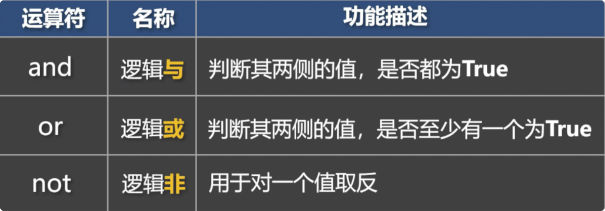

1️⃣**and 运算符**：用于判断其两侧的值，是否都为`True`

```python
print(True and True)   # True
print(True and False)  # False
print(False and True)  # False
print(False and False) # False

print(8 > 7 and 8 > 7) # True
print(8 > 7 and 2 > 3) # False
print(2 > 3 and 8 > 7) # False
print(2 > 3 and 2 > 3) # False
```

`and`具备“逻辑短路”能力，以下代码中包含`3/0`这种错误代码，但最终没有报错。

```python
print(False and 3 / 0)  # False
print(3 > 9 and 3 / 0)  # False
```

`and`返回的不一定是布尔值，它返回的是某个参与计算的值本身，`and`会先看左边，如果左边是“假”，就直接返回左边，否则返回右边；若参与`and`运算的值不是布尔值，那 Python 会自动转为布尔值，然后再进行逻辑操作。

```python
print(2 - 2 and True) # 0
print('' and True)
print(True and 8 / 2)  # 4.0
print(3 + 3 and 3 * 4) # 12
```

2️⃣**or 运算符**：用于判断其两侧，是否至少有一个为True（只要有一个是True，那就返回True）

```python
print(True or True)    # True
print(True or False)   # True
print(False or True)   # True
print(False or False)  # False

print(9 > 2 or 9 > 2)  # True
print(9 > 2 or 3 < 1)  # True
print(3 < 1 or 9 > 2)  # True
print(3 < 1 or 3 < 1)  # False
```

`or`同样具备“逻辑短路”的能力，以下代码中包含`3/0`这种错误代码，但最终没有报错。

```python
print(True or 3 / 0) # True
print(9 > 3 or 3 / 0) # True
```

`or`返回的也不一定是布尔值，它返回的是参与计算的值本身，`or`会先看左边，如果左边为“真”，就直接返回左边，否则返回右边；若参与`or`运算的值不是布尔值，那 Python 会自动转为布尔值，然后再进行逻辑操作。

```python
print(7 - 2 or False)    # 5
print('你好' or '尚硅谷') # 你好
print(False or 8 / 2)	 # 4.0
print(2 - 2 or 3 * 4)    # 12
```

3️⃣**not 运算符**：`not`用于取反，不过要注意：如果参与`not`运算的值不是布尔值，那 Python 会自动将其转为布尔值，然后再进行逻辑操作。

```python
print(not True)  # False
print(not False) # True
print(not 3 > 2) # False
print(not 3 < 2) # True
```

`not`返回的值，一定是布尔值！

```python
print(not 0) 	  # True
print(not 3 > 2)  # False
print(not 9 // 4) # False
print(not 'abc')  # False
```

## 进制
### 概述
进制是指：用多少个符号，来表示数值的一种『记数方式』。比如我们平时使用的『十进制』，就是用`0 ~ 9`这十个符号来表示所有的数，而计算机中存储和运算的数据，都是二进制，常见的进制与规则如下：

::: info
**二进制**：`0 ~ 1`，满`2`进`1`。

**八进制**：`0 ~ 7`，满`8`进`1`。

**十进制**：`0 ~ 9`，满`10`进`1`。

**十六进制**：`0 ~ 9`，`A-F`，满`16`进`1`。

:::

::: tip
**📋备注：** 在十六进制中，除了`0 ~ 9`这十个数字外，还引入了字母，以便表示超过`9`的值，字母`A`对应十进制的`10`，字母`B`对应十进制的`11`，同理字母 `C`、`D`、`E`、`F` 分别对应十进制的：`12`、`13`、`14`、`15`。

:::

各进制的表示如下图：


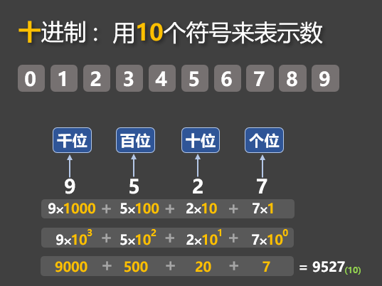
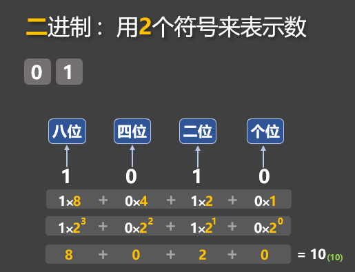


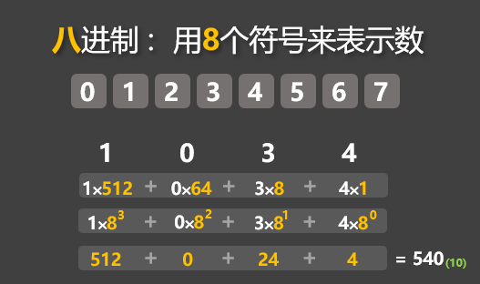
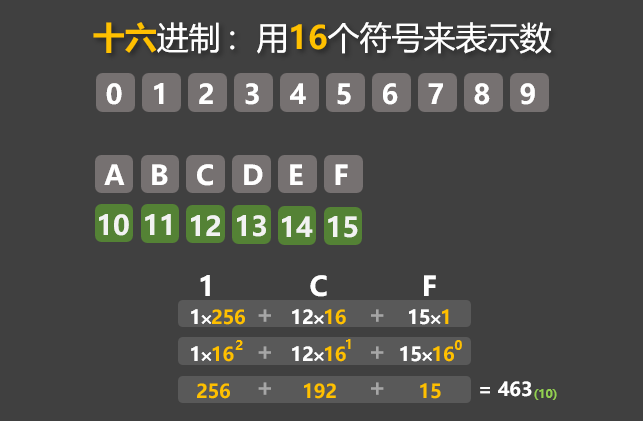

### **代码中如何表示不同进制**
在 Python 中，不同进制的数，有不同的前缀：

::: info
**二进制**：以`0b`或`0B`开头表示。

**八进制**：以`0o`开头表示

**十进制**：无需前缀，正常编写即可。

**十六进制**：以`0x`或`0X`开头表示，此处的`A-F`不区分大小写。

:::

```python
# 0b开头表示二进制
num1 = 0b11001
# 0o开头表示八进制
num2 = 0o1034
# 0x开头表示十六进制
num3 = 0x1cf
```

::: tip
**📋备注**：Python 中所有的『非十进制』数字，只是代码层面的编写方式，只是给程序员看的，Python 在进行：计算、打印等操作时，会自动将这些『非十进制』数字，转为『十进制』数字。

:::

```python
# 0b开头表示二进制
num1 = 0b11001
# 0o开头表示八进制
num2 = 0o1034
# 0x开头表示十六进制
num3 = 0x1cf

# Python 在对上面的 num1、num2、num3进行计算、打印等操作时，会自动将其转为十进制
print(num1, num2, num3)  # 25  540  463
print(num1 + 1)  # 26
print(str(num2)) # 540
print(num3 > 400) # True
```

### 不同进制之间的转换
1️⃣**手动转换**：使用连除法

::: info
十进制转二进制：不断用 2 去除这个数，直到商为 0，然后把每次的余数倒着写即可。

十进制转八进制：不断用 8 去除这个数，直到商为 0，然后把每次的余数倒着写即可。

十进制转十六进制：不断用 16 去除这个数，直到商为 0，把每次的余数倒着写，若余数 `≥ 10`，则依次用 `A`、`B`、`C`、`D`、`E`、`F` 表示 `10~15`。

:::


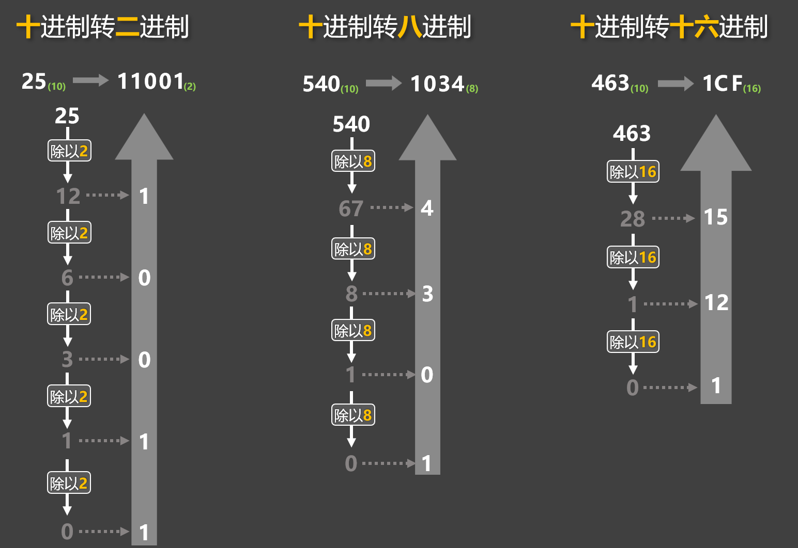

2️⃣借助 Python 提供的内置函数，实现进制转换


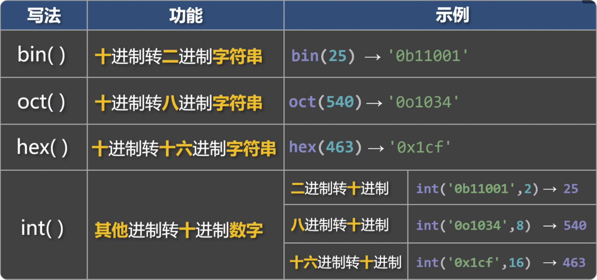

## 输入语句
在 Python 中，输入语句用于：从键盘接收用户输入的内容。

```python
# 使用input()获取用户的输入
name = input('请输入你的姓名：')
age = input('请输入你的年龄：')

# input()获取到的内容全都是字符串类型
print(type(age))
```

::: tip
**📋备注**：程序执行到 `input()` 时，会暂停等待用户的输入，用户输入后敲下回车，程序继续运行。

:::

`input()`所获取到的内容全都是字符串类型，不过我们可以手动进行数据类型转换。

```python
age = int(input('请输入你的年龄：'))
```
