# 第 4 章 流程控制语句
程序并不是简单的“从上到下”执行，很多时候，我们希望程序能根据不同的情况，做出不同的选择，比如：根据情况跳过某些代码，或者重复执行某些代码，那这时就需要用到『流程控制语句』，程序的执行流程大体上可分为三类：**顺序**、**分之**、**循环**。

::: tip
**📋备注**：其中顺序执行是最简单的，就是按照程序的编写顺序依次执行，所以我们不再探讨顺序执行。

:::

## 分之
+ 分支有很多其他的称呼，比如：条件控制语句、分支语句、选择语句。
+ 分之是通过条件判断，来决定执行哪些代码。

### 单分支
**1️⃣语法格式**：

```python
if 判断条件:
    条件【成立】时执行的代码1
    条件【成立】时执行的代码2
    ......
```

**2️⃣语法图解**：


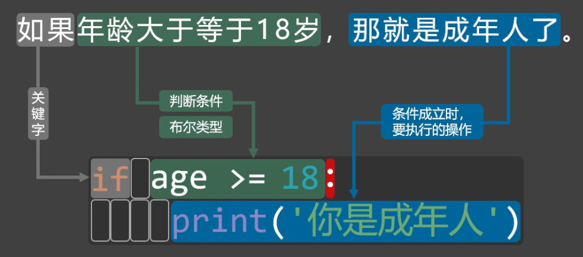

::: warning
⚠️**注意**：Python 靠代码缩进来识别代码范围，所以条件成立时要执行的代码前，必须加空格。

:::

**3️⃣示例代码**：

```python
age = int(input('请输入你的年龄：'))
if age >= 18:
    print('你是成年人')
    print('成年人的世界，虽不容易，但很精彩！')
print('欢迎你来学习Python！')
```

### 双分支
**1️⃣语法格式**：

```python
if 判断条件:
    条件【成立】时执行的代码1
    条件【成立】时执行的代码2
else:
    条件成【不成立】时执行的代码1
    条件成【不成立】时执行的代码2
```

**2️⃣语法图解**：


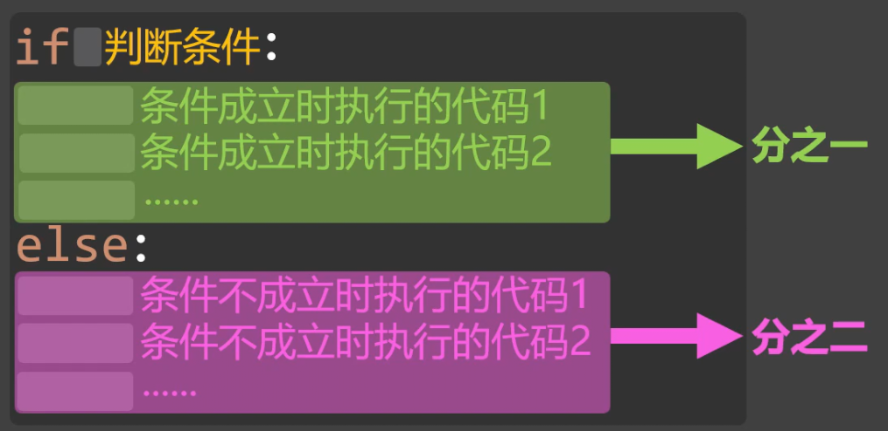

**3️⃣示例代码**：

```python
age = int(input('请输入你的年龄：'))
if age >= 18:
    print('你是成年人')
    print('成年人的世界，虽不容易，但很精彩！')
else:
    print('你是未成年人')
    print('好好加油，努力学习，未来可期！')
print('欢迎你来学习Python！')
```

### 多分支
**1️⃣语法格式**：

```python
if 判断条件1:
    条件1【成立】时执行的代码
elif 判断条件2:
    条件2【成立】时执行的代码
elif 判断条件3:
    条件3【成立】时执行的代码
else:  # else如不需要可以省略
    上述所有条件都不成立时执行的代码
```

**2️⃣语法图解**：


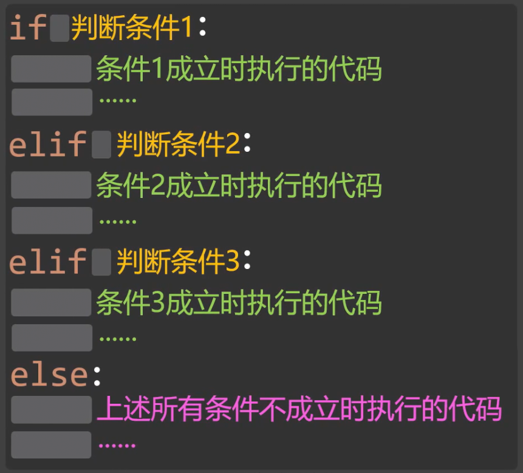

**3️⃣示例代码**：

```python
# 根据年龄来判断处于人生哪个阶段。
age = int(input('请输入你的年龄：'))
if age <= 10:
    print('你是幼儿')
elif age <= 18:
    print('你是青少年')
elif age <= 30:
    print('你是青年')
elif age <= 50:
    print('你是中年')
elif age <= 60:
    print('你是中老年')
else:
    print('你是老年')
```

使用多分支语句时，需要注意下面几点：

::: info
1. 一个`if`语句只能匹配`1`个`else`语句，但可以匹配多个`elif`语句，并且`else`语句要在所有的`elif`语句之后。
2. 一旦某个分支语句检测为`true`，其他的`elif`以及`else`语句都将不再执行。

:::

### 嵌套分之
**1️⃣语法格式**：

```python
if 判断条件1:
    # 条件1 成立时执行的代码1
    # 条件1 成立时执行的代码2
    # ......
    if 判断条件2:
        # 条件2 成立时执行的代码1
        # 条件2 成立时执行的代码2
        # ......
    elif 判断条件3:
        # 条件3 成立时执行的代码
        # ......
    else:
        # 条件2、条件3 都不成立时执行的代码1
        # 条件2、条件3 都不成立时执行的代码2
        # ......
else:
    # 条件1 不成立时执行的代码1
    # 条件1 不成立时执行的代码2
    # ......
    if 判断条件4:
        # 条件4 成立时执行的代码
        # ......
    else:
        # 条件4 不成立时执行的代码
        # ......
```

**2️⃣语法图解**：


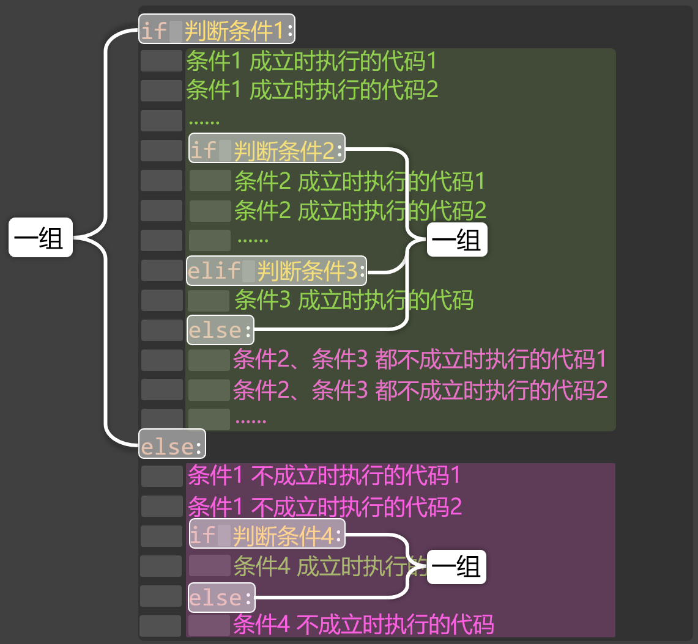

**3️⃣案例**：


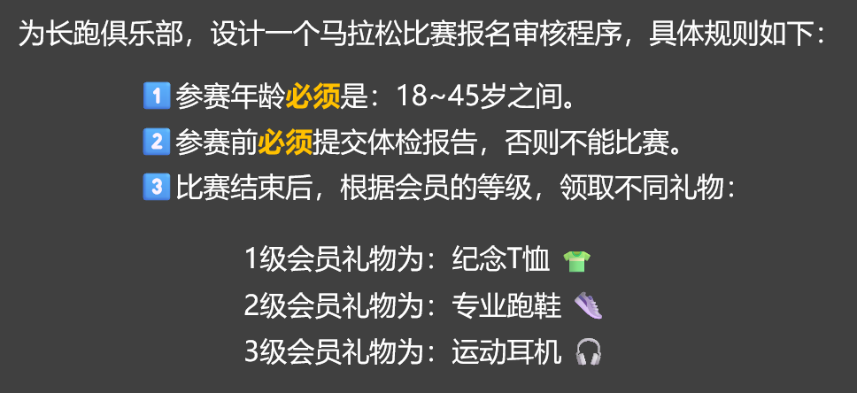

```python
age = int(input('请输入你的年龄：'))
has_report = input('您是否提交了体检报告？（是/否）')
level = int(input('请输入你的会员等级（1/2/3）'))

print('******⬇️程序的识别结果如下⬇️：******')
if 18 <= age <= 45:
    print('✅️您的年龄符合比赛要求！')
    if has_report == '是':
        print('✅️您已提交体检报告！')
        print('✅️您可以参加比赛！')
        if level == 1:
            print(f'😊尊敬的{level}会员，比赛结束后，您可以领取纪念T恤👕一件！')
        elif level == 2:
            print(f'😊尊敬的{level}会员，比赛结束后，您可以领取专业跑鞋👟一双！')
        elif level == 3:
            print(f'😊尊敬的{level}会员，比赛结束后，您可以领取运动耳机🎧️一副！')
        else:
            print('❌您输入的会员等级不正确！')
    elif has_report == '否':
        print('❌您未提交体检报告，不能参加比赛！')
    else:
        print('❌您输入的体检报告有误！')
else:
    print('❌抱歉，参赛年龄需要在18~45之间！')
```

## 循环
循环是一种让代码“重复执行”的机制，当某个条件成立时，程序会反复执行一些语句，直到条件不再满足时，再停止运行。

### while 循环
**1️⃣语法格式**：

```python
while 循环条件:
    条件成立时执行的操作1
    条件成立时执行的操作2
```

**2️⃣循环逻辑**：

::: tip
1. 先判断循环条件是否成立（是否为 `True`）
2. 如果成立 → 执行循环中的代码
3. 执行完循环体 → 再次判断循环条件
4. 若仍成立 → 继续执行循环中的代码
5. 若不成立 → 循环结束

:::

**3️⃣代码示例**：

```python
n = 1
while n <= 10:
    print(f'第{n}次你好啊')
    n += 1
print(f'我是while循环以外的代码，执行到这里时，循环已经结束了，此时的n是：{n}')
```

::: warning
📢**注意**：如果条件一直成立，就是无限循环（死循环）。例如上述代码中，如果忘记编写`n += 1`就会产生死循环。

:::

**4️⃣案例**：


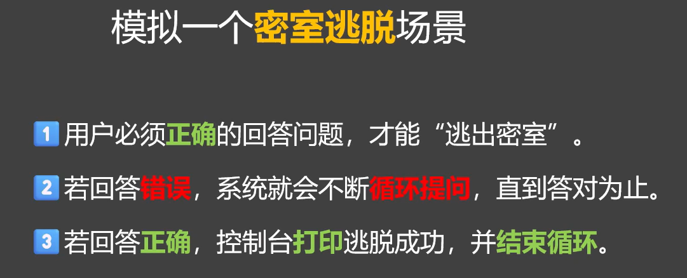

```python
print('😦您现在身处密室，需要正确回答问题之后，才能逃出密室！')
riddle = '你是什么人？'
answer = '你的心上人'
guess = ''

while guess != answer:
    print(f'问题：{riddle}')
    guess = input('请输入答案：')
    if guess == answer:
        print('✅️答案正确，逃脱成功！')
    else:
        print('❌️回答错误，请再想想！')
```

### for 循环
**1️⃣语法格式**：

```python
for 临时变量 in 可迭代对象：
    要执行的操作1
    要执行的操作2
```

::: info
**💡什么叫『可迭代对象』？**

比如我们有一个盒子，里面装着：苹果、香蕉、橙子。我们可以一个接一个地把水果取出来，那这个盒子，就相当于 Python 中的可迭代对象。每次 for 循环执行时，其实就是在“取出一个水果”，目前我们还没学到“类”和“对象”，先记住一句话： 能一个个取出来的，就是可迭代的。

:::

**2️⃣循环逻辑**：

::: tip
1. 从可迭代对象中取出第一个元素 → 赋值给临时变量
2. 执行循环中的代码
3. 取出下一个元素 → 重复执行
4. 当所有元素取完后 → 循环结束

:::

**3️⃣代码示例**：

```python
# 使用for循环遍历range()所指定的数字范围
n = 0
for n in range(1, 11):
    print(f'第{n}次你好啊')
print(f'我是for循环以外的代码，执行到这里时，循环已经结束了，此时的n是：{n}')

# 使用for循环遍历字符串
for m in 'abcdef':
    print(m)

# 演示由于误操作造成的死循环（下面代码中，用到了列表，我们后面会讲解）
# 备注：for循环还能遍历很多我们没有讲到的东西，比如：元组、列表、对象......
nums = [1,2,3]
for i in nums:
    # nums.append(4) # 此行代码会造成死循环
    print(i)
```

::: info
以上代码中的：`range(1, 11)`、`'abcdef'`、`[1,2,3]`这些都是可迭代对象，我们后面还会遇到很多可迭代对象。

:::

**4️⃣案例**：实现一个字符串加密程序，大致思路如下图：


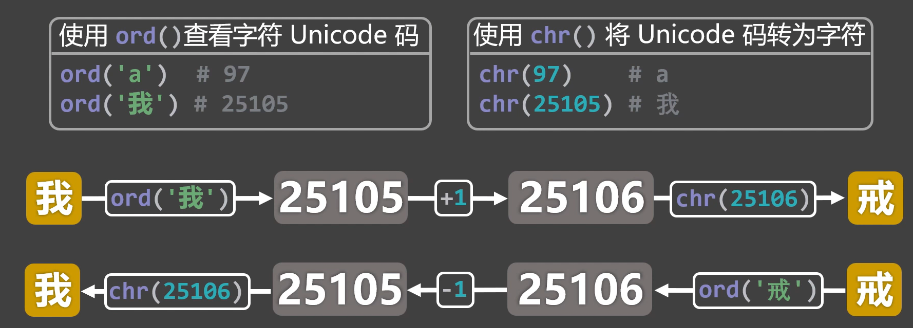

```python
# 加密代码
text = input('📝请输入要加密的文字：')
secret = ''
for t in text:
    secret += chr(ord(t) + 1)
print(f'㊙️经过加密后的内容为：{secret}')

# 解密代码
secret = input('📝请输入要解密的文字：')
text = ''
for s in secret:
    text += chr(ord(s) - 1)
print(f'📃经过解密后的内容为：{text}')
```

### 对比 while 与 for

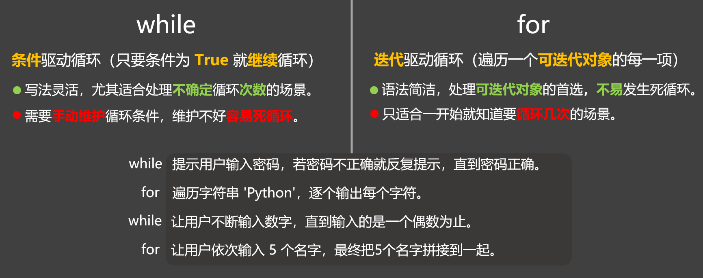

### 嵌套循环
**1️⃣概念**：在一个循环的内部，再写一个或多个循环，就是嵌套循环。

**2️⃣案例**：实现一个为期 30 天的健身计划，效果如图：


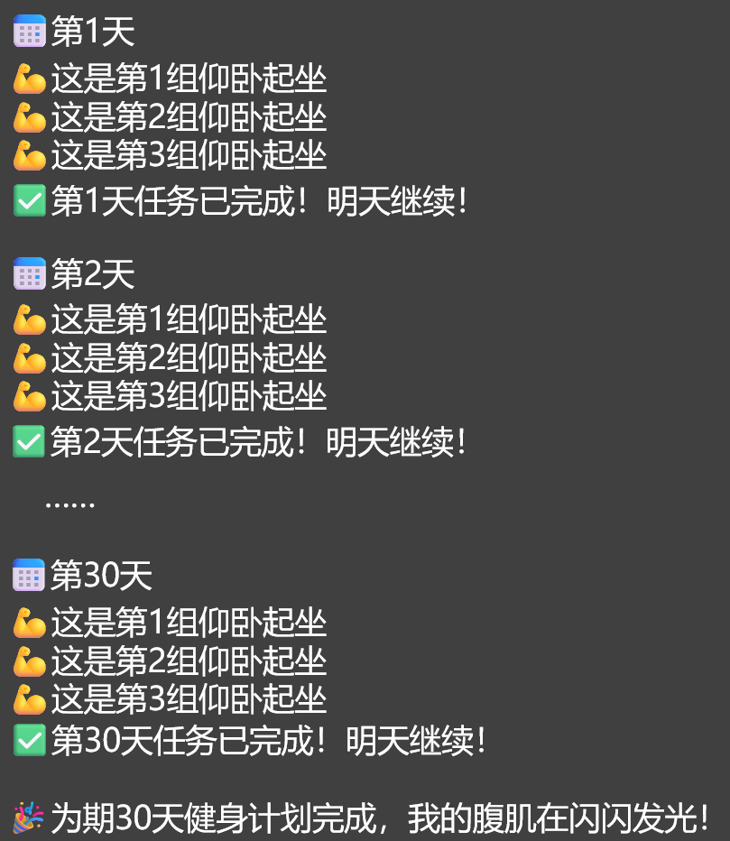

```python
# for循环实现
day = 1
for day in range(1,31):
    print(f'********📅第{day}天********')
    for group in range(1,4):
        print(f'💪这是第{group}组仰卧起坐')
    print(f'✅第{day}天任务已完成！明天继续！\n')
print(f'🎉为期{day}天的健身计划完成，我的腹肌在闪闪发光！')
```

```python
# while循环实现
day = 1
while day <= 30:
    print(f'********📅第{day}天********')
    group = 1
    while group <= 3:
        print(f'💪这是第{group}组仰卧起坐')
        group += 1
    print(f'✅第{day}天任务已完成！明天继续！\n')
    day += 1
print(f'🎉为期{day - 1}天的健身计划完成，我的腹肌在闪闪发光！')
```

### 九九乘法表案例
案例效果如图：


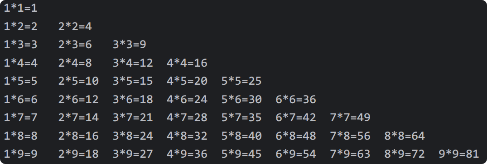

::: tip
💡`print('你好', end='')` 中的`end`用来控制打印后结尾输出的内容。

:::

```python
# 前序知识
print('你好', end='')
print('尚硅谷', end='')
```

```python
# for循环实现九九乘法表
for row in range(1, 10):
    for item in range(1, row + 1):
        print(f'{item}*{row}={item * row}', end='\t')
    print()
```

### continue 与 break
`continue`和`break`都可用于循环语句中（`while`循环、`for`循环都可以）它们的作用分别是：

+ `continue`：跳过本次循环剩余语句，直接进入下一次循环判断。
+ `break`：立即终止循环，不再执行后续循环。

1️⃣**测试**`continue`

> 建议参考视频教程中对下方代码的分析与讲解：
>

```python
# 测试continue
for day in range(1, 5):
    print(f'********第{day}天********')
    print('吃饭')
    continue
    print('睡觉')

for day in range(1, 5):
    print(f'********第{day}天********')
    print('吃饭')
    if day == 2:
        continue
    print('睡觉')

for day in range(1, 5):
    if day == 2:
        continue
    print(f'********第{day}天********')
    print('吃饭')
    print('睡觉')

for day in range(1, 5):
    print(f'********第{day}天********')
    print('吃饭')
    for item in range(1, 3):
        print(f'面包{item}')
        continue
        print(f'牛奶{item}')
    print('睡觉')

for day in range(1, 5):
    print(f'********第{day}天********')
    print('吃饭')
    for item in range(1, 3):
        print(f'面包{item}')
        if day == 4 and item == 2:
            continue
        print(f'牛奶{item}')
    print('睡觉')
```

**2️⃣测试**`break`

> 建议参考视频教程中对下方代码的分析与讲解：
>

```python
for day in range(1, 5):
    print(f'********第{day}天********')
    print('吃饭')
    break
    print('睡觉')

for day in range(1, 5):
    print(f'********第{day}天********')
    print('吃饭')
    if day == 2:
        break
    print('睡觉')

for day in range(1, 5):
    if day == 2:
        break
    print(f'********第{day}天********')
    print('吃饭')
    print('睡觉')

for day in range(1, 5):
    print(f'********第{day}天********')
    print('吃饭')
    for item in range(1,3):
        print(f'面包{item}')
        if day == 4 and item == 2:
            break
        print(f'牛奶{item}')
    print('睡觉')
```

### 综合案例

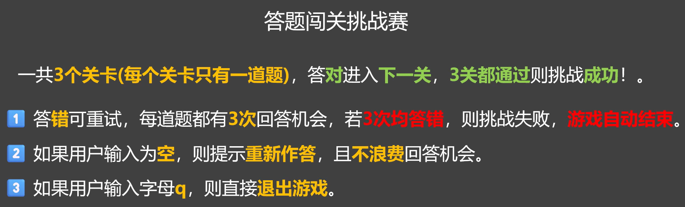

```python
print('🏆欢迎来到：答题闯关挑战赛（输入q可随时退出）\n')

# 题目与答案
ques1, ans1 = 'Python中用于输出的函数是？', 'print'
ques2, ans2 = 'Python中用于表示逻辑“并且”的关键字是？', 'and'
ques3, ans3 = 'Python属于编译型还是解释型？', '解释型'

# 最多可尝试次数
max_tries = 3
# 总关卡数
total_levels = 3
# 是否处于可游戏状态
is_playing = True

# 根据题目数量开始循环
for level in range(1, total_levels + 1):
    # 打印当前是第几关
    print(f'********🎯第{level}关********')
    # 取出当前关卡所对应的题目和答案
    if level == 1:
        question, answer = ques1, ans1
    elif level == 2:
        question, answer = ques2, ans2
    else:
        question, answer = ques3, ans3
    # 记录当前关卡的尝试次数
    tries = 1
    # 若已经尝试的次数，小于等于最大尝试次数，则进入循环
    while tries <= max_tries:
        # 向用户提问
        user_input = input('📢'+question)
        # 根据用户的输入，来决定做什么
        if user_input == answer:
            print('✅回答正确！\n')
            break
        elif user_input == '':
            print('⚠️您的输入为空，请重新作答！\n')
            continue
        elif user_input == 'q':
            print('👋您已退出游戏！\n')
            is_playing = False
            break
        else:
            # 计算剩余次数
            leave = max_tries - tries
            # 判断是否还有剩余次数
            if leave > 0:
                print(f'❌回答错误，您还剩{leave}次机会！\n')
                tries += 1
                continue
            else:
                print(f'😢挑战失败，本题的正确答案是：{answer}，游戏结束！')
                is_playing = False
                break
    # 每次进入下一关之前，都要看一下is_playing，如果is_playing为False就要结束游戏！
    if not is_playing:
        break
# 如果到了这里，is_playing的值依然为True，那就意味着用户已经通关了！
if is_playing:
    print('🎉🎉🎉恭喜您！全部通关！🎉🎉🎉')
```
