# 第 5 章 函数入门
## 概念及分类
### 函数的概念
函数（function）是：**组织好**的、可**重复使用**的、用于执行**特定任务**的代码块。

::: info
🌰举个生活中的例子：

+ 函数就像是智能家居中的一个场景，我们提前配置好场景中要执行的操作，等需要时，直接呼唤场景的名字，场景中的操作就会开始执行。
+ Python 中的函数是一段有名字的代码块，我们提前编写好函数中要执行的代码，等需要时，调用函数，函数中的代码就会执行。


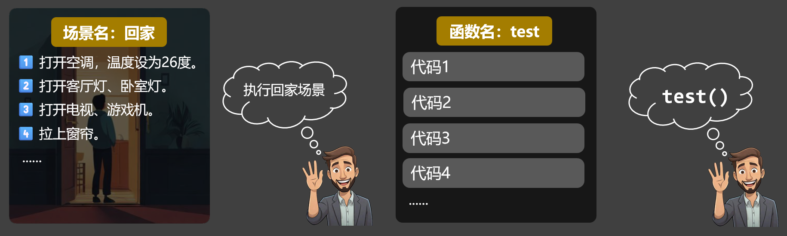

:::

使用函数的主要优势：


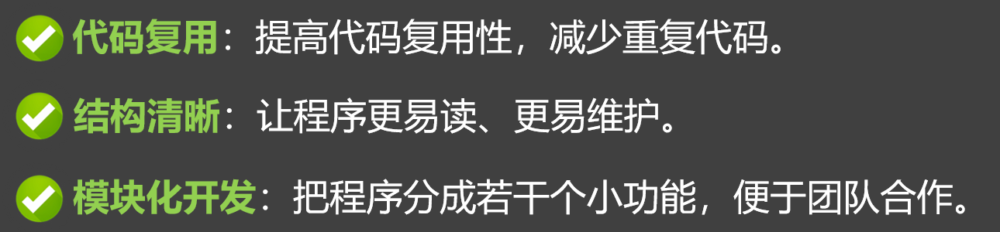

### **Python 中函数的分类**
Python 中函数分为三类：①内置函数、②模块提供的函数、③自定义函数。


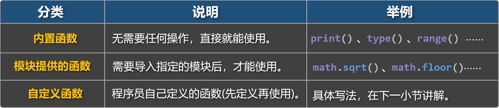

> **相关官方文档**：
>
> 内置函数：[https://docs.python.org/zh-cn/3.13/library/functions.html](https://docs.python.org/zh-cn/3.13/library/functions.html)
>
> 模块提供的函数：[https://docs.python.org/zh-cn/3.13/py-modindex.html](https://docs.python.org/zh-cn/3.13/py-modindex.html)
>

::: tip
**📋备注**：

1. 内置函数与模块提供的函数， Python 都已经提前定义完毕，我们只管调用即可。
2. 本章主要讲解自定义函数，对于内置函数和模块提供的函数，后面用到哪个讲哪个。

:::

## 基本使用
### 定义函数
**1️⃣语法格式**：

> 如下语法格式是函数的基本定义，不涉及：接收参数和返回值。
>

```python
def 函数名():
    函数体
    函数体
```

**2️⃣语法图解**：


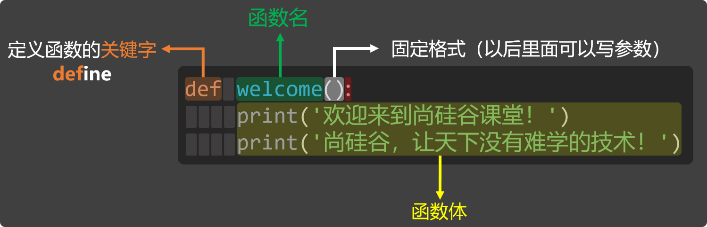

3️⃣**说明**：

::: info
+ 定义函数的关键字是`def`，需要将`def`与函数名用空格隔开，随后紧跟`():`。
+ 函数的命名遵循我们之前讲过的『标识符命名规范』。
+ 函数定义完毕后，只是告诉 Python 我们定义了一个函数，可以完成某些功能，但此时函数体还没有执行，需要调用函数后，函数体才会执行！

:::

4️⃣**示例代码**：定义一个名为 `welcome` 的函数，函数体中打印两句欢迎语。

```python
# 定义函数
def welcome():
    print('欢迎来到尚硅谷课堂！')
    print('尚硅谷，让天下没有难学的技术！')
```

### 调用函数
**1️⃣语法格式**：

> 如下语法格式是基本调用形式，不涉及：传递参数。
>

```python
函数名()
```

**2️⃣语法图解**：


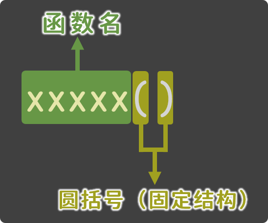

**3️⃣示例代码**：编写代码，调用我们刚才定义的`welcome`函数。

```python
# 定义函数
def welcome():
    print('欢迎来到尚硅谷课堂！')
    print('尚硅谷，让天下没有难学的技术！')

# 调用函数（让函数中的代码运行起来）
welcome()
welcome()
welcome()
```

::: warning
**⚠️注意**：函数必须先定义再调用。

:::

## 参数
### 参数的作用
参数可以让函数接收外部传入的数据，能让函数更具通用性和灵活性，比如下面的这个需求：

::: info
**📒需求**：定义一个名为`order`的函数，在函数体中打印用户的点餐信息。

:::

用如下代码实现，就会面临两个问题：**①**每次的点餐数量只能是一份。**②**每次点的菜品只能是辣椒炒肉。

```python
# 定义函数
def order():
    num = 1
    dish = '辣椒炒肉'
    print(f'您点的是：{num}份 {dish}')

# 调用函数
order()
```

但如果在上述代码的基础上，使用参数，就可以灵活修改点餐数量和菜品，写法如下：

```python
# 定义函数（定义的同时：声明需要两个参数，分别是：菜品数量 num，和菜品名称 dish）
def order(num, dish):
    print(f'您点的是：{num}份 {dish}')
    print(f'{dish}可是很好吃的！')
    print(f'你只点了{num}份，够吃吗？\n')

# 调用函数（调用的同时：传递了两个值）
order(1, '辣椒炒肉')
order(2, '辣子鸡')
```

### 实参与形参
在使用函数时，要注意区分『形参』与『实参』。

+ **形参（形式参数）**：在定义函数时，用来接收数据的变量叫形参，形参是函数定义者设置的。
+ **实参（实际参数）**：在调用函数时，给函数传递的具体值叫实参，实参是函数调用者提供的。


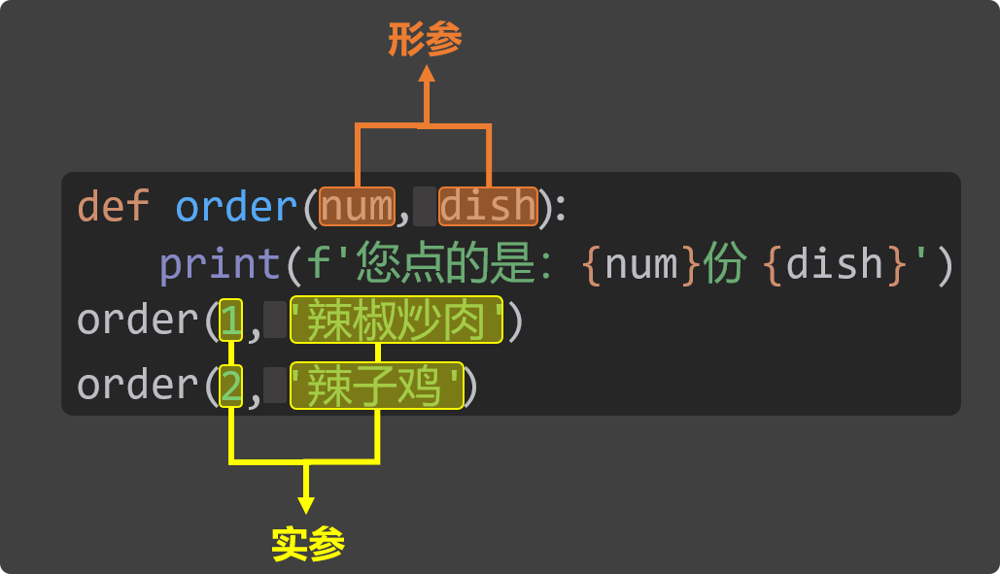

::: tip
**📋备注**：形参存储的到底是什么数据，要看调用者传递的实参具体是什么。

:::

::: warning
📢**注意**：形参的使用范围仅限函数体内。

:::

### 位置参数
**位置参数**：调用函数时，根据参数在函数定义时出现的顺序，把实参的值，依次传递给对应的形参。

::: info
例如在上一小节所写的`order`函数，就是在使用位置参数，其中形参与实参的对应关系如下图：


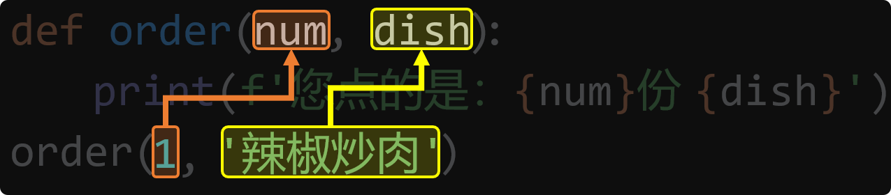

:::

::: warning
📢**注意**：在使用『位置参数』时，实参的个数与顺序，必须和形参保持一致！

:::

```python
def order(num, dish):
    print(f'您点的是：{num}份 {dish}')
    print(f'{dish}可是很好吃的！')
    print(f'你只点了{num}份，够吃吗？\n')

# 以下是错误示范
order(3)  # 参数少了
order(4, '宫保鸡丁', 7)  # 参数多了
order('宫保鸡丁', 4)  # 实参顺序没有和形参保持一致，不会报错，但会造成数据错乱。
```

### 关键字参数
**关键字参数**：函数调用时通过`形参名 = 值`的形式传递的参数，就是关键字参数。

关键字参数的优势是：不受顺序限制。

```python
# 定义函数
def greet(name, gender, age, height):
    print(f'我叫{name}，性别{gender}，年龄是{age}，身高是{height}cm')

# 调用函数（使用关键字参数）
greet(name='张三', gender='男', age=18, height=172)
greet(height=172, age = 18, gender='男', name='张三')
```

::: warning
📢**注意**：『位置参数』和『关键字参数』可以混用，但『位置参数』必须写在『关键字参数』之前！

:::

```python
# 正确使用方式
greet('张三', '男', height=172, age=18)

# 错误示例
greet(height=172, age=18, '张三', '男')
greet(name='张三', '男', 18, 172)
greet(name='张三', '男', age=18, 172)
greet(height=172, age=18, gender='男', name='张三', age=19)
greet(height=172, age=18, gender='男', name='张三', school='尚硅谷')
```

### 限制传参方式
**具体限制方式**：`/`前面只能用『位置参数』，`*`后面只能用『关键字参数』**。**

```python
# 定义函数（使用/和*限制传参方式）
def greet(name, /, gender, *, age, height):
    print(f'我叫{name}，性别{gender}，年龄是{age}，身高是{height}cm')

# 正确示例
greet('张三', '男', age=18, height=172)
greet('张三', gender='男', age=18, height=172)

# 错误示例
greet(name='张三', gender='男', age=18, height=172)
greet('张三', '男', 18, height=172)
```

### 参数默认值
在定义函数时，可以通过`形参名 = 值`的形式，为形参设置一个默认值，这样就可以实现：

+ 若调用函数时**没有传入**该参数的值，就使用默认值。
+ 若调用函数时**传入了**该参数的值，就使用传入的值。

```python
# 定义函数（设置参数默认值）
def greet(name, gender, age, height, msg='你好'):
    print(f'我叫{name}，性别{gender}，年龄是{age}，身高是{height}cm')
    print(f'我想说：{msg}')

# 调用函数
greet('张三', '男', 18, 172)
greet('张三', '男', 18, 172, 'hello')
greet('张三', '男', 18, 172, msg='hello')
```

::: warning
📢**注意**：定义函数时，『默认参数』必须放在『必选参数』的后面，或者换一种说法就是：某个形参，一旦设置了默认值，那它后面的所有形参，也必须要写默认值！

:::

例如：下面的代码中，`msg='你好'`这个默认参数，居然写在了位置参数`height`前面，所以就会报错。

```python
# 定义函数（设置参数默认值的错误示例）
def greet(name, gender, age,  msg='你好', height):
    print(f'我叫{name}，性别{gender}，年龄是{age}，身高是{height}cm')
    print(f'我想说：{msg}')
```

### 可变参数
在定义函数时，如果不确定会传入多少个参数，那就可以使用可变参数，具体写法有两种：

+ 使用`*形参名`来接收任意数量的『位置参数』，多个位置参数最终会被打包成一个『元组』。
+ 使用`**形参名`来接收任意数量的『关键字参数』，多个关键字参数最终会被打包成一个『字典』。

::: tip
**📋备注**：元组和字典都是新的数据类型，后面才会讲，但没关系，这不耽误大家理解本小节的内容。

:::

```python
# 定义函数（使用*args去接收：可变位置参数，args只是大家习惯这么写，当然也可以换成其他变量）
def test1(*args):
    # 此处args的值，是一种新的数据类型，叫：元组，我们下一章就去讲元组
    print(args)

# 调用函数
test1('张三', '男', 18, 172)
```

```python
# 定义函数（使用**kwargs去接收：可变关键字参数，kwargs只是大家习惯这么写，当然也可以换成其他变量）
def test2(**kwargs):
    # 此处kwargs的值，是一种新的数据类型，叫：字典，我们下一章就去讲字典
    print(kwargs)

# 调用函数
test2(name='张三', gender='男', age=18, height=172)
```

💡『可变位置参数』和『可变关键字参数』，可以同时使用，但必须要**先写**『**可变位置参数**』。

```python
# 定义函数（同时使用：可变位置参数、可变关键字参数）
def test3(a, b, *args, c='尚硅谷', **kwargs):
    print(a)
    print(b)
    print(c)
    print(args)
    print(kwargs)
# 调用函数
test3('张三', '男', '抽烟', '喝酒', age=18, height=172)
```

### 特殊的字面量 None
None 是一个特殊的字面量，用来表示：空值、无值、无意义。

例如：`msg = None` 的含义是 —— 我先定义一个变量 `msg`，但目前还不知道它会存储什么类型的值，那能不能写成 `msg = 0` 呢？这要看具体情况：

::: info
+ 如果确定 `msg` 之后会存放数值类型的数据，那这样写是可以的。
+ 但如果还不确定 `msg` 将来会存放什么类型的数据，最好不要写成 `msg = 0`，否则可能会误导别人以为它一定是数值类型。

:::

所以使用 None 更加中立、开放，因为它不暗示变量的类型。

> None 的官方文档：[https://docs.python.org/zh-cn/3.13/library/constants.html#None](https://docs.python.org/zh-cn/3.13/library/constants.html#None)
>

::: info
**💡几个关键点**：

1. `None`的类型是`NoneType`。
2. `None`出现在布尔判断中(`if`判断条件、`while`循环条件)，会被当作`False`来处理。
3. `None`不能参与任何数学运算，也不能与字符串拼接。
4. 不给函数设置返回值，那函数默认就会返回`None`

:::

`None`出现最多的两个场景：

::: info
1️⃣函数中没有写`return`，或写了`return`但没有返回任何内容  。

2️⃣变量定义时，暂时还不知道要存放什么，可以先赋值为`None`。

:::

```python
# None是一个特殊的字面量，它表示：空值 / 无值 / 无意义。
msg = None

# None 的类型是 NoneType。
print(type(msg))

# None 转为布尔值是 False。
print(bool(msg))
if not msg:
    print('你好')

# 不能参与数学运算，也不能与字符串拼接。
# result1 = msg + 1
# result1 = msg + 'hello'
```

## 返回值
### 什么是返回值
**函数返回值**：函数执行完毕后，会把执行结果交给调用者，这个执行结果就是函数的返回值。

我们之前用过的这些内置函数，都有返回值：


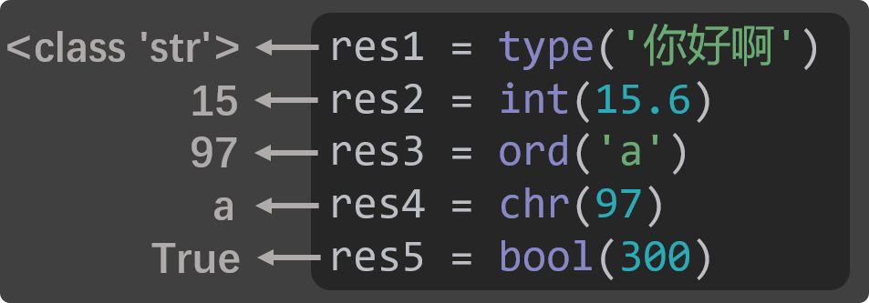

对于自定义的函数，即便我们不去设置返回值，函数也会默认返回`None`，由于`None`表示空，所以如果一个函数的返回值是`None`的话，就也可以说：这个函数“没有”返回值。

```python
# 定义函数
def add(n1, n2):
    print(f'我收到了：{n1}、{n2}，二者相加是：{n1 + n2}')
    print('add函数执行完毕了')

# 调用函数
result = add(100, 200)
print(result)  # None
```

### 如何设置返回值
使用`return`关键字可以设置函数的返回值，`return`的作用有两个，分别是：

1. 结束函数的运行。
2. 把`return`后面的值，作为函数的返回值。

```python
# 定义函数
def add(n1, n2):
    print(f'我收到了：{n1}、{n2}，二者相加是：{n1 + n2}')
    print('add函数执行完毕了')
    return n1 + n2

# 调用函数
result = add(100, 200)
print(result)

# print函数是没有返回值的
res = print('hello')
print(res)
```

## 全局作用域 VS 局部作用域
### 什么是作用域？
作用域就是变量能**起作用的范围**（变量在哪里能用，在哪里不能用），Python 中有多种作用域，我们先来学习：全局作用域、局部作用域。

### 全局作用域 _ 全局变量
1. **全局作用域**：整个`.py`文件最外层的范围，就是全局作用域。
2. **全局变量**：写在全局作用域中的变量，就叫：全局变量，全局变量在整个程序中都可以访问。


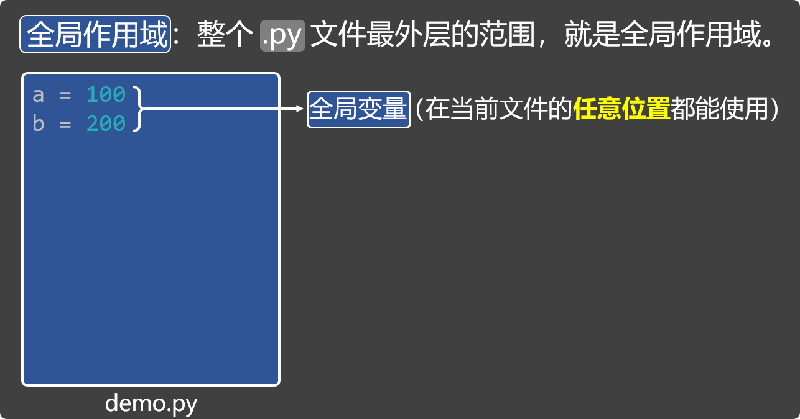

### 局部作用域 _ 局部变量
1. **局部作用域**：函数的内部范围，就是局部作用域。
2. **局部变量**：写在局部作用域中（函数内部）的变量，叫：局部变量，它只能在当前函数中使用。


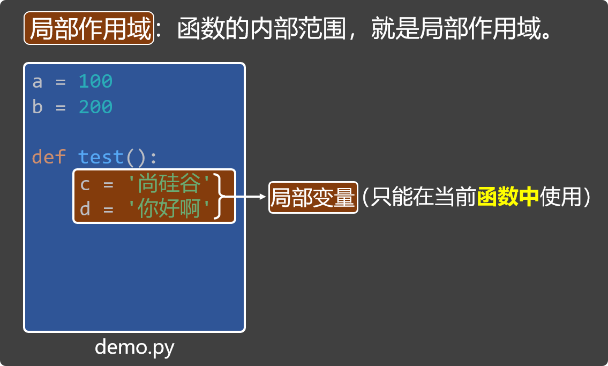

### global 关键字
在函数内部使用`global`关键字，可以声明变量为全局变量。

```python
a = 100

def test():
    global a  # 使用 global 关键字，将a声明为全局变量。
    a = 300
    print('函数中的打印（a）', a)
test()
print('全局的打印（a）', a)
```

### 小测试
请说出如下代码的输出结果（具体分析请参考视频教程）

```python
# 全局作用域 与 局部作用域，以及global的使用
a = 100
b = 200

def test():
    c = '尚硅谷'
    d = '你好啊'
    global a
    a = 300
    print('函数中的打印（a）', a)
    print('函数中的打印（b）', b)
    print('函数中的打印（c）', c)
    print('函数中的打印（d）', d)
test()
print('***************')
print('全局的打印（a）', a)
print('全局的打印（b）', b)
print(c)
print(d)


# 局部作用域 和 局部变量，会在函数调用时创建，在函数执行结束后自动销毁
def test2():
    m = 100
    m += 1
    print(f'我是test2函数中打印的m：{m}')
test2()
test2()
test2()


# 全局作用域 与 全局变量，会在程序开始时创建，在程序结束后销毁
n = 100
def test3():
    global n
    n += 1
    print(f'我是test3函数中打印的n：{n}')
test3()
test3()
test3()
print(n)
```

## 嵌套调用
**嵌套调用**：在一个函数执行的过程中，调用了另外一个函数，例如下面的代码：

> 如下代码的具体分析过程，请参考视频教程。
>

```python
# 函数嵌套调用测试1
def greet(name, msg):
    print(f'我叫{name}，我想说的话在下面：')
    speak(msg)
    print('嗯，我想说的结束了')

def speak(msg):
    print('----------')
    print(msg)
    print('----------')

greet('张三', '你好啊')

# 函数嵌套调用测试2
def test1():
    print('进入 test1 函数')
    test2()
    print('退出 test1 函数')

def test2():
    print('进入 test2 函数')
    test3()
    print('退出 test2 函数')

def test3():
    print('进入 test3 函数')
    print('***正在执行 test3 函数')
    print('退出 test3 函数')

test1()
```

## 递归调用
1️⃣递归调用：函数自己调用自己的一种操作。

```python
def welcome():
    print("你好啊！")
    welcome() # welcome 函数内部在调用自己

welcome()
```

::: warning
📢**警告**：上述代码确实是递归调用，但会出现死循环！

:::

2️⃣递归必须要具备终止条件（不能无限的一直调用，总得有停下来的时候。）

> 如下代码使用递归调用的方式，输出了 10 次“你好啊！”
>

```python
# 使用递归打印n次“你好啊”（从大到小）
def welcome(n):
    print(f'你好啊{n}')
    if n > 1:
        welcome(n - 1)
# 调用函数
welcome(5)

# 使用递归打印n次“你好啊”（从小到大）
def welcome(n):
    if n > 1:
        welcome(n - 1)
    print(f'你好啊{n}')
# 调用函数
welcome(5)
```

3️⃣**递归的应用**：使用递归完成一个数的阶乘

> 如下代码的具体分析过程，请参考视频教程。
>

```python
# 使用递归求阶乘
def factorial(num):
    if num == 0:
        return 1
    else:
        return num * factorial(num - 1)
# 调用函数，求5的阶乘
result = factorial(6)
print(result)
```

## 函数说明文档
**函数说明文档**：写在函数里的文字说明，用来描述：函数的功能、需要哪些参数、返回什么结果，它的语法和普通字符串一样，用三引号包裹：

```python
def add(n1, n2):
    """
    计算两个数相加的结果
    :param n1:第一个数
    :param n2:第二个数
    :return:二者相加的结果
    """
    return n1 + n2

result = add(1, 2)
```

有了函数说明文档之后，可以通过鼠标悬浮的方式，查看函数的具体信息，如下图：


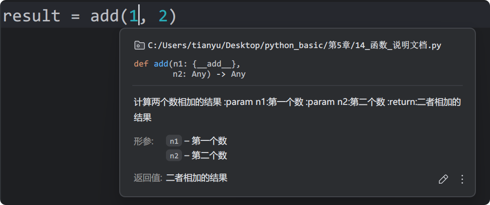

## 函数综合案例
完成一个健身挑战赛程序，功能演示见下图：


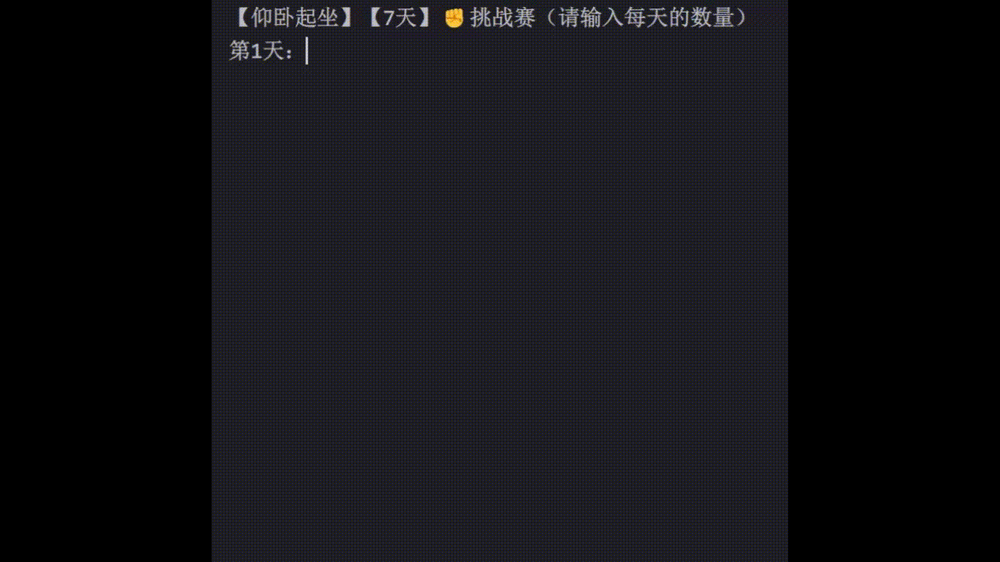

具体实现代码如下：

> 如下代码的具体分析过程，请参考视频教程。
>

```python
def calc_total(*nums):
    """
    计算总运动量（个）
    :param nums: 每一天的运动量（可变参数）
    :return: 总运动量（个）
    """
    # 备注：nums的类型是元组（下一章马上就讲了），sum是内置函数，可以对元组中的数据求和
    return sum(nums)

def calc_avg(total, days=7):
    """
    计算平均值
    :param total: 总运动量（个）
    :param days: 天数（默认值是7）
    :return: 平均值
    """
    return total / days

def check_success(total, goal=120):
    """
    判断本次挑战是否成功
    :param total: 总运动量
    :param goal: 成功数量（默认值为120）
    :return: 成功或失败的具体信息
    """
    if total >= goal:
        return '✅恭喜！挑战成功！'
    else:
        return '❌抱歉！挑战失败！'

def main(title, duration, goal):
    """
    主函数，用于开始一场挑战赛
    :param title: 比赛标题
    :param duration: 比赛持续天数
    :param goal: 目标运动量
    :return: None
    """
    print(f'【{title}】【{duration}天】✊️挑战赛（请输入每天的数量）')
    num1 = int(input('第1天：'))
    num2 = int(input('第2天：'))
    num3 = int(input('第3天：'))
    # 计算总数
    total = calc_total(num1, num2, num3)
    # 计算平均值
    avg = calc_avg(total, duration)
    # 判断挑战是否成功
    result = check_success(total, goal)
    # 打印相关信息
    print(f'【{title}】【{duration}天】健身总结')
    print(f'总数：{total}，平均值：{avg:.1f}')
    print(result)

main('俯卧撑', 3, 40)
```
