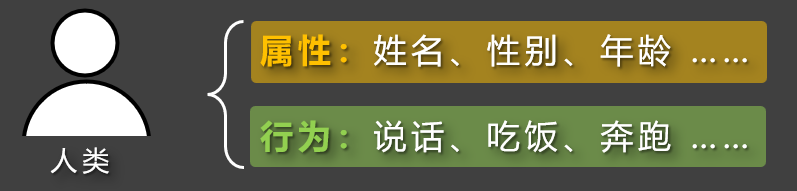
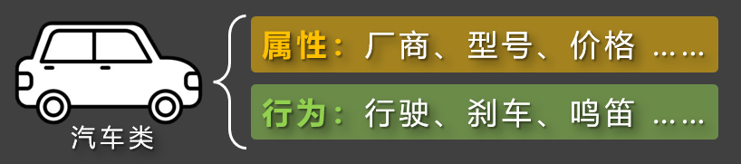
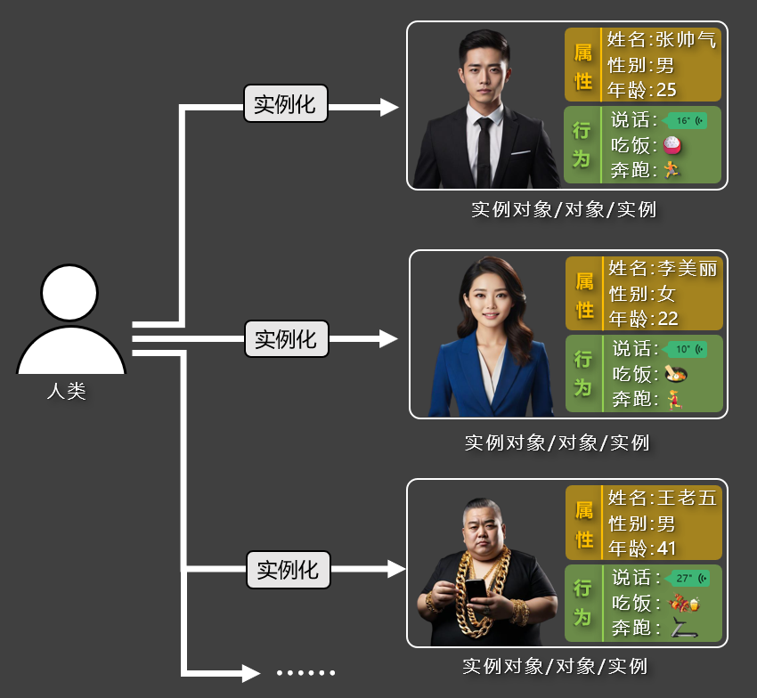
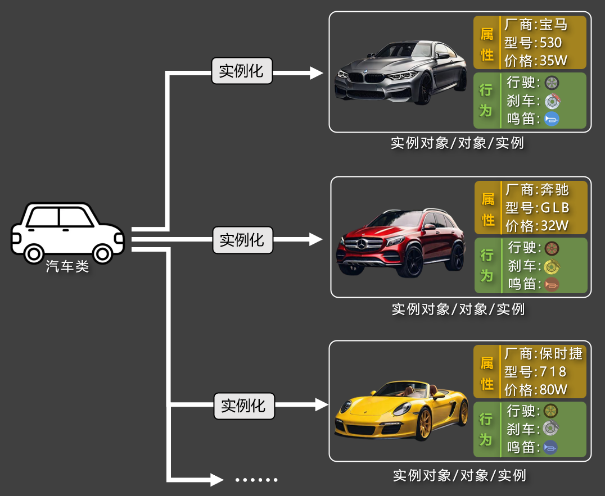
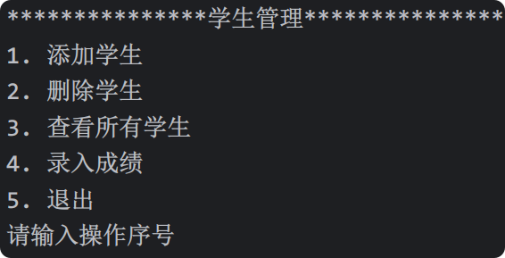
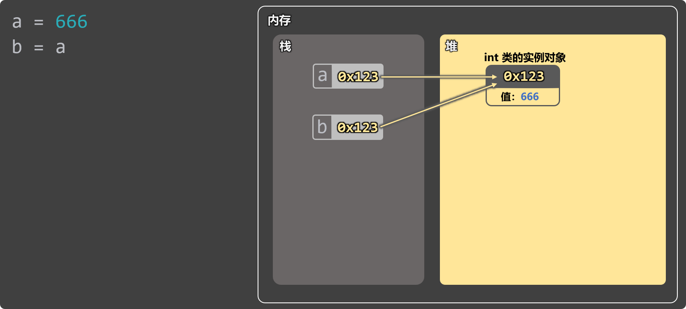
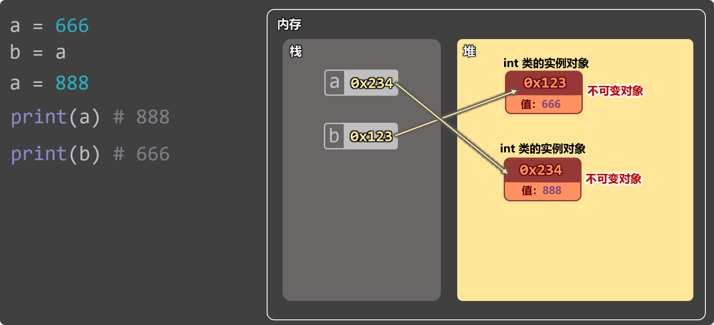
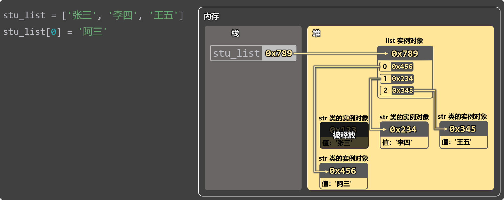
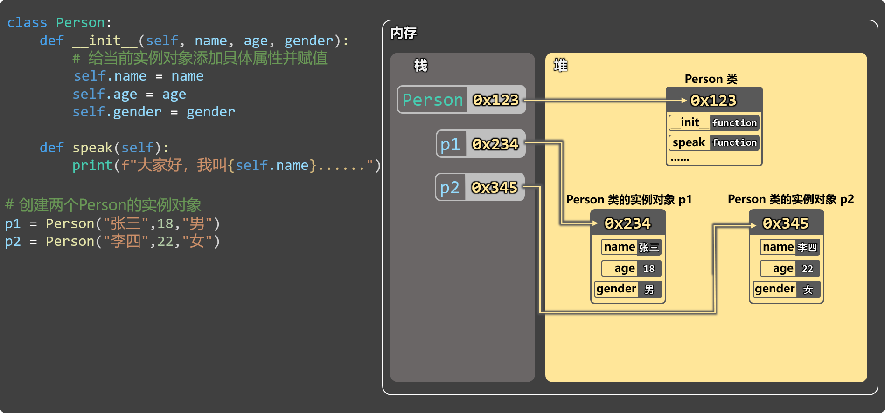

# 第 7 章  面向对象
## 概述
### 对象
『对象』是一个拥有『**属性**』和『**行为**』的个体，它是构成现实世界和程序世界的基本单位。编程领域有这么一句话，叫“万物皆对象！”之所以这么说，是因为任何一个具体存在的人或物，都可以看成是一个**对象**，例如：一个人、 一辆车、一部手机，都是对象，他们的『**属性**』和『**行为**』分别是：

::: tip
1. 人的属性有：姓名、性别、年龄...... ，人的行为有：吃饭、睡觉、跑步......
2. 车的属性有：品牌、颜色、价格...... ，车的行为有：启动、加速、刹车......
3. 手机的属性有： 品牌、颜色、电量...... ，手机的行为有： 打电话、播放音乐、拍照......

:::

### 面向对象
『面向对象』是一种以对象为中心，去思考和组织代码的方式，它更关注：“谁来做这件事”。

  以“做饭”这件事为例：

+ **传统思想**：关注“做饭的步骤”，会依次进行：洗菜 → 切菜 → 炒菜 → 装盘。
+ **面向对象思想**：关注“谁来做这件事”，会找『切菜员』来洗菜和切菜，找『厨师』来炒菜和装盘。

> 在上述描述中：『切菜员』和『厨师』就是对象，至于这些对象是我们自己编写的，还是来自外部模块，这并不重要。
>

::: info
面向对象思想的好处是：可扩展性强，『切菜员』能给我做菜，也能给别人做菜；能做简单的菜，也能做复杂的菜。在程序中也是这个道理：我们定义的“对象”，可以被复用，多个对象之间还可以协作，一起组成更大的系统。

:::

### 类
『类（class）』是用来描述一类事物的"模板"，它规定了一类事物所具有的『**属性**』和『**行为**』。





### 实例 VS 实例化
**1️⃣实例**：根据『类』创建出来的一个具体的『对象』又称『实例』，也可称为『实例对象』。

::: tip
对象、实例、实例对象，这三个词在日常使用中是同一个意思。

:::

**2️⃣实例化**：所谓『实例化』就是根据类“制造出”一个对象的过程。

::: tip
类是抽象的“模板”，『实例 / 实例对象 / 对象』是具体的个体。

:::





## 基本使用
### **类的定义**
1️⃣语法格式：

```python
# 定义一个类（类名通常用大驼峰写法）
class 类名:
    # 当一个函数被定义在类中时，它就被称为“方法”。
    # __init__方法又叫：初始化方法，它主要用来给当前实例对象添加属性。
    # __init__方法收到的参数是：当前正在创建的实例对象、其他自定义参数。
    # 当我们后期编写代码，对类进行实例化的时候，Python就会自动调用__init__方法，去完成对实例的初始化。
    def __init__(self, 参数1, 参数2, 参数3):
        # 通过self给当前实例添加属性，语法格式为：self.属性名 = 属性值
        self.属性名 = 参数1
        self.属性名 = 参数2
        self.属性名 = 参数3
```

2️⃣相关说明：

::: info
1. 类名通常采用**大驼峰**命名法（如:`Person`、`UserInfo`）。
2. 类中所定义的函数，通常又称为**方法**。
3. `__init__`方法叫**初始化方法**，当我们对类进行实例化时，Python会**自动调用**`__init__`方法。
4. `__init__`方法的名字不能更改，否则 Python 无法自动调用。
5. `__init__`收到的第一个参数是当前**正在创建的**实例对象，形参通常用`self`。
6. `__init__`方法收到的除`self`以外的参数，通常用来设置实例的属性值，通过“点”语法实现：`self.属性名 = 属性值`

:::

3️⃣代码示例：

```python
# 定义一个Person类（类名通常使用：大驼峰写法）
class Person:
    # 说明：当一个函数被定义在了类中时，那这个函数就被称为：方法。
    # __init__方法：初始化方法，主要作用：给当前正在创建的实例对象添加属性
    # __init__方法收到的参数：当前正在创建的实例对象（self）、其它的自定义参数
    # 当我们以后编写代码去创建Person类实例的时候，Python会自动调用__init__方法
    def __init__(self, name, age, gender):
        # 给实例添加属性（语法为：self.属性名 = 值）
        self.name = name
        self.age = age
        self.gender = gender
```

### **创建实例**
1️⃣语法格式：

```python
实例名 = 类名(参数1, 参数2, ...)
```

**2️⃣**代码示例：

```python
class Person:
    def __init__(self, name, age, gender):
        self.name = name
        self.age = age
        self.gender = gender

# 创建Person的实例对象
p1 = Person('张三', 18, '男')
p2 = Person('李四', 22, '女')
```

3️⃣通过实例的“点”语法，可以『访问』或『修改』实例的属性。

```python
# 如果直接打印一个实例的话，我们是看不到实例身上的属性的
print(p1)
print(p2)

# 通过点语法可以访问或修改实例身上的属性
print(p1.name)
print(p1.age)
print(p1.gender)
print('-' * 20)
print(p2.name)
print(p2.age)
print(p2.gender)
p1.name = '阿三'
print(p1.name)
```

4️⃣通过`实例.__dict__`的方式，可以查看实例身上的所有属性。

```python
# 通过 实例.__dict__ 可以查看实例身上的所有属性
print(p1.__dict__)
print(p2.__dict__)
```

5️⃣在实例创建完毕后，也可以通过`实例.属性名 = 值`的形式，给实例追加属性。

```python
# 实例创建完毕后，依然可以通过 实例.属性名 = 值 去给实例追加属性
p1.address = '北京昌平宏福科技园'
print(p1.__dict__)
```

6️⃣通过`type()` 函数，可以查看某个实例对象，是由哪个类创建出来的。

```python
# 通过type函数，可以查看某个实例对象，是由哪个类创建出来的
print(type(p1))
print(type(p2))
```

### **自定义方法（行为）**
> 我们之前提到过：类是用来规定一类事物所具有的『属性』和『行为』，在上一小节中，我们已经通过 `self.属性名 = 值`的形式，为实例对象添加了『属性』；接下来，要想让对象具备相应的『行为』，就需要通过『自定义方法』来实现。
>

::: info
『自定义方法』的第一个参数也是`self`，是调用该方法的实例对象。

:::

```python
# 定义一个Person类
class Person:
    # 初始化方法（给实例添加属性）
    def __init__(self, name, age, gender):
        self.name = name
        self.age = age
        self.gender = gender

    # 自定义方法（给实例添加行为）
    # speak方法收到的参数是：调用speak方法的实例对象（self）、其它参数
    # speak方法只有一份，保存在Person类身上的，所有Person类的实例对象，都可以调用到speak方法
    def speak(self, msg):
        print(f'我叫{self.name}， 年龄是{self.age}， 性别是{self.gender}，我想说：{msg}')

# 验证一下：speak方法是存在Person类身上的
# print(Person.__dict__)

# 创建Person类的实例对象
p1 = Person('张三', 18, '男')
p2 = Person('李四', 22, '女')

# 验证一下：Person的实例对象身上是没有speak方法的
# print(p1.__dict__)
# print(p2.__dict__)

# 所有Person类的实例对象，都可以调用到speak方法
# 当执行p1.speak()的时候，查找speak方法的过程：1.实例对象自身(p1)  =>  2.实例的“缔造者”的身上(Person)
# p1.speak('好好学习')
# p2.speak('天天向上')

# 验证一下上述的查找过程
def speak():
    print('巴拉巴拉巴拉巴拉巴拉')
p1.speak = speak
print(Person.__dict__)
print(p1.__dict__)
print(p2.__dict__)
p1.speak()
```

## 实例属性、类属性
### 实例属性
**1️⃣定义**：通过`实例.属性名 = 值`定义在实例身上的属性，称为：实例属性。

**2️⃣特点**：

::: info
1. 每个实例都有自己『独立的一份』实例属性，各个实例之间是互不影响的。
2. 实例属性只能通过`实例.xxxx`访问和修改，不能通过『类名』访问或修改。

:::

```python
# 定义一个Person类
class Person:
    # 初始化方法
    def __init__(self, name, age, gender):
        # 通过【实例.属性名 = 值】给实例添加的属性，就叫实例属性
        # 实例属性只能通过实例访问，不能通过类访问
        # 每个实例都有自己【独一份的】实例属性，各个实例之间是互不干扰的
        self.name = name
        self.age = age
        self.gender = gender

# 创建Person类的实例对象
p1 = Person('张三', 18, '男')
p2 = Person('李四', 22, '女')

# 实例属性只能通过实例访问，不能通过类访问
print(p1.name)
print(Person.name)
```

### **类属性**
**1️⃣定义：** 在类中直接写赋值语句（例如：`a = 100`），就会在类身上添加一个`a`属性，值为 `100`，此时的`a`就是『类属性』，它属于类本身，由类所拥有，并且该类创建出来的**所有实例对象**，都能去访问`a`属性。

**2️⃣特点**：

::: info
1. 所有实例访问的，都是同一个类属性，所以类属性通常用于：存放公共数据。
2. 类属性即可以通过『类』访问，也可以『实例』访问。

:::

```python
# 定义一个Person类
class Person:
    # max_age、planet 他们都是类属性，类属性是保存在类身上的
    # 类属性可以通过类访问，也可以通过实例访问
    # 类属性通常用于保存：公共数据
    max_age = 120
    planet = '地球'

    # 初始化方法
    def __init__(self, name, age, gender):
        # 给实例添加属性
        self.name = name
        self.gender = gender
        # 限制age的最大值
        if age <= Person.max_age:
            self.age = age
        else:
            print(f'年龄超出范围了，已经将年龄设置为最大值：{Person.max_age}')
            self.age = Person.max_age

# 验证一下：类属性是保存在类身上的
# print(Person.__dict__)

# 创建Person类的实例对象
p1 = Person('张三', 18, '男')
p2 = Person('李四', 22, '女')

# 验证一下：实例身上是没有类属性的
# print(p1.__dict__)
# print(p2.__dict__)


# 验证一下：类属性可以通过类访问，也可以通过实例访问
# print(Person.max_age)
# print(p1.max_age)  # 查找max_age的过程：1.实例自身(p1)  => 2.实例的“缔造者”(Person)
# print(p2.planet)

# 测试一下年龄超出范围
# p3 = Person('王五', 170, '女')
# print(p3.__dict__)
```

**3️⃣特别注意**：

::: warning
进行`实例.属性名 = xxx`操作时，只会对**实例自身**的属性起作用（有则修改，无则添加）！

:::

```python
# 注意点：进行【实例.属性名 = 值】操作时，只会对实例自身的属性起作用，不会影响类属性
p1.planet = '火星'
print(Person.__dict__)
print(p1.__dict__)
print(p2.__dict__)
print(p1.planet)
print(p2.planet)
```

## 实例方法、类方法、静态方法
###  实例方法
**定义**：类中所定义的方法，最终会保存在类身上，并且主要是通过**实例调用**，所以叫：实例方法。

**特点**：

::: info
1. 实例方法虽然最终会**保存在类身上**，但它主要是**供实例使用**的，所以才叫实例方法。
2. 因为收到了`self`参数，所以其内部可以：访问实例属性，调用实例方法。
3. 实例方法的主要作用：定义**实例对象**的**具体行为**。

:::

```python
# 定义一个Person类
class Person:
    # 初始化方法（给实例添加属性）
    def __init__(self, name, age, gender):
        self.name = name
        self.age = age
        self.gender = gender

    # 下面的speak方法、run方法，都保存在类身上，但他们主要是供实例调用，所以他们都叫：实例方法
    # 自定义方法（给实例添加行为）
    def speak(self, msg):
        print(f'我叫{self.name}， 年龄是{self.age}， 性别是{self.gender}，我想说：{msg}')

    # 自定义方法（给实例添加行为）
    def run(self, distance):
        print(f'{self.name}疯狂的奔跑了{distance}米')

# 创建Person类的实例对象
p1 = Person('张三', 18, '男')
p2 = Person('李四', 22, '女')

print(Person.__dict__)
print(p1.__dict__)
print(p2.__dict__)

# 通过实例调用实例方法
p1.speak('你好')
p1.run(300)

# 通过类去调用实例方法(能调用，但不推荐)
Person.run(p2, 100)
```

### 类方法
**定义**：使用`@classmethod`装饰器修饰，第一个参数是**类本身**，通常用形参`cls`接收。

**特点**：

::: info
1. 可通过『类名』或『实例名』调用，但**强烈推荐通过类名调用**以体现语义。
2. 因为收到了`cls`参数，所以内部可以访问类属性。
3. 一般用于：实现**与类相关的逻辑**，如：操作类级别的信息、工厂方法等。

:::

```python
from datetime import datetime

# 定义一个Person类
class Person:
    # 类属性
    max_age = 120
    planet = '地球'

    # 初始化方法（给实例添加属性）
    def __init__(self, name, age, gender):
        self.name = name
        self.age = age
        self.gender = gender

    # speak方法、run方法，他们都属于：实例方法
    def speak(self, msg):
        print(f'我叫{self.name}， 年龄是{self.age}， 性别是{self.gender}，我想说：{msg}')

    def run(self, distance):
        print(f'{self.name}疯狂的奔跑了{distance}米')

    # 使用 @classmethod 装饰过的方法，就叫：类方法，类方法保存在类身上的
    # 类方法收到的参数：当前类本身（cls）、自定义的参数
    # 因为收到了cls参数，所以类方法中是可以访问类属性的
    # 类方法通常用于实现：与类相关的逻辑，例如：操作类级别的信息、一些工厂方法
    @classmethod
    def change_planet(cls, value):
        cls.planet = value

    @classmethod
    def create(cls, info_str):
        # 从info_str中获取到有效信息
        name, year, gender = info_str.split('-')
        # 获取当前年份
        current_year = datetime.now().year
        # 计算年龄
        age = current_year - int(year)
        # 创建并返回一个Person类的实例对象
        return cls(name, age, gender)


# 验证一下：类方法保存在类身上的
# print(Person.__dict__)

# 类方法需要通过类调用
# Person.change_planet('月球')
# print(Person.__dict__)

# 创建Person实例
p1 = Person('张三', 18, '男')
p2 = Person('李四', 22, '女')

# 验证一下：类属性planet已经修改了
# print(p1.planet)
# print(p2.planet)

# 测试一下类方法 —— create
# p3 = Person.create('李华-2003-女')
# print(p3.__dict__)

# 注意点：类方法，也能通过实例调用到，但是非常不推荐
p4 = p1.create('李华-2003-女')
print(p4.__dict__)
```

### 静态方法
**定义**：使用`@staticmethod`装饰器修饰，方法没有`self`或`cls`参数，只是单纯的定义在类中。

**特点**：

::: info
1. 可通过『类名』或『实例名』调用，但**强烈推荐通过类名调用**以体现语义。
2. 由于没有`self`或`cls`参数，所以静态方法中通常：不访问类属性，也不访问实例属性。
3. 一般用于：定义与类相关，但可以独立使用的**工具方法**。

:::

```python
# 定义一个Person类
class Person:
    # *******************************
    # *******************************
    # *******************************

    # 静态方法
    # 使用 @staticmethod 装饰过的方法，就叫：静态方法，静态方法也是保存在类身上的
    # 静态方法只是单纯的定义在类中，它不会收到：self、cls参数，它收到的参数都是自定义参数
    # 由于静态方法没有收到：self、cls参数，所以其内部不会访问任何：类和实例相关的内容
    # 静态方法通常用于定义：与类相关的工具方法
    @staticmethod
    def is_adult(year):
        # 获取当前的年份
        current_year = datetime.now().year
        # 计算年龄
        age = current_year - year
        # 返回结果（成年True，未成年False）
        return age >= 18

    @staticmethod
    def mask_idcard(idcard):
        return idcard[:6] + '********' + idcard[-4:]


# 验证一下：静态方法也是保存在类身上的
# print(Person.__dict__)

# 静态方法需要通过类去调用
# result = Person.is_adult(2015)
# print(result)
# result2 = Person.mask_idcard('212101198802030028')
# print(result2)

# 注意点：通过实例也能调用到静态方法，但非常不推荐
p1 = Person('张三', 18, '男')
res = p1.mask_idcard('212101198802030028')
print(res)
```

## 继承
### 基本语法
**概念**：是指一个类，可以继承另一个类的属性和方法。

**作用**：可以实现代码的复用与扩展，避免重复编写相同的代码，让程序结构更简洁、更高效。

**举例**：就像生活中，孩子可以继承父母的：长相、性格、财产等，程序中的继承与之类似。

**代码实例**：

如下代码中`Person`为父类（又称：基类）`Student`为子类（又称：派生类）

```python
# 定义一个Person类
class Person:
    def __init__(self, name, age, gender):
        self.name = name
        self.age = age
        self.gender = gender

    def speak(self, msg):
        print(f'我叫{self.name}， 年龄是{self.age}， 性别是{self.gender}，我想说：{msg}')

# 定义一个Student类（子类、派生类）， 继承自Person类（父类、超类、基类）
class Student(Person):
    def __init__(self, name, age, gender, stu_id, grade):
        # 在子类中，有两种方式去调用父类的初始化方法，来实现对继承属性：name, age, gender 初始化操作
        # 方式1（更推荐）
        super().__init__(name, age, gender)

        # 方式2
        # Person.__init__(self, name, age, gender)

        # 子类独有的属性，需要自己手动完成初始化
        self.stu_id = stu_id
        self.grade = grade

    def study(self):
        print(f'我叫{self.name}，我在努力的学习，争取做到{self.grade}年级的第一名')

# 创建Student类的实例对象
s1 = Student('李华', 16, '男', '2025001', '初二')
# print(s1.__dict__)
# print(type(s1))

# 查找speak方法的过程：1.实例自身(s1) => 2.Student类 => 3.Person类
# s1.speak('你好')

# print(s1.__dict__)

# 查找study方法的过程：1.实例自身(s1) => 2.Student类 => 3.Person类
# s1.study()

```

**几个说明**：

::: info
1. 定义类时，在类名后写圆括号`()`，并填入另一个类名，表示该类继承自另一个类。
2. 在子类中，可以直接使用父类中定义的：属性、方法，也可以定义自己独有的内容。
3. `super().__init__()`的作用：调用父类的初始化方法。

:::

###  方法重写
 	如果子类中定义了与父类同名的方法，则会子类会“覆盖”父类中的方法，又称：“重写”。

```python
# 定义一个Person类
class Person:
    def __init__(self, name, age, gender):
        self.name = name
        self.age = age
        self.gender = gender

    def speak(self, msg):
        print(f'我叫{self.name}， 年龄是{self.age}， 性别是{self.gender}，我想说：{msg}')


# 定义一个Student类，继承自Person类
class Student(Person):
    def __init__(self, name, age, gender, stu_id, grade):
        super().__init__(name, age, gender)
        self.stu_id = stu_id
        self.grade = grade

    # 方法重写：当子类中定义了一个与父类中相同的方法，那么子类中的方法就会“覆盖”父类的方法
    def speak(self, msg):
        super().speak(msg)
        print(f'我是学生，我的学号是{self.stu_id}，我正在读{self.grade}，我想说：{msg}')

s1 = Student('李华', 12, '男', '2025001', '初二')
s1.speak('好好学习')
```

### `isinstance()` 和 `issubclass()`
两个常用方法：

| 函数 | 作用 |
| --- | --- |
| `isinstance(obj, Class)` | 判断对象是否为**指定类**或其**子类**的实例 |
| `issubclass(Sub, Super)` | 判断一个类是否是另一个类的**子类** |


```python
# 定义一个Person类
class Person:
    def __init__(self, name, age, gender):
        self.name = name
        self.age = age
        self.gender = gender

# 定义一个Student类，继承自Person类
class Student(Person):
    def __init__(self, name, age, gender, stu_id, grade):
        super().__init__(name, age, gender)
        self.stu_id = stu_id
        self.grade = grade

p1 = Person('张三', 18, '男')
s1 = Student('李华', 12, '男', '2025001', '初二')

# 方法1：isinstance(instance, Class)，作用：判断某个对象是否为指定类或其子类的实例
print(isinstance(s1, Student))
print(isinstance(p1, Person))
print(isinstance(s1, Person))
print(isinstance(p1, Student))

# 方法2：issubclass(Class1, Class2)，作用：判断某个类是否是另一个类的子类
print(issubclass(Student, Person))
print(issubclass(Person, Student))
```

### 多重继承
**概念**：多重继承指一个类同时继承多个父类，从而拥有多个父类的属性和方法。

**举例**：就像孩子不仅继承爸爸的长相，还可能继承妈妈的性格。

```python
class 子类名(父类A, 父类B, ...):
    # 子类可以继承多个父类的属性和方法
    ...
```

**代码示例**：如下代码中`Student`类同时继承`Person`类和`Worker`类。

```python
# 所谓多重继承，就是一个类，可以同时继承多个父类
# 定义一个Person类
class Person:
    def __init__(self, name, age, gender):
        self.name = name
        self.age = age
        self.gender = gender
    def speak(self):
        print(f'我叫{self.name}， 年龄是{self.age}， 性别是{self.gender}')

# 定义一个Worker类
class Worker:
    def __init__(self, company):
        self.company = company
    def do_work(self):
        print(f'我在{self.company}做兼职')

# 定义一个Student类，继承自：Person类、Worker类
class Student(Person, Worker):
    def __init__(self, name, age, gender, stu_id, grade, company):
        Person.__init__(self, name, age, gender)
        Worker.__init__(self, company)
        self.stu_id = stu_id
        self.grade = grade
    def study(self):
        print(f'我在很努力的学习，争取做{self.grade}年级的第一名')

# 创建Student实例对象
s1 = Student('张三', 18, '男', '2025001', '初二', '麦当劳')
print(s1.__dict__)
s1.speak()
s1.do_work()
s1.study()

# 类的__mro__属性：用于记录属性和方法的查找顺序
# 通过实例去查找属性或方法时，会现在实例自身上寻找，如果没有，就按照__mro__中所记录的顺序去查找
print(Student.__mro__)
```

## 权限控制
### 三种访问权限
在 Python 中，我们可以给属性赋予三种权限，分别是：公有属性、受保护属性、私有属性。

下面是详细梳理👇

| 权限类型 | 定义方式 | 在当前类内部访问 | 在子类内部访问 | 在类外部访问 |
| :---: | :---: | :---: | :---: | :---: |
| 公有属性 | `属性名` | ✅ 能 | ✅ 能 | ✅ 能 |
| 受保护属性 | `_属性名` | ✅ 能 | ✅ 能 | ⚠️ 能（但不推荐） |
| 私有属性 | `__属性名` | ✅ 能 | ❌ 不能 | ❌ 不能 |


测试『类外部』访问：

```python
class Person:
    def __init__(self, name, age, idcard):
        self.name = name        # 公有属性：当前类内部、子类内部、类外部，可都可访问
        self._age = age         # 受保护属性：当前类内部、子类内部，可以访问
        self.__idcard = idcard  # 私有属性：仅能在当前类内部访问

    def speak(self):
        # 类的内部，可以访问任何权限的属性（公有属性、受保护属性、私有属性）。
        print(f"我叫：{self.name}，年龄：{self._age}，身份证：{self.__idcard}")

class Student(Person):
    def hello(self):
        # 子类的内部可以访问：公有属性、受保护属性
        print(f"我是学生，我叫：{self.name}，年龄：{self._age}")

p1 = Person('张三', 18, '110101199001011234')
print(p1.name)

# 类的外部，仅能访问公有属性
# 注意：如果在类的外部，强制访问【受保护的属性】，也能访问，但最好别这么做
print(p1._age)

# 强制访问【私有属性】会报错
# print(p1.__idcard)

# 扩展：Python保护【私有属性】的方式，是重命名，例如：__idcard属性，会被重命名为：_Person__idcard
print(p1.__dict__)
print(p1._Person__idcard)
```

### getter 与 setter
在面向对象编程中，我们会把一些内部数据保护起来，但同时还想提供一个“安全的通道”让外部访问。这时候我们就用到：

+ **getter**：读取属性的方法
+ **setter**：修改属性的方法

在 Python 中：通过`@property`和`@xxx.setter`语法，把普通方法变成像属性一样使用的方法。

```python
class Person:
    def __init__(self, name, age, idcard):
        self.name = name        # 公有属性：当前类内部、子类内部、类外部，可都可访问
        self._age = age         # 受保护属性：当前类内部、子类内部，可以访问
        self.__idcard = idcard  # 私有属性：仅能在当前类内部访问

    # 注册 age 属性的 getter 方法：当访问 Person 实例的 age 属性时，age方法会自动调用
    @property
    def age(self):
        return self._age

    # 注册 age 属性的 setter 方法：当给 Person 实例的 age 属性赋值时，age方法会自动调用
    @age.setter
    def age(self, value):
        if value <= 120:
            self._age = value
        else:
            print('年龄非法，已将年龄变为最大值120')
            self._age = 120

    # 注册 idcard 属性的 getter 方法：当访问 Person 实例的 idcard 属性时，会自动调用此方法
    @property
    def idcard(self):
        return self.__idcard[:6] + '********' + self.__idcard[-4:]

    # 注册 idcard 属性的 setter 方法，当 idcard 被修改时调用，内部会禁止修改身份证号并给出提示。
    @idcard.setter
    def idcard(self, value):
        print("抱歉，身份证号不允许随意修改，如有特殊需求，请联系管理员！")

p1 = Person('张三', 18, '110101199001011234')
print(p1.age)
print(p1.idcard)

# 测试修改age
p1._age = 19
print(p1.age)

# 测试修改idcard
p1.idcard = 'asd'
```

## 魔法方法
::: info
+ **概念**：以 `__xxx__` 命名的特殊方法（双下划线开头和结尾）。
+ **特点**：不需要手动调，在特定场景由 Python 自动调用。

:::

几个常用的魔法方法：

| 方法 | 调用时机 |
| --- | --- |
| **1️⃣**`__str__` | 当调用 `print(对象)`或`str(对象)` 时 |
| **2️⃣**`__len__` | 当调用`len(对象)`时 |
| **3️⃣**`__lt__` | 当执行`对象1 < 对象2`时 |
| **4️⃣**`__gt__` | 当执行`对象1 > 对象2`时 |
| **5️⃣**`__eq__` | 当执行`对象1 == 对象2`时 |
| **6️⃣**`__getattr__` | 当访问不存在的属性时 |


```python
# 类中以双下划线开头和结尾的方法，叫魔法方法（魔术方法）。
# 魔法方法不需要手动调用，Python会在特定场景自动调用。
class Person:
    def __init__(self, name, age, gender):
        self.name = name
        self.age = age
        self.gender = gender

    # __str__ 方法，执行时机：当调用 print(对象)或str(对象) 时
    def __str__(self):
        return f'姓名：{self.name}， 年龄：{self.age}， 性别：{self.gender}'

    # __len__ 方法，执行时机：当调用len(对象)时
    def __len__(self):
        return len(self.__dict__)

    # __lt__方法，执行时机：当执行 对象1 < 对象2 时
    def __lt__(self, other):
        return self.age < other.age

    # __gt__方法，执行时机：当执行 对象1 > 对象2 时
    def __gt__(self, other):
        return self.age > other.age

    # __eq__方法，执行时机：当执行 对象1 == 对象2 时
    def __eq__(self, other):
        return self.__dict__ == other.__dict__

    # __getattr__方法，执行时机：当访问了对象不存在的属性时
    def __getattr__(self, item):
        print(f'您访问的{item}属性，不存在！')

# 创建Person实例
p1 = Person('张三', 18, '男')
p2 = Person('李四', 22, '女')

# 测试代码
print(p1)
print(str(p1))
print(len(p1))
print(p1 < p2)
print(p1 > p2)
print(p1 == p2)
print(p1.address)
```

## object 类
+ `object`是所有类的最终祖先，所有的类，无论写与不写，都继承自`object`。
+ `object`提供了所有对象都会有的一组最基本方法，例如：

| 方法名 | 作用简述 |
| --- | --- |
| `__init__(self)` | 在对实例对象初始化时调用 |
| `__str__(self)` | `print(obj)`或 `int(obj)`时调用 |
| `__class__` | 返回对象所属的类 |
| ...... | |


::: tip
备注：上述这些方法，如果我们不去重写，Python 会自动继承并使用默认版本。

:::

```python
# Python 中，所有的类都继承了 object 类，即：object 类是所有类的顶层父类。
class Person:
    def __init__(self, name, age, gender):
        self.name = name
        self.age = age
        self.gender = gender

# 验证一下：所有的类都继承了 object 类
print(issubclass(Person, object))
print(issubclass(int, object))
print(issubclass(str, object))
print(issubclass(list, object))
print(issubclass(tuple, object))
print(issubclass(bool, object))

# 因为 object 是所有类的父类，所以 Python 中的所有对象，都间接是 object 类的实例。
p1 = Person('张三', 18, '男')
print(isinstance(p1, object))
print(isinstance(100, object))
print(isinstance('hello', object))
print(isinstance(True, object))
print(isinstance(None, object))
print(isinstance([10, 20, 30], object))
print(isinstance({'吃饭','睡觉'}, object))

# 所有对象都继承了 object 类所提供的：各种属性和方法，从而保证每个对象都具备统一的基本能力。
for key in object.__dict__:
    print(key)

p1 = Person('张三', 18, '男')
print(p1.__dict__)  # 打印对象自己身上的东西
print(dir(p1))      # 打印对象能访问到的东西

print(p1.__str__())
print(p1)
```

## 多态
### 何为多态
多态就是“多种形态”，即：不同的对象调使用同一个方法名调用方法时，会表现出不同的行为。

### 标准多态
::: info
+ **基于继承实现多态，又叫：『传统多态』或『标准多态』**。
+ 常见于`Java`、`C++` 这样的强类型语言中，`Python`支持『标准多态』。

:::

```python
# 多态是指：同一个方法名，在不同的对象上调用时，能呈现出不同的行为。
# Python中支持：标准多态、鸭子多态

# 标准多态：
class Animal:
    def speak(self):
        print('动物正在发出声音')

class Dog(Animal):
    def speak(self):
        print('汪汪汪！')

class Cat(Animal):
    def speak(self):
        print('喵喵喵！')

# 注意Pig类没有继承Animal类
class Pig:
    def speak(self):
        print('哼哼哼！')

# make_sound函数要求：传入的对象，必须是 Animal 类型（或其子类型），才能保证可以调用到sepak方法
def make_sound(animal:Animal):
    animal.speak()

# 创建实例对象
a1 = Animal()
d1 = Dog()
c1 = Cat()

# 多态的体现：同一函数，不同对象 → 不同行为
make_sound(a1)  # 动物正在发出声音
make_sound(d1)  # 汪汪汪！
make_sound(c1)  # 喵喵喵！

# 按标准多态规则：Pig 没有继承 Animal，类型不匹配（会出现类型警告）
p1 = Pig()
make_sound(p1)  # 在其它语言中会报错，虽然 Python 中能运行，但这不属于标准多态
```

### 鸭子多态
> 鸭子类型：如果一个东西看起来像鸭子，叫起来也像鸭子，那它就是鸭子，鸭子类型指一种编程风格，它并不依靠查找对象类型，来确定其是否具有正确的实现，而是直接调用或使用其方法或属性。
>
> 官方文档地址：[https://docs.python.org/zh-cn/3.13/glossary.html#term-duck-typing](https://docs.python.org/zh-cn/3.13/glossary.html#term-duck-typing)
>

::: info
+ 特点：不需要继承，只要传进来的对象，有对应实现就可以。
+ Python 中支持“鸭子多态”。

:::

```python
# 核心理念：如果一个东西看起来像鸭子，叫起来也像鸭子，那它就是鸭子。
# 鸭子类型是一种编程风格，它不检查对象的类型，只关注对象能否“做某件事”（是否有对应的方法）。

class Dog:
    def speak(self):
        print('汪汪汪！')

class Cat:
    def speak(self):
        print('喵喵喵！')

class Pig:
    def speak(self):
        print('哼哼哼！')

class Fish:
    def speak(self):
        print('咕噜噜！')

# 不再对animal的类型做限制，animal可以是任何类型，只要能调用speak方法就可以
def make_sound(animal):
    animal.speak()

# 创建实例对象
d1 = Dog()
c1 = Cat()
p1 = Pig()
f1 = Fish()

make_sound(d1)
make_sound(c1)
make_sound(p1)
make_sound(f1)
```

## 抽象类
+ **概念**：抽象类（Abstract Class） 是一种 不能被直接实例化 的类，通常作为“规范”，让子类去继承并实现其中定义的抽象方法，本身只定义规范，不需要提供完整实现。
+ **例如**：动物会叫、飞行器会飞、支付方式会支付。

```python
from abc import ABC, abstractmethod

#【抽象类】是一种不能直接实例化的类，它通常作为“规范”，让子类去继承，并实现其中定义的【抽象方法】。

# MustRun类一旦继承了ABC类，那MustRun类就是【抽象类】了
class MustRun(ABC):
    # run方法一旦被@abstractmethod装饰后，就变成了【抽象方法】
    @abstractmethod
    def run(self):
        pass

class Person(MustRun):
    def __init__(self, name, age, gender):
        self.name = name
        self.age = age
        self.gender = gender

    def run(self):
        print(f'我叫{self.name}，我在努力的奔跑！')

p1 = Person('张三', 18, '男')
p1.run()

```

## 小练习
完成一个学生成绩管理小案例




具体代码如下：

```python
from datetime import datetime

# 定义Person类
class Person:
    def __init__(self, name, age, gender):
        self.name = name
        self.age = age
        self.gender = gender

class Student(Person):
    # 计数器
    count = 0

    def __init__(self, name, age, gender):
        super().__init__(name, age, gender)
        Student.count += 1
        # 给每个学生添加stu_id属性，格式为：年份-序号，序号靠计数器增长。
        self.stu_id = f'{datetime.now().year}{Student.count:03d}'
        # 给学生添加成绩，格式为： {'数学':90, '语文':80, '英语':70}
        self.scores = {}

    # 给当前学生添加成绩
    def add_score(self, subject, score):
        # 给指定学生添加成绩，subject是学科，score是成绩
        self.scores[subject] = score

    # 计算平均分
    def calcu_avg(self):
        if self.scores:
            # 计算平均成绩
            return sum(self.scores.values()) / len(self.scores)
        else:
            return 0

    # 魔法方法
    def __str__(self):
        return f'{self.name}({self.age}-{self.gender})，成绩：{self.scores}，平均分:{self.calcu_avg():.1f}'

class Manager:
    def __init__(self):
        self.stu_list = []

    # 添加学生
    def add_student(self):
        name = input('请输入姓名：')
        age = int(input('请输入年龄：'))
        gender = input('请输入性别：')
        # 创建学生实例对象
        stu = Student(name, age, gender)
        # 将当前学生添加到stu_list列表中
        self.stu_list.append(stu)
        print(f'添加成功！学号是：{stu.stu_id}')

    # 删除学生
    def del_student(self):
        sid = input('请输入学号：')
        # target用于保存要删除的学生
        target = None
        # 遍历所有学生，找到要删除的学生，并交给target变量
        for stu in self.stu_list:
            if stu.stu_id == sid:
                target = stu
        # 如果找到了要删除的学生，就调用remove方法移除该学生
        if target:
            self.stu_list.remove(target)
            print('删除成功！')
        # 如果未找到要删除的学生
        else:
            print('学号有误，删除失败！')

    # 展示所有学生
    def show_all_student(self):
        # 如果当前stu_list中有学生，就遍历展示
        if self.stu_list:
            for stu in self.stu_list:
                print(stu)
        # 如果当前stu_list中没有学生，就打印：暂无学生！
        else:
            print('暂无学生！')

    # 给指定学生设置成绩
    def set_score(self):
        sid = input('请输入学号：')
        # 遍历stu_list列表
        for stu in self.stu_list:
            # 如果当前学生学号，与输入的sid相等
            if stu.stu_id == sid:
                # 输入成绩字符串，格式为：学科-分数，学科-分数
                score_str = input('清输入成绩（学科-分数，学科-分数）')
                # 将输入的多个成绩，按照逗号拆分，形成成绩列表
                score_list = score_str.replace('，', ',').split(',')
                # 循环成绩列表，依次添加成绩
                for item in score_list:
                    # 获取科目与成绩
                    subject, score = item.split('-')
                    subject = subject.strip()
                    score = float(score.strip())
                    # 调用add_score方法，添加科目，成绩
                    stu.add_score(subject, score)
                print('添加成功！')
                # 结束循环，同时结束set_score函数
                return
        # 若程序能执行到此处，证明在stu_list中没有找到与sid对应的学生
        print('学号有误！')

    # 提供主菜单
    def run(self):
        while True:
            print('************学生管理************')
            print('1. 添加学生')
            print('2. 删除学生')
            print('3. 查看所有学生')
            print('4. 录入成绩')
            print('5. 退出')

            chocie = input('请输入操作编号：')
            if chocie == '1':
                self.add_student()
            elif chocie == '2':
                self.del_student()
            elif chocie == '3':
                self.show_all_student()
            elif chocie == '4':
                self.set_score()
            elif chocie == '5':
                print('再见！')
                break
            else:
                print('输入有误！')

m1 = Manager()
m1.run()
```

## 内存分析
内存分为两个部分：栈内存、堆内存；变量在栈内存中，对象在堆内存中。

> 备注：强烈建议各位参考视频教程学习本小节
>

1️⃣Python 中变量里保存的不是存数据，而是指向堆中对象的引用（内存地址）。




2️⃣不可变对象：重新赋值会创建新对象

> int 类的实例对象，是不可变对象，所以修改变量 a 时，会创建新对象，不会影响其他引用（b）
>
> Python 中常见的不可变对象有：int 、float 、bool 、str 、tuple 、frozenset 、None。
>
> Python 中常见的可变对象有：list 、dict 、set 、自定义类的实例对象。
>




3️⃣ 可变对象：修改内容不改变地址




4️⃣自定义类对象的内存表示




# ⬇️进阶篇⬇️
