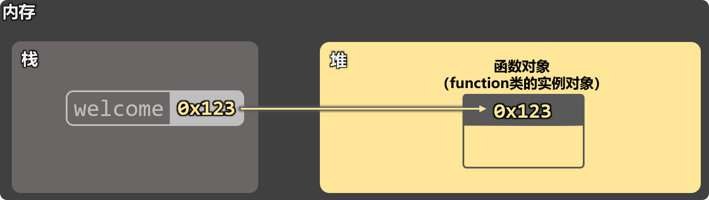
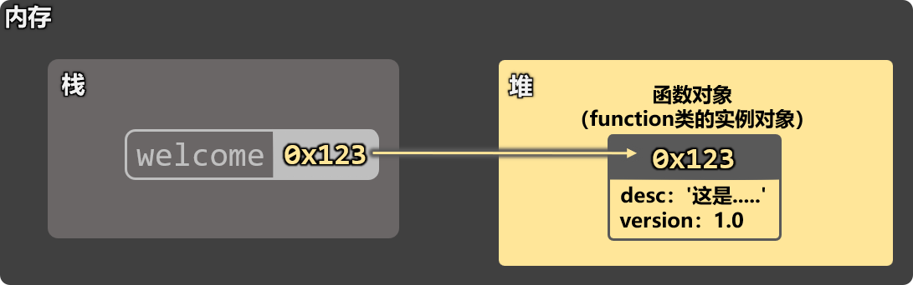
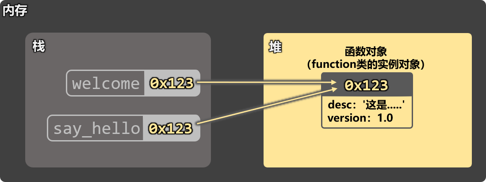
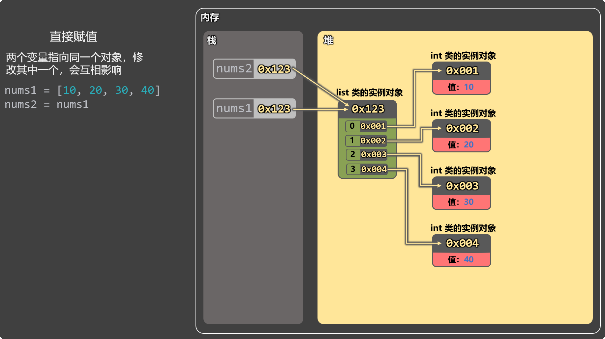
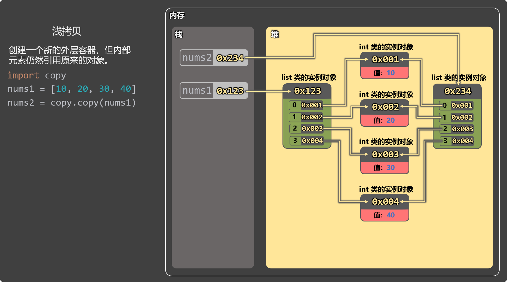
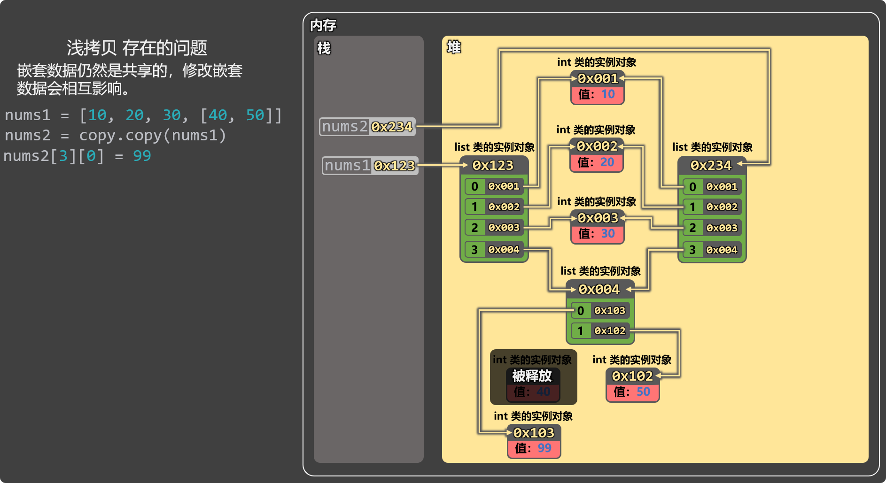
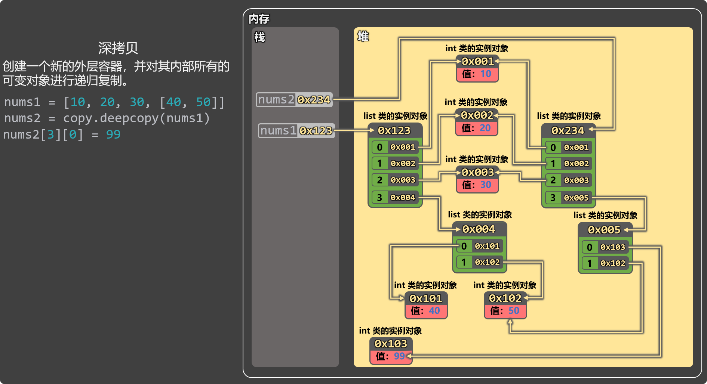
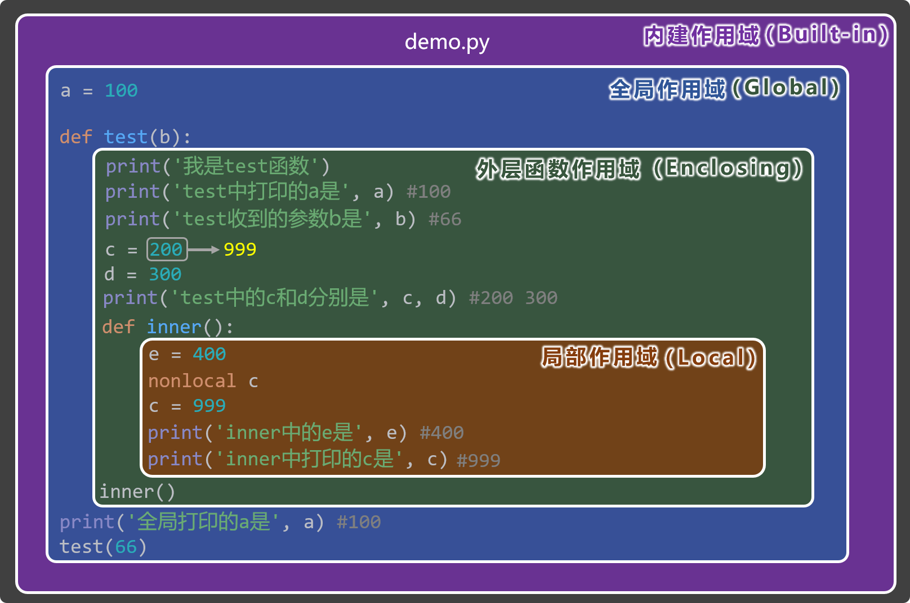

# 第 8 章 函数进阶
## 重新认识函数
::: details 1️⃣函数也是对象。

```python
a1 = 100            # a1是int类的实例对象
a2 = 'hello'        # a2是str类的实例对象
a3 = [10, 20, 30]   # a3是list类的实例对象

# welcome函数是function类的实例对象
def welcome():
    print('你好啊')

print(type(a1))
print(type(a2))
print(type(a3))
print(type(welcome))
```

上述代码中`welcome`函数的内存示意图：


:::
::: details 2️⃣函数可以像对象一样，动态添加属性。

```python
def welcome():
    print("你好")

# 动态添加属性
welcome.desc = "这是一个用于打招呼的函数"
welcome.version = 1.0
print(welcome.__dict__)

# 调用函数
welcome()
```


:::
::: details 3️⃣函数可以赋值给变量。

```python
def welcome():
    print('你好啊！')

# 把函数对象赋值给变量
say_hello = welcome

# 通过变量调用函数
say_hello()

# 通过函数名调用函数
welcome()
```

上述代码的内存结构示意图：


:::
::: details 4️⃣可变参数 vs 不可变参数

```python
def welcome(data):
    print(f'函数收到的data是：{data}，地址是：{id(data)}')
    data = 888
    print(f'被修改后的data是：{data}，地址是：{id(data)}')

a = 666
print(f'函数外侧a的值是：{a}，地址是：{id(a)}')
welcome(a)
print(f'函数调用后a的值是：{a}，地址是：{id(a)}')
```

```python
def welcome(data):
    print(f'函数收到的data是：{data}，地址是：{id(data)}')
    data[2] = 99
    print(f'被修改后的data是：{data}，地址是：{id(data)}')

a = [10, 20, 30]
print(f'函数外侧a的值是：{a}，地址是：{id(a)}')
welcome(a)
print(f'函数调用后a的值是：{a}，地址是：{id(a)}')
```
:::
::: details 5️⃣函数也可以作为参数

```python
def welcome():
    print('你好啊！')

def caller(f):
    print('caller函数开始调用')
    f()

caller(welcome)
```
:::
::: details 6️⃣函数也可以作为返回值

```python
def welcome():
    print('你好啊')
    def show_msg(msg):
        print(msg)
    return show_msg

# result = welcome()
# result('尚硅谷')
welcome()('尚硅谷')
```
:::
## 函数的多返回值
在`return`关键字后面写多个值，并且多个值之间用逗号隔开，Python 会自动把多个值打包成元组。

```python
def calculate(x, y):
    res1 = x + y
    res2 = x - y
    return res1, res2 # 实际返回的是：(res1, res2)

result = calculate(10, 20)
r1, r2 = calculate(10, 20)

print(result)  # (30, -10)
print(r1)      # 30
print(r2)      # -10
```

## 参数的打包与解包
定义函数时，打包接收参数：

+ `*形参名`：打包所有的位置参数（会形成一个元组）。
+ `**形参名` ：打包所有的关键字参数（会形成一个字典）。

调用函数时，解包传递参数：

+ `*变量名`：将元组拆解成一个一个独立的位置参数。
+ `**变量名`：将字典拆解一个一个`key=value`形式的关键字参数。

```python
# 打包接收参数：
# *args    ：打包所有的位置参数（会形成一个元组）
# **kwargs ：打包所有的关键字参数（会形成一个字典）
def show_info(*args, **kwargs):
    print(args)
    print(kwargs)

nums = (10, 20, 30)
person = {'name': '张三', 'age': 18}

# 解包传递参数：
# *nums    ：将元组拆解成一个一个独立的位置参数
# **person ：将字典拆解一个一个 key=value 形式的关键字参数
show_info(*nums, **person)
```

## 高阶函数
 当一个函数的『参数是函数』或者『返回值是函数』那该函数就是『高阶函数』。

```python
def welcome():
    print('你好啊！')

# caller函数的参数是函数，所以caller是高阶函数
def caller(f):
    print('call函数开始调用')
    f()

caller(welcome)


# outer函数的返回值是函数，所以outer函数是高阶函数
def outer():
    print('我是outer')
    def inner():
        print('我是inner')
    return inner
```

高阶函数的意义：

::: info
1. 代码复用性高：可以把行为“独立出去”，传入不同函数实现不同逻辑。
2. 能让函数更灵活，更通用。
3. 高阶函数是：装饰器、闭包的基础。（后面会讲）

:::

```python
def info(msg):
    return '[提示]' + msg
def warn(msg):
    return '[警告]' + msg
def error(msg):
    return '[错误]' + msg

def log(fun, text):
    print(fun(text))

log(info, '文件保存成功！')
log(warn, '磁盘空间不足！')
log(error, '该用户不存在！')
```

## 条件表达式
::: details **表达式**：执行后最终能得到一个值的代码，就是表达式，例如这些都是表达式：

```python
3 + 5
'abc' * 3
5 > 3
'y' in 'Python'
len('hello')
```

> 表达式最终会形成一个值，可以写在任何一个需要值的地方。
:::
::: details **条件表达式**：根据不同的条件，得到不同的值，又称：三元表达式，也叫：三目运算符。

1️⃣语法格式为：

```python
结果1 if 条件 else 结果2
```

> 具体规则： 如果条件为真，整个表达式的结果就是“结果1”，否则就是“结果2”。

2️⃣代码示例：

```python
age = 20

# 传统if-else写法
if age >= 18:
    text = '成年'
else:
    text = '未成年'

# 条件表达式写法
text = '成年' if age >= 18 else '未成年·'
print(text)
```

3️⃣什么时候适合用条件表达式？ —— 简单的二选一场景，可以让代码更紧凑。

```python
rain = True
food = '外卖' if rain else '出去吃'

is_vip = True
disscount = 0.8 if is_vip else 1.0

is_login = True
msg = '欢迎回来！' if is_login else '请先登录！'
```
:::
## 匿名函数
+ **概念**：所谓『匿名函数』，就是没有名字的函数，它无需使用`def`关键字去定义。
+ **语法**：Python 中使用`lambda`关键字来定义『匿名函数』，格式为：`lambda 参数: 表达式`
+ **使用场景：** 当一个函数只用一次、只做一点点小事，使用匿名函数会更简洁。

```python
# 使用普通函数实现计算效果
def add(x, y):
    return x + y

def sub(x, y):
    return x - y

def calculate(func, a, b):
    print(f'计算结果为：{func(a, b)}')

calculate(add, 30, 10)
calculate(sub, 30, 10)
```

```python
# 使用匿名函数实现计算效果
def calculate(func, a, b):
    print(f'计算结果为：{func(a, b)}')

calculate(lambda x, y: x + y, 30, 10)
calculate(lambda x, y: x - y, 30, 10)
```

+ **特点**：

::: info
1. 只能写一行，不能写多行代码。
2. 不能写代码块（if、for、while）
3. 冒号右边必须是表达式，且只能写一个表达式。
4. 执行结果自动作为返回值。

:::

```python
is_adult = lambda age: '成年' if age >= 18 else '未成年'
print(is_adult(18))
print(is_adult(13))
```

## 几个数据处理函数
### map 函数
+ `map`函数：对一组数据中的每一个元素，统一执行某种操作（加工），并生成一组新数据。
+ 语法格式：`map(操作函数, 可迭代对象)`

```python
# 统一数据处理
nums = [10, 20, 30, 40]
# map函数的返回值是一个迭代器对象，需要我们自己去手动遍历，或者手动类型转换
result = map(lambda x: x * 2, nums)
print(list(result))
print(nums)

# 字符串转换
names = ('python', 'java', 'js')
result = map(lambda x: x.upper(), names)
print(tuple(result))
print(names)

# 类型转换
str_number = {'1', '2', '3'}
result = map(int, str_number)
print(set(result))
print(str_number)

# 注意点：
# 1.延迟执行：map 不会立刻计算，只有在“需要结果”时才执行计算。
# 2.返回的是迭代器对象，且一旦遍历完成，就会被“耗尽”。
# 3.map不会影响元素数量。

nums = [10, 20, 30, 40]
result = list(map(lambda x: x * 2, nums))
print(result)
print(result)
print(result)
print(result)
```

### filter 函数
+ `filter`函数：从一组数据中，筛选出符合条件的元素（过滤），并组成一组新数据。
+ 语法格式：`filter(过滤函数, 可迭代对象)`

```python
# 筛选数值
nums = [10, 20, 30, 40, 50]
result = filter(lambda n: n > 30, nums)
print(list(result))
print(nums)

# 筛选成年人
persons = [
    {'name':'张三', 'age':15, 'gender':'男'},
    {'name':'李四', 'age':16, 'gender':'女'},
    {'name':'王五', 'age':17, 'gender':'男'},
    {'name':'李华', 'age':18, 'gender':'女'},
    {'name':'赵六', 'age':19, 'gender':'女'},
    {'name':'孙七', 'age':20, 'gender':'男'}
]
result = filter(lambda p: p['age'] >= 18, persons)
print(list(result))

# 过滤一下非法字符串
names = ['张三', '', '李四', None, '王五']
result = filter(lambda n: n, names)
print(list(result))

# 注意点
# 1.延迟执行：filter不会立刻筛选，只有在“需要结果”时才执行。
# 2.返回的是迭代器对象，且一旦遍历完成就会被“耗尽”。
# 3.filter可能会影响元素数量。

# filter函数的特殊用法：如果不传递过滤函数，那么自动会过滤掉“假值”
data = [0, 1, '', 'hello', [], (), 5]
result = filter(None, data)
print(list(result))
```

### sorted 函数
+ `sorted`函数：对一组数据进行排序，返回一组新数据。
+ 语法格式：`sorted(可迭代对象, key=xxx, reverse=xxx)`

```python
# 数字排序
nums = [30, 40, 20, 10]
result = sorted(nums, reverse=True)
print(result)

# 按照字符串的长度去排序
names = ['python', 'sql', 'java']
result = sorted(names, key=len, reverse=True)
print(result)

# 根据字典中的某个字段进行排序
persons = [
    {'name':'张三', 'age':15, 'gender':'男'},
    {'name':'李四', 'age':17, 'gender':'女'},
    {'name':'王五', 'age':19, 'gender':'男'},
    {'name':'李华', 'age':20, 'gender':'女'},
    {'name':'赵六', 'age':18, 'gender':'女'},
    {'name':'孙七', 'age':16, 'gender':'男'}
]
result = sorted(persons, key=lambda p: p['age'], reverse=True)
print(result)

# 我们之前讲的max函数、min函数，也可以传递key参数，用于设置筛选依据
result1 = max(persons, key=lambda p: p['age'])
result2 = min(persons, key=lambda p: p['age'])
print(result1)
print(result2)
```

### reduce 函数
+ `reduce`函数：将一组数据不断“合并”，最终归并成一个结果。
+ 语法格式：`reduce`(合并函数, 可迭代对象, 初始值)。

::: tip
备注：`reduce`函数需要从`functools`模块中引入才能使用。

:::

```python
# 从 functools 模块中引入 reduce
from functools import reduce

# 数值统计
nums = [1, 2, 3, 4, 5]
result = reduce(lambda a, b: a + b, nums, 10)
print(result)

# 字符串拼接
str_list = ['ab', 'cd', 'ef']
result = reduce(lambda a, b: a + b, str_list)
print(result)
```

## 列表推导式
+ 概念：用一条简洁语句，从可迭代对象中，生成新列表的语法结构。
+ 语法格式：`[ 表达式 for 变量 in 可迭代对象 ]`

```python
# 需求：让nums列表中所有的元素，都变为原来的2倍

# 方式一：用map函数
nums = [10, 20, 30, 40]
result = list(map(lambda n: n * 2, nums))
print(result)

# 方式二：使用for循环结合append方法
nums = [10, 20, 30, 40]
result = []
for n in nums:
    result.append(n * 2)
print(result)

# 方式三：使用列表推导式(列表推导式就是上面 for + append 的简写形式)
nums = [10, 20, 30, 40]
result = [n * 2 for n in nums]
print(result)

# 带条件的列表推导式
nums = [10, 20, 30, 40]
result = [n * 2 for n in nums if n > 20]
print(result)

# 字典推导式
names = ['张三', '李四', '王五']
scores = [60, 70, 80]
result = {names[i]: scores[i] for i in range(len(names))}
print(result)

# 集合推导式
names = ['张三', '李四', '王五']
result = {n + '！' for n in names}
print(result)

names = ['张三', '李四', '王五']
# 注意：Python中没有元组推导式，下面这种写法叫：生成器（后面会仔细讲）
result = (n + '！' for n in names)
print(result)
```

## 常用内置函数梳理
以下函数是截至目前，我们需要掌握的一些常用函数，注意：下面这些并不是所有，我们后面还会学习到更多的常用内置函数。（详细讲解请参考视频教程）

### 输入与输出
| 函数 / 参数 | 功能说明 |
| --- | --- |
| `print` | 输出指定内容 |
| `objects` | 要输出的内容 |
| `sep` | 输出多个内容时的分隔符 |
| `end` | 结尾追加的内容 |
| `file` | 输出位置（默认控制台） |
| `flush` | 是否立即刷新输出 |
| `input()` | 获取用户输入 |


### 类型转换
| 函数 | 功能说明 |
| --- | --- |
| `int()` | 转为整数 |
| `float()` | 转为浮点数 |
| `str()` | 转为字符串 |
| `bool()` | 转为布尔值 |
| `list()` | 转为列表 |
| `tuple()` | 转为元组 |
| `set()` | 转为集合 |
| `dict()` | 转为字典 |


### 数学相关
| 函数 | 功能说明 |
| --- | --- |
| `abs()` | 取绝对值 |
| `round()` | 银行家舍入法：小于5舍，大于5入，等于5看奇偶（奇入偶舍） |
| `pow(a, b)` | 计算 a 的 b 次方 |
| `pow(a, b, c)` | 计算 a 的 b 次方后，再对 c 取模 |
| `divmod(a, b)` | 返回 `(商, 余数)` |
| `max()` | 最大值（支持 `key`） |
| `min()` | 最小值（支持 `key`） |
| `sum()` | 求和 |
| `map()` | 加工一组数据 |
| `filter()` | 按条件过滤数据 |
| `reduce()` | 合并计算（需 `functools.reduce`） |
| `sorted()` | 排序（支持 `key`） |


### 数据容器相关
| 函数 | 功能说明 |
| --- | --- |
| `len()` | 获取容器中元素个数 |
| `range()` | 生成数字序列（常用于循环） |
| `enumerate()` | 为序列添加索引 |
| `zip()` | 将多个序列一一配对 |


### 类型判断与对象相关
| 函数 | 功能说明 |
| --- | --- |
| `type()` | 查看对象类型 |
| `isinstance(obj, type)` | 判断对象是否属于某个类型 |
| `issubclass(A, B)` | 判断类 A 是否为类 B 的子类 |
| `id()` | 查看对象的内存地址 |


### 逻辑判断相关
| 函数 | 功能说明 |
| --- | --- |
| `all()` | 所有元素为真时返回 True |
| `any()` | 至少一个为真返回 True |


### 字符串辅助相关
| 函数 | 功能说明 |
| --- | --- |
| `ord()` | 获取字符的 Unicode 编码值 |
| `chr()` | 将 Unicode 编码值转换为字符 |


## 浅拷贝 vs 深拷贝
### 为什么要拷贝？
::: tip
+ 赋值语句：`b = a` ，只是让`b` 指向和 `a` 一样的对象。
+ 如果`a`和`b`指向的是一个可变对象，那通过`b`修改后，再通过`a`访问到的数据也是变化后的。

:::

###  直接赋值
在如下代码中：`nums2 = nums1` 不是复制！是**两个变量指向同一个列表**，并且修改任何一个，都会影响另一个。

```python
nums1 = [10, 20, 30, 40]
nums2 = nums1
nums2[3] = 99

print(nums1[3]) # 99
print(nums2[3]) # 99
```




###  浅拷贝
浅拷贝会创建一个新的外层容器，但内部的元素仍然引用原来的对象。

```python
import copy
nums1 = [10, 20, 30, 40]
nums2 = copy.copy(nums1)
nums2[3] = 99

print(nums1[3]) # 40
print(nums2[3]) # 99
```




浅拷贝存在的问题：嵌套数据仍然是共享的，修改嵌套数据会互相影响

```python
import copy

nums1 = [10, 20, 30, [40, 50]]
nums2 = copy.copy(nums1)
nums2[3][0] = 99

print(nums1[3][0])
print(nums2[3][0])
```




### 深拷贝
创建一个新的外层容器，同时对内部所有【可变对象】进行递归复制（不可变对象不复制，继续引用）。

```python
import copy

nums1 = [10, 20, 30, [40, 50]]
nums2 = copy.deepcopy(nums1)
nums2[3][0] = 99

print(nums1[3][0])
print(nums2[3][0])
```




特点：

::: tip
1. 深拷贝可以彻底消除数据之间的相互影响。
2. 深拷贝遇到【不可变对象】不会复制，会直接引用。

:::

注意点：

::: tip
1. 深拷贝只复制可变对象，不可变对象会直接引用。
2. 元组中如果只包含不可变对象，则深拷贝没有效果。

:::

```python
import copy
a = 666
# a是不可变对象，即便调用deepcopy也不会深拷贝，会直接引用
b = copy.deepcopy(a)

print(id(a))
print(id(b))
```

```python
import copy
nums1 = (10, 20, 30, [40, 50])
# nums1元组中只包含不可变对象，即便调用deepcopy也不会深拷贝
nums2 = copy.deepcopy(nums1)

print(id(nums1))
print(id(nums2))
```

## 四种作用域
Python 中有四种作用域，分别是：

::: info
1. **L**ocal（局部作用域）
2. **E**nclosing（外层作用域）
3. **G**lobal（全局作用域）
4. **B**uilt-in（内建作用域）

:::

当访问一个变量时，Python 会按以下顺序查找： **L**ocal =>**E**nclosing =>**G**lobal =>**B**uilt-in




::: warning
上述图示的详细分析，请参考视频教程。

:::

### 局部作用域（Local）
**定义**：函数的内部就是局部作用域，局部作用域中的变量，只在该函数内部可见。

**特点**：

+ 每次调用函数都会创建一个新的局部作用域。
+ 函数运行结束后，局部作用域会随之销毁。
+ 局部作用域优先级最高，即：查找一个变量时，Python 会首先在局部作用域中查找。

**举例**：

```python
def test():
    x = 10  # x 在局部作用域
    print(x)  # 可以访问

print(x)  # ❌ 报错：x 在局部之外不可见
```

### 外层作用域（Enclosing）
**定义**：如果函数中又定义了函数，那么外层函数的作用域，就是内层函数的 Enclosing 作用域。

**特点**：

+ 只有当函数“嵌套定义”时才会出现。
+ 内层函数可以读取外层函数变量。
+ 想修改外层变量必须使用`nonlocal`。

**举例**：

```python
def outer():
    y = 20  # outer 的局部变量 → inner 的 Enclosing 变量

    def inner():
        print(y)  # 内层函数读取外层变量

    inner()
```

**修改外层变量**：

```python
def outer():
    y = 20
    def inner():
        nonlocal y
        y = 99  # 修改外层函数作用域变量
```

### 全局作用域（Global）
**定义**：`.py`文件就是全局作用域，全局作用域中的变量，在当前`.py`文件的任何位置都可以访问。

**特点**：

+ 全局变量只在当前`.py`文件中可见。
+ 函数内部可以使用`global`关键字修改全局变量。

**例子**：

```python
a = 100  # 全局变量

def test():
    print(a)  # 可以读取

test()
print(a)  # 在本文件任何位置都可以访问
```

**如果要修改**：

```python
a = 100

def test():
    global a
    a = 200  # 修改全局变量
```

### 内建作用域（Built-in）
**定义**：Python 预先定义好的东西，会放在内建作用域中，所有`.py`文件都可以直接使用。

**特点**：

+ 所有`.py`文件都能直接使用其中的名称。
+ 例如：`print`、`len`、`range`、`sum`、`max` 等。
+ 查找优先级最低，即：查找一个变量时，内建作用域是“最后一道防线”。

**例子**：

```python
print('hello')
len([1, 2, 3])
```

## 闭包
### 前置知识
**前置知识 1： 局部作用域的生命周期**。

+ 每次调用函数时，都会创建一个新的局部作用域。
+ 函数执行完毕后，该作用域就会被销毁，其中的局部变量，也会随之释放。

```python
def outer():
    num = 10
    num += 1
    print(num)

outer() #11
outer() #11
outer() #11
```

>  在上述代码中：每次调用 `outer()`，`num` 都会重新生成，不会保存上一次的值。
>

**前置知识 2：内层函数访问外层变量**。

+ 【内层函数】可以访问到【外层函数】作用域中的变量。
+ 访问外层变量不用`nonlocal`，修改外层变量时要使用`nonlocal`。

```python
def outer():
    num = 10

    def inner():
        print(num)
    inner()

outer()
```

如下代码验证了：理论上`num`变量应该在`outer`函数调用完销毁，但实际并没有。

```python
def outer():
    num = 10

    def inner():
        print(num)

    return inner

f = outer()
f()
```

### 什么是闭包
+ **闭包 = 内层函数 + 被内层函数引用的外层变量**。
+ **产生闭包的三个条件如下**：

::: info
1. 必须有函数嵌套
2. 内层函数使用了外层函数的变量
3. 外层函数返回内层函数

:::

### 闭包的基本形式
在上述代码的基础上，我们在`inner`函数中不仅要打印`num`，还要去修改`num`（修改时记得加上`nonlocal num`）。最终发现：`num`的值居然还可以一直增加，所以截至目前，证明了一件事：本应该随着`outer`函数调用结束而死去的`num`，并没有死去，并且`inner`函数依然可以对`num`进行读取和修改。所以我们观察如下的代码形式，完全符合上述的闭包产生条件，所以此时就出现了**闭包**。

```python
def outer():
    num = 10

    def inner():
        nonlocal num
        num += 1
        print(num)

    return inner

f = outer()
f() # 11
f() # 12
f() # 13
```

### 闭包是如何保存外层变量的？
外层变量会被保存到 **闭包单元（cell）**中，例如下面代码中，那些被` inner`函数所使用到的`outer`函数中的局部变量，会被封存在**闭包单元（cell）** 中，这些`cell`组成一个 `__closure__` 元组，保存在了`inner`函数上。

```python
def outer():
    num = 10
    print(id(num)) # 140707460170952

    def inner():
        nonlocal num
        num += 1
        print(num)

    return inner

f = outer()

print(f.__closure__) # __closure__的值是一个元组，元组中保存着被inner函数所“挽救”下来的数据
print(f.__closure__[0].cell_contents) # 10
print(id(f.__closure__[0].cell_contents)) # 140707460170952
```

思考：内层函数`inner`会保存外层函数`outer`中所有的数据吗？ 不会，只会保存`inner`中所用到的。

```python
def outer():
    num = 10
    msg = '你好啊！'
    print(msg)

    def inner():
        nonlocal num
        num += 1
        print(num)

    return inner

f = outer()
print(f.__closure__) # 发现__closure__中只有num，没有msg
```

### 注意点
 1. 每次获得一个新闭包，互不影响（闭包之间是互相独立的）。

```python
def outer():
    num = 10

    def inner():
        nonlocal num
        num += 1
        print(num)

    return inner

f1 = outer()
f1()
f1()
f1()
print('*****************')
f2 = outer()
f2()
```

2. 外层变量为可变对象时仍互不影响。

```python
def outer():
    nums = []

    def inner(value):
        nums.append(value)
        print(nums)

    return inner

# 每次调用 outer() 都创建一个新的 nums
f1 = outer()
f1(10)
f1(20)
f1(30)
print('**********************')
f2 = outer()
f2(666)
```

### 闭包的优点
1. 可以“记住”状态：不用全局变量，也不用写类，就能在多次调用之间保存数据。
2. 可以做“配置过的函数”：先传一部分参数，把环境固定住，得到一个定制版函数。
3. 可以实现简单的“数据隐藏”：外层变量对外不可见，只能通过内层函数访问。
4. 是装饰器（decorator）等高级用法的基础。

小案例：使用闭包实现对文字的美化效果。

```python
def beauty(char, n):
    def show_msg(msg):
        print(char * n + msg + char * n)
    return show_msg

show1 = beauty('*', 3)
show1('你好啊')
show1('尚硅谷')

show2 = beauty('@', 5)
show2('你好啊')
show2('尚硅谷')
```

###  闭包的缺点
1. 理解成本较高：对初学者不太友好，滥用会让代码难读。
2. 如果闭包里引用了很大的对象，又长期不释放，可能会增加内存占用。
3. 很多场景下，其实用【类 + 实例属性】会更清晰，闭包不一定是最优解。

例如将上述的文字美化效果，用类实现：

```python
class Beauty:
    def __init__(self, char, n):
        self.char = char
        self.n = n

    def show_msg(self, msg):
        print(self.char * self.n + msg + self.char * self.n)

b1 = Beauty('*', 3)
b1.show_msg('你好啊')
b1.show_msg('尚硅谷')

b2 = Beauty('#', 5)
b2.show_msg('你好啊')
b2.show_msg('尚硅谷')
```

## 装饰器
+ **概述**：装饰器是一种在【不修改原函数代码】的前提下，对函数进行【增强】的工具。 它是 Python 中非常强大的语法特性，常用于：日志、校验、计时、缓存、权限控制等。
+ **核心语法**： 装饰器是一种可调用对象（通常是函数），接收一个函数作为参数，并返回一个新函数。

### 函数装饰器
**需求**：在不修改`add`函数的前提下，给`add`函数增加一些额外的功能，例如：计算前打印一句欢迎语。

#### 1️⃣定义函数装饰器
```python
def say_hello(func):
    def wrapper(*args, **kwargs):
        print('你好，我要开始计算了')
        return func(*args, **kwargs)
    return wrapper
```

> 定义装饰器核心规则：
>
> 1. 接收被装饰的函数、同时返回新函数（wrapper）
> 2. 装饰器“吐出来”的是 wrapper 函数，以后别人调用的也是 wrapper 函数。
> 3. 为了保证参数的兼容性，wrapper 函数要通过 `*args` 和 `**kwargs` 接收参数。
> 4. wrapper 函数中主要做的是：调用原函数（被装饰的函数）、执行其它逻辑，但要记得将原函数的返回值 return 出去。
>

#### 2️⃣使用函数装饰器（手动装饰）
```python
def say_hello(func):
    def wrapper(*args, **kwargs):
        print('你好，我要开始计算了')
        return func(*args, **kwargs)
    return wrapper

# 调用say_hello装饰器，对add函数进行装饰，并得到装饰后的新函数
add = say_hello(add)

result = add(10, 20, 30)
print(result)
```

#### 3️⃣使用函数装饰器（语法糖 @）
```python
def say_hello(func):
    def wrapper(*args, **kwargs):
        print('你好，我要开始计算了')
        return func(*args, **kwargs)
    return wrapper

@say_hello
def add(x, y, z):
    res = x + y + z
    print(f'{x}和{y}和{z}相加的结果是：{res}')
    return res

result1 = add(10, 20, 30)
print(result1)
```

> 上述代码的执行流程：
>
> 1. `@say_hello` 会自动执行： `add = say_hello(add)`。
> 2. 以后调用 `add()`时，真正执行的是`wrapper()`。
>

#### 4️⃣带参数的函数装饰器（三层嵌套）
**需求**：装饰不同的函数，打印不同的欢迎语。

**核心**：带参数的装饰器最终是三层嵌套结构：外层接收配置、中间层接收函数、内层接收具体参数。

```python
def say_hello(msg):
    def outer(func):
        def wrapper(*args, **kwargs):
            print(f'你好，我要开始{msg}计算了')
            return func(*args, **kwargs)
        return wrapper
    return outer

# 装饰加法函数
@say_hello('加法')
def add(x, y, z):
    res = x + y + z
    print(f'{x}和{y}和{z}相加的结果是：{res}')
    return res

# 装饰减法函数
@say_hello('减法')
def sub(x, y):
    res = x - y
    print(f'{x}和{y}相减的结果是：{res}')
    return res

# 测试代码
result1 = add(10, 20, 30)
print(result1)

result2 = sub(20, 10)
print(result2)
```

#### 5️⃣多个函数装饰器一起使用
核心：注意装饰顺序，距离函数最近的装饰器，会先工作。

例如下面代码：`test2`先装饰，`test1`再装饰。

```python
def test1(func):
    print('我是test1装饰器')
    def wrapper(*args, **kwargs):
        res = func(*args, **kwargs)
        print('test1追加的逻辑')
        return res
    return wrapper

def test2(func):
    print('我是test2装饰器')
    def wrapper(*args, **kwargs):
        res = func(*args, **kwargs)
        print('test2追加的逻辑')
        return res
    return wrapper

@test1
@test2
def add(x, y):
    res = x + y
    print(f'{x}和{y}相加的结果是{res}')
    return res

result = add(10, 20)
print(result)
```

### 类装饰器
1. 包含`__call__`方法的类，就是类装饰器。
2. 像调用函数一样，去调用类装饰器的实例对象，就会触发`__call__`方法的调用。
3. `__call__`方法通常接收一个函数作为参数，并且会返回一个新函数。

#### 1️⃣定义类装饰器
需求和之前一样，还是给`add`函数增加【打印欢迎语】的功能。

```python
class SayHello:
    def __call__(self, func):
        def wrapper(*args, **kwargs):
            print('你好，我要开始计算了')
            return func(*args, **kwargs)
        return wrapper
```

#### 2️⃣使用类装饰器（手动装饰）
使用类装饰器的流程：先创建类的实例对象，随后调用实例对象，并传入要装饰的函数

```python
class SayHello:
    def __call__(self, func):
        def wrapper(*args, **kwargs):
            print('你好，我要开始计算了')
            return func(*args, **kwargs)
        return wrapper

# 使用 SayHello 去装饰 add 函数（手动装饰）
say = SayHello()
add = say(add)

# 调用装饰后的函数
result = add(10, 20)
print(result)
```

#### 3️⃣使用类装饰器（语法糖 @）
通过`语法糖@`使用装饰器时，类名后要加圆括号调用

```python
class SayHello:
    def __call__(self, func):
        def wrapper(*args, **kwargs):
            print('你好，我要开始计算了')
            return func(*args, **kwargs)
        return wrapper

@SayHello()
def add(x, y):
    res = x + y
    print(f'{x}和{y}相加的结果是{res}')
    return res

# 依然按照原本的方式调用，但调用的是被装饰后的新函数
result = add(10, 20)
print(result)
```

#### 4️⃣带参数的类装饰器
带参数的类装饰器写起来，要比带参数的函数装饰器简单，不需要三层嵌套结构

```python
class SayHello:
    def __init__(self, msg):
        self.msg = msg

    def __call__(self, func):
        def wrapper(*args, **kwargs):
            print(f'你好，我要开始{self.msg}计算了')
            return func(*args, **kwargs)
        return wrapper

@SayHello('加法')
def add(x, y):
    res = x + y
    print(f'{x}和{y}相加的结果是{res}')
    return res

result = add(10, 20)
print(result)
```

#### 5️⃣多个类装饰器一起使用
和之前的函数装饰器一样，离函数近的装饰器，先工作。

```python
# 多个类装饰器的使用
class Test1:
    def __call__(self, func):
        def wrapper(*args, **kwargs):
            print('我是Test1追加的逻辑')
            return func(*args, **kwargs)
        return wrapper

class Test2:
    def __call__(self, func):
        def wrapper(*args, **kwargs):
            print('我是Test2追加的逻辑')
            return func(*args, **kwargs)
        return wrapper

@Test1()
@Test2()
def add(x, y):
    res = x + y
    print(f'{x}和{y}相加的结果是{res}')
    return res

result = add(10, 20)
print(result)
```

## 类型注解 vs 函数类型注解
 类型注解不会影响程序运行，它只是给人和工具看的，它可以提高代码可读性、让 IDE 智能提示更强 。

### 变量类型注解
语法格式：`变量名: 类型 = 值`。

```python
num: int = 100
prcie: float = 12.5
message: str = '你好啊'
is_vip: bool = True
result: None = None  # 语法上没有问题，但这么写没有意义
```

注意：可以先写变量的类型注解，以后再赋值。

```python
school: str
print('*******', school)
school = '尚硅谷'
```

> 备注：上述代码中，`school: str`并不是在定义变量，只是说明：如果未来有`school`变量，那应该是`str`类型。Python 执行到`school = '尚硅谷'`这句代码时，才会真正的定义`school`变量。
>

容器类型的注解：

```python
# hobby 是列表，并且列表中的所有元素必须是 str 类型
hobby: list[str] = ['抽烟', '喝酒', '烫头']

# hobby 是列表，并且列表中的元素，可以是：str 或 int 类型
hobby: list[str | int] = ['抽烟', '喝酒', '烫头']
# 上面这行代码的旧写法如下：
from typing import Union
hobby: list[Union[str, int]] = ['抽烟', '喝酒', '烫头']

# citys 是集合，并且集合中所有元素必须是 str 类型
citys: set[str] = {'北京', '上海', '深圳'}

# citys 是集合，并且集合中所有元素可以是：str 或 float 或 bool 类型
citys: set[str | float | bool] = {'北京', '上海', '深圳'}

# persons 是字典，键是 str 类型，值是 int 类型
persons: dict[str, int] = {'张三': 18, '李四': 19, '王五': 20}

# persons 是字典，键是 str 或 int 类型，值是 int 类型
persons: dict[str | int, int] = {'张三': 18, '李四': 19, '王五': 20}
```

元组的类型注解有些特殊：

```python
# scores 是元组，并且元组中仅包含1个int类型的元素
scores: tuple[int] = (60,)

# scores 是元组，并且元组中包含3个int类型的元素
scores: tuple[int, int, int] = (60, 70, 80)

# scores 是元组，并且元组中包含任意个数的元素，但每个元素的类型必须是int
scores: tuple[int, ...] = (60, 70, 80, 90, 100)

# scores 是元组，并且元组中包含任意个数的元素，每个元素的类型可以是：int 或 str
scores: tuple[int | str, ...] = (60, '70', 80, '90', 100)
```

Python 中存在类型推导：根据变量初始赋值的实际数据，自动推断变量的类型。

1. 对于非容器变量：后续如果改变类型，不会警告。
2. 对于容器变量：要求内部元素类型必须与推导出来的一致，否则就会警告。

```python
x = 100
x = '尚硅谷'

y = [10, 20, 30]
y.append('40')  # 此行会有警告
```

### 函数类型注解
1. 函数类型注解：给函数的【参数】和【返回值】添加类型说明。
2. 语法格式：`函数名(参数1: 类型, 参数2: 类型) -> 返回值类型:`

1️⃣给参数和返回值加类型注解

```python
def add(x: int, y: int) -> int:
    return x + y
```

2️⃣ 带默认值的参数，可以不写注解

```python
def add(x=1, y=1) -> int:
    return x + y
```

3️⃣ 设置多个返回值的类型注解

```python
def show_nums_info(nums: list[int]) -> tuple[int, int, float]:
    max_v = max(nums)
    min_v = min(nums)
    return max_v, min_v, max_v / min_v
```

4️⃣ 可变参数类型注解

```python
# 设置 *args 的类型注解，要求 args 中的每个参数都必须是 int 类型
def add(*args: int) -> int:
    return sum(args)

# 设置 **kwargs 的类型注解，要求 kwargs 中的每组参数的值，必须是 str 或 int 类型
def show_info(**kwargs: str | int):
    print(kwargs)
```

5️⃣获取函数的注解信息

```python
print(add.__annotations__)
```
