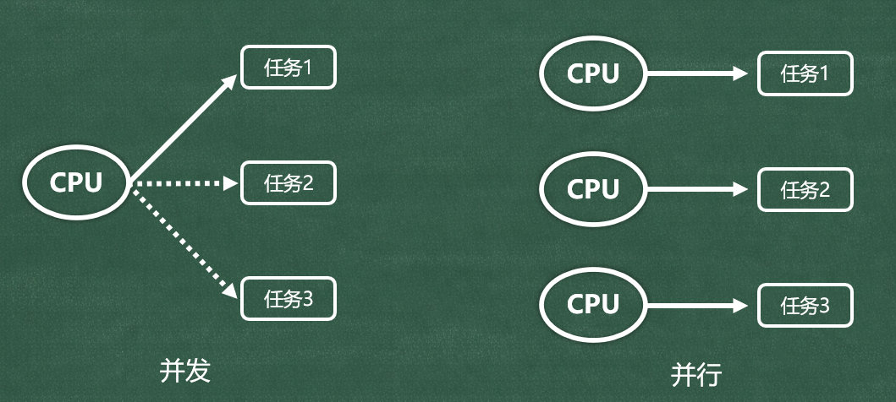
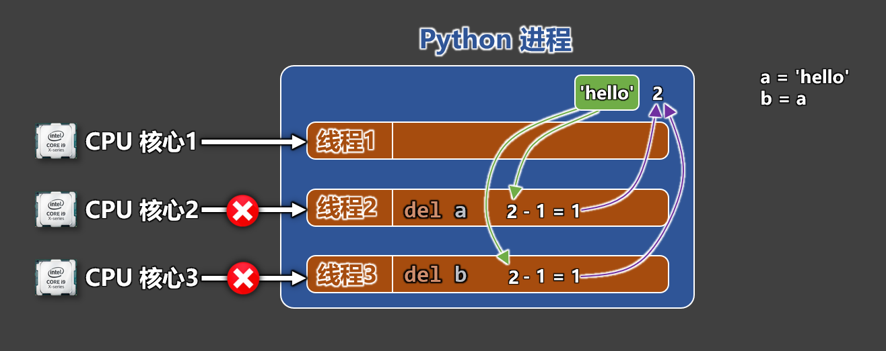
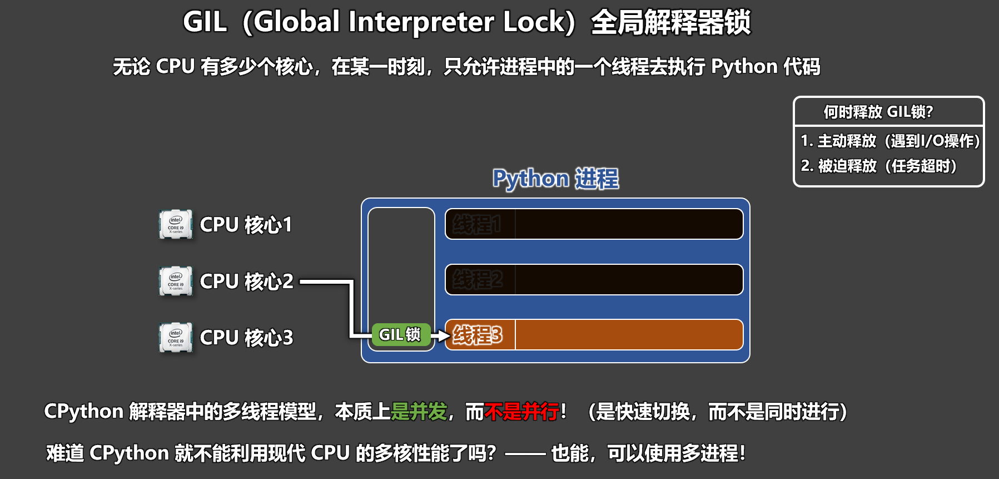
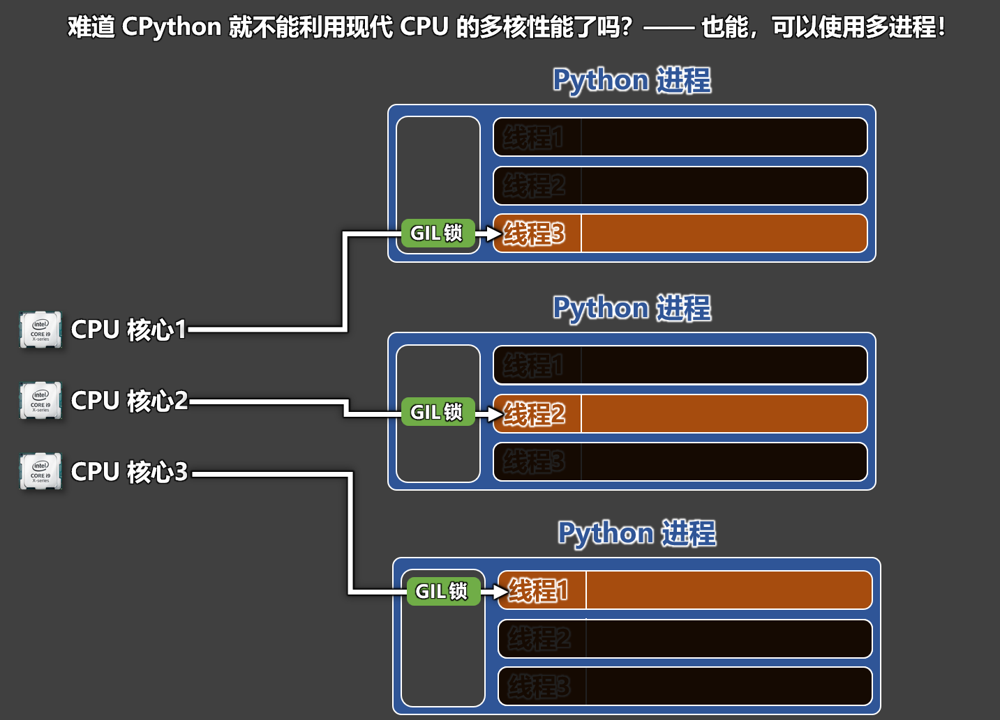
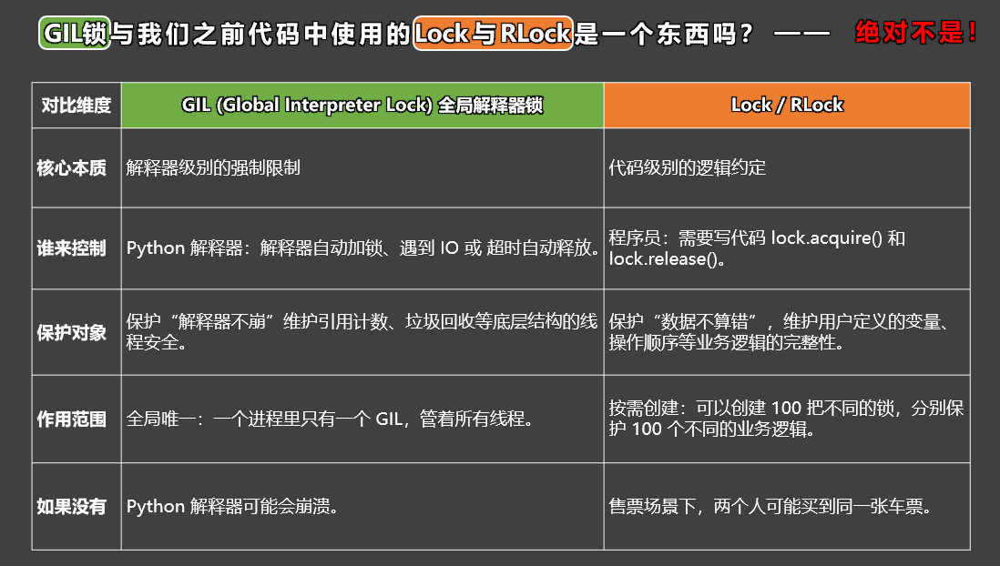

# 第 13 章 进程与线程
##  一些核心概念
### 1️⃣并发 vs 并行
1. **并发**：

🔸概念：在一段时间内，当 CPU 面对多个任务时，会将每个任务交替着执行一段时间。

🔸特点：

(1). 对于某个瞬间，CPU实际上只在执行一个任务。

(2). CPU通过高频切换不同的任务，让每个任务都能得到推进，仿佛多个任务在“同时执行”。

2. **并行**：

🔸概念：并行依赖于多个CPU，或多核心的CPU，在同一时刻，每个核心都在执行不同的任务

🔸特点：

(1). 对于某个瞬间，每个CPU（或每个核心）都在执行不同的任务。

(2). 通过多个CPU（或多个核心）同时工作的方式，让多个任务真的在同时执行。





> **注意**：现代操作系统中，并发与并行通常同时存在。
>

### 2️⃣ 同步 vs 异步
1. **同步(sync)**：

	🔸概念：发起一个任务之后，需要等该任务完成后，才能继续执行后续任务。

	🔸表现：当前执行流会被『阻塞』。

2. **异步(async)**：

	🔸概念：发起一个任务之后，不必等该任务完成，就可以继续执行其他任务。

 🔸备注：虽然不必等待任务完成，但任务完成后，仍然可以通过特定方式获取结果。

	🔸表现：当前执行流不会被『阻塞』。

概念对比：

::: info
+ 并发 / 并行：描述的是任务如何被执行，即：多个任务在执行时，CPU 要如何处理。
+ 同步 / 异步：描述的是任务如何被组织和等待，即：是否等当前任务执行完，再进行下一个任务。

:::

⚠️**注意点**：

::: warning
CPU 的核心数和执行速度，不会改变任务之间的逻辑依赖关系！例如：一旦任务1、任务2、任务3 之间被设计为同步关系，那么：即便 CPU 切换任务的速度再快，核心数量再多，也不会在【任务1】没完成的情况下去启动【任务2】

:::

### 3️⃣进程 vs 线程
1. **进程**：

🔸一个正在运行的程序或软件，背后就对应着一个或多个进程。

🔸进程是操作系统进行资源分配的基本单位。

🔸每个进程都有自己独立的一块内存空间。

2. **线程**：

🔸线程是进程内部的执行单元（一个进程中可以有多个线程）。

🔸线程是操作系统进行 CPU 调度的基本单位。

🔸同一进程内的线程共享进程资源。

## 主进程 _ 子进程
> 在操作系统中，每个进程都会对应一个进程编号（PID），并且主进程与子进程是一个相对的概念，比如 A 进程中创建了 B 进程，B 进程中创建了 C 进程，那此时的 B 进程既是 A 进程的子进程，又是 C 进程的（主）父进程
>

**Python 中查看进程 PID**：

+ `os.getpid()`: 获取当前进程 ID。
+ `os.getppid()`: 获取父进程 ID。

**Windows 命令查看：进程名、父进程 PID、进程 PID**：

+ `wmic process get Name,ParentProcessId,ProcessId` 。

## 使用 Process 创建进程
使用`multiprocessing.Process`类创建进程对象。

```python
import os
import time
from multiprocessing import Process
print(100, __name__, os.getpid())

# 定义一个 speak 函数，功能是：每隔一秒说话一次（一共说话10次）
def speak():
    for index in range(10):
        print(f'我在说话{index}, 进程pid是:{os.getpid()}, 我的父进程是:{os.getppid()}')
        time.sleep(1)

# 定义一个 study 函数，功能是：每隔一秒学习一次（一共学习15次）
def study():
    for index in range(15):
        print(f'我在学习{index}, 进程pid是:{os.getpid()}, 我的父进程是:{os.getppid()}')
        time.sleep(1)

# 注意：一定要写 if __name__ == '__main__' 这个判断，原因如下：
#   1.当创建子进程时，Python 并不会把父进程内存里的 speak 函数直接交给子进程。
#   2.Python会启动一个全新的 Python 解释器进程，重新执行当前的 .py 文件（作为模块）。
#   3.在执行过程中，重新定义出一个 speak 函数，交给子进程。
if __name__ == '__main__':
    print('我是主进程中的【第一行】打印')
    # 创建两个 Process 类的实例对象（进程对象），分别是 p1 和 p2。
    # 注意点1：p1 和 p2 就对应着以后的两个子进程，在创建它们的时候，就要指定好他们要执行的任务。
    # 注意点2：此时的 p1 和 p2 只是代码层面的两个进程对象，操作系统还没有创建 p1 和 p2 两个进程。
    p1 = Process(target=speak)
    p2 = Process(target=study)

    # 调用进程对象的 start 方法，会立刻向操作系统申请一个进程，并且会将该进程交由操作系统进行调度。
    p1.start()
    p2.start()

    print('我是主进程中的【最后一行】打印')
```

**⚠️注意点**：

::: warning
在 Windows 中使用 `multiprocessing` 必须加上` if __name__ == '__main__':`，原因是：创建子进程时，Python 不会直接拷贝内存里的函数给子进程。Python 会启动一个全新的解释器，重新执行当前的`.py`文件作为模块。如果不加判断，会无限递归创建子进程。

:::

## 关于 Process 的参数
在实例化 `Process` 时，可以传递以下参数：

      🔸`group`： 默认值为`None`（应当始终为`None`）。

      🔸`target`：子进程要执行的可调用对象，默认值为 `None`。

      🔸`name`：  进程名称，默认为 `None` ，如果设置为 `None`，Python 会自动分配名字。

      🔸`args`：  给 `target` 传的位置参数（元组）

      🔸`kwargs`：给 `target` 传的关键字参数（字典）。

      🔸`daemon`：标记进程是否为守护进程，取值为布尔值（默认为 `None`，表示从创建方继承）。

> 备注：可以使用 `current_process().name` 获取当前进程的名字。
>

```python
import os
import time
from multiprocessing import Process, current_process

def speak(a, b, msg):
    for index in range(10):
        print(f'{msg}--{a}--{b}--{current_process().name}--我在说话{index}, 进程pid是:{os.getpid()}, 我的父进程是:{os.getppid()}')
        time.sleep(1)

def study():
    for index in range(15):
        print(f'我在学习{index}, 进程pid是:{os.getpid()}, 我的父进程是:{os.getppid()}')
        time.sleep(1)

if __name__ == '__main__':
    print('我是主进程中的【第一行】打印')
    p1 = Process(target=speak, name='说话进程', args=(666, 888), kwargs={'msg':'尚硅谷'})
    p2 = Process(target=study)
    # print(p1.name)
    # print(p2.name)
    p1.start()
    p2.start()
    print('我是主进程中的【最后一行】打印')
```

## 进程控制
### 1️⃣Lock（进程锁）
为了防止多个进程同时打印或操作同一资源导致数据错乱，可以使用 Lock。

**传统用法**：

```python
lock.acquire() # 上锁
# ... 临界区代码 ...
lock.release() # 释放锁
```

**上下文管理器用法 (推荐)**：

```python
with lock:
    # 自动上锁，退出块时自动释放
    # 好处：即便发生异常也能保证释放锁，避免死锁
```

示例代码：

```python
import os
import time
from multiprocessing import Process, Lock

def speak(lock):
    for index in range(10):
        # 上锁：如果锁是空闲的，立刻上锁，继续往下执行；如果锁被别人拿着：当前进程会阻塞等待
        lock.acquire()
        print('好好', end='')
        print('学习', end='')
        print('天天', end='')
        print('向上')
        # 释放锁：acquire 和 release 必须成对出现，否则会永远卡住（死等）
        lock.release()
        time.sleep(1)


def study(lock):
    for index in range(15):
        # with lock: 会自动完成两件事：
        #   (1).进入前：自动执行 lock.acquire() 上锁
        #   (2).离开后：自动执行 lock.release() 释放锁
        # 好处：即便代码块里发生异常，也能保证释放锁，避免“卡死”
        with lock:
            print('A', end='')
            print('B', end='')
            print('C', end='')
            print('D')
        time.sleep(1)

if __name__ == '__main__':
    print('我是主进程中的【第一行】打印')
    lock = Lock()
    p1 = Process(target=speak, args=(lock,))
    p2 = Process(target=study, args=(lock,))
    p1.start()
    p2.start()
    print('我是主进程中的【最后一行】打印')
```

传统 Lock 在面对多次上锁时，会产生死锁状态，解决办法是使用 RLock，示例代码：

```python
import os
import time
from multiprocessing import Process, Lock, RLock

def speak(lock):
    for index in range(10):
        lock.acquire()
        lock.acquire()
        print('好好', end='')
        print('学习', end='')
        print('天天', end='')
        print('向上')
        lock.release()
        lock.release()
        time.sleep(1)


def study(lock):
    for index in range(15):
        with lock:
            print('A', end='')
            print('B', end='')
            print('C', end='')
            print('D')
        time.sleep(1)

if __name__ == '__main__':
    print('我是主进程中的【第一行】打印')
    lock = RLock()
    p1 = Process(target=speak, args=(lock,))
    p2 = Process(target=study, args=(lock,))
    p1.start()
    p2.start()
    print('我是主进程中的【最后一行】打印')
```

### 2️⃣ join 方法
+ **作用**：阻塞当前进程（通常是主进程），直到调用 `join` 的那个进程执行完毕。
+ **参数**：`join(timeout)`，`timeout` 为超时时间（秒）。如果时间到了进程还没结束，主进程就不等了，会继续执行。
+ **注意**：`join` 必须在 `start()` 之后调用。

```python
# join 方法的作用：阻塞当前进程，等 join 前面的进程执行完，再继续往下执行。
# join(timeout)，其中 timeout 是可选参数，表示等多久，单位是秒。

# 注意点：
#   1.p.join() 不是让进程 p 等，而是让“执行这行 join 代码的那个进程”去等，等的是 p 这个进程。
#   2.当达到了 timeout 所指定的时间后，进程并不会终止，只是“不再等”了。
#   3.join 必须在 start 之后
import os
import time
from multiprocessing import Process

def speak():
    for index in range(10):
        print(f'我在说话{index}, 进程pid是:{os.getpid()}, 我的父进程是:{os.getppid()}')
        time.sleep(1)

def study():
    for index in range(15):
        print(f'我在学习{index}, 进程pid是:{os.getpid()}, 我的父进程是:{os.getppid()}')
        time.sleep(1)

if __name__ == '__main__':
    print('我是主进程中的【第一行】打印')
    p1 = Process(target=speak)
    p2 = Process(target=study)
    p1.start()
    # 让主进程等 p1 5秒钟
    p1.join(5)

    p2.start()
    # p1.join() # 让主进程等 p1 进程执行完毕后，主进程再继续执行。
    # p2.join() # 让主进程等 p2 进程执行完毕后，主进程再继续执行。
    print('我是主进程中的【最后一行】打印')
```

### 3️⃣terminate 方法
+ **作用**：向操作系统申请强制终止进程。
+ **注意**：使用 `terminate` 终止进程，**不会执行**`finally`**代码块**。
+ **辅助方法**：`is_alive()` 可用于查看进程是否还“活着”。

```python
import os
import time
from multiprocessing import Process

def speak():
    try:
        for index in range(10):
            print(f'我在说话{index}, 进程pid是:{os.getpid()}, 我的父进程是:{os.getppid()}')
            time.sleep(1)
    # 注意：使用 terminate 终止进程，不会引起 finally 执行！
    finally:
        print('我是finally里的逻辑')

def study():
    for index in range(15):
        print(f'我在学习{index}, 进程pid是:{os.getpid()}, 我的父进程是:{os.getppid()}')
        time.sleep(1)

if __name__ == '__main__':
    print('我是主进程中的【第一行】打印')
    p1 = Process(target=speak)
    p2 = Process(target=study)
    p1.start()
    p2.start()

    time.sleep(3)
    print('我是主进程，我准备强制终止p1进程........')
    # 向操作系统申请强制终止p1进程
    p1.terminate()
    # 等操作系统彻底终止掉了p1进程
    p1.join()
    # 看一下p1进程是否“活着”
    print(p1.is_alive())

    print('我是主进程中的【最后一行】打印')
```

### 4️⃣ 守护进程 (Daemon)
**什么是守护进程？**

一种 “依附于主进程存在的子进程”，一旦主进程结束，它就会被自动终止。简言之：主进程一死，守护进程必跟着死。

**守护进程的使用场景**：

::: info
1. 后台监控类任务
2. 日志 / 统计 / 采样 类任务
3. 辅助型“陪跑任务”

:::

**注意点**：

::: info
1. 守护进程必须是 子进程。
2. 主进程结束，守护进程也会随之结束。
3. 守护进程中，不允许再创建新的子进程。
4. 必须在 start 之前，`start()`之后，不能再设置`daemon`。

:::

```python
import os
import time
from multiprocessing import Process

def monitor():
    while True:
        try:
            with open('log.txt', 'r', encoding='utf-8') as file:
                lines = sum(1 for _ in file)
        except FileNotFoundError:
            lines = 0
        print(f'我是【守护进程({os.getpid()})】，log.txt 共有{lines}行')
        time.sleep(1)

def test():
    for index in range(30):
        print(f'我是test({os.getpid()})')
        time.sleep(1)

if __name__ == '__main__':
    print(f'我是主进程({os.getpid()})中的【第一行】代码')

    p1 = Process(target=monitor, daemon=True)
    p2 = Process(target=test)

    p1.start()
    p2.start()

    # 向文件中写入数据
    with open('log.txt', 'a', encoding='utf-8') as file:
        for index in range(10):
            file.write(f'尚硅谷{index}\n')
            file.flush()
            time.sleep(1)

    print(f'我是主进程({os.getpid()})中的【最后一行】代码')
```

## 进程之间不共享变量
进程之间不共享内存，因此也就不共享任何变量。验证代码如下：

验证代码 1：

```python
# 进程之间不共享内存，因此也就不共享任何变量。
from multiprocessing import Process
num = 100
names = []

def test1():
    global num, names
    num += 10
    names.append('张三')
    print(f'我是 test1 进程，操作之后的num是{num}，操作之后的names是{names}')

def test2():
    global num, names
    num -= 10
    names.append('李四')
    print(f'我是 test2 进程，操作之后的num是{num}，操作之后的names是{names}')

if __name__ == "__main__":
    print('主进程中的【第一行】代码')
    p1 = Process(target=test1)
    p2 = Process(target=test2)

    p1.start()
    p2.start()

    p1.join()
    p2.join()
    print('主进程中的【最后一行】代码', num, names)
```

验证代码 2：

```python
# 进程之间不共享内存，因此也就不共享任何变量。
from multiprocessing import Process

def test1(num, names):
    num += 10
    names.append('张三')
    print(f'我是 test1 进程，操作之后的num是{num}，操作之后的names是{names}')

def test2(num, names):
    num -= 10
    names.append('李四')
    print(f'我是 test2 进程，操作之后的num是{num}，操作之后的names是{names}')

if __name__ == "__main__":
    num = 100
    names = []

    print('主进程中的【第一行】代码')
    p1 = Process(target=test1, args=(num, names))
    p2 = Process(target=test2, args=(num, names))

    p1.start()
    p2.start()

    p1.join()
    p2.join()
    print('主进程中的【最后一行】代码', num, names)
```

注意：

::: warning
我们正常编写的变量，在多个进程之间是不共享的，但有些对象是天然被多个进程共享的，比如：我们之前讲过的 Lock 和 RLock，我们后面还会学习到很多天然被多个进程锁共享的对象，例如：`multiprocessing.Queue`

:::

## Queue（队列）
+ 我们之前学过 `list`、`tuple`、`dict`，它们的特点是：数据想怎么拿数据，就怎么拿。
+ 队列(Queue)是：一种“先进先出”的数据结构（先放进去的数据，一定会先取出来）。
+ 队列的常见操作如下：

```python
import time
from multiprocessing import Queue, Process

# 创建一个队列（不限制大小，即：不设置容量上限）
q1 = Queue()

# 创建一个队列（最多能保存3个元素）
q2 = Queue(3)

# 1️⃣put方法：往队列里放数据（入队）
q1.put(10)
q1.put(20)
q1.put(30)

# 2️⃣get方法：从队列里取数据（出队）
value1 = q1.get()
value2 = q1.get()
value3 = q1.get()
print(value1)
print(value2)
print(value3)

# 3️⃣empty方法：判断队列是否为空
result = q1.empty()
print(result)

# 4️⃣full方法：判断队列是否已满
q1.put(10)
q1.put(20)
q1.put(30)
result = q1.full()
print(result)

q2.put(100)
q2.put(200)
q2.put(300)
result = q2.full()
print(result)

# 5️⃣qsize方法：获取队列长度
q1.put(10)
q1.put(20)
q1.put(30)
result = q1.qsize()
print(result)

# 6️⃣队列具备等待模式
q2.put(100)
q2.put(200)
q2.put(300)

# (1).当队列已满，继续 put，就会进入等待模式，等别人调用get方法，取走一个元素
q2.put(400)
print('放入完毕')

# (2).当队列已满，执行：put(元素, timeout=秒数)，就会等待指定秒数。
q2.put(400, timeout=3)
print('放入完毕')

# (3).put_nowait 方法，会直接向队列中添加元素，不会进入等待模式，若队列已满，会抛出异常。
# 备注：put_nowait 等价于 put(元素, block=False)，block的默认值为 True
q2.put_nowait(400)
q2.put(400, block=False)

# get读多了，也会进入等待模式
q2.get()
q2.get()
q2.get()

# (1).当队列已空，继续 get，就会进入等待模式。x
q2.get()

# (2).当队列已空，执行 get(timeout=秒数)，就会等待指定秒数。
q2.get(timeout=3)

# (3).get_nowait 方法，会直接读取队列中的元素，不会进入等待模式，若队列已空，会抛出异常
# 备注：get_nowait 等价于 get(block=False)
q2.get_nowait()
q2.get(block=False)
```

通过多进程演示：当队列满了以后，再次`put`会等待，当有人从队列中取出元素后，`put`会继续。

```python
def test(q):
    time.sleep(3)
    result = q.get()
    print('我从队列中取出了一个元素：',result)


# 通过多进程，演示一下：当队列满了以后，再次put会等待，当有人从队列中取出元素后，put会继续。
if __name__ == '__main__':
    # 创建一个队列，让其最多能保存2个元素
    q = Queue(2)
    # put两次，把队列填满
    q.put('尚硅谷')
    q.put('atguigu')
    print(f'队列是否已满：{q.full()}')

    # 创建子进程p1
    p1 = Process(target=test, args=(q, ))
    # 开启子进程p1，让其3秒钟后，从队列中取出一个元素
    p1.start()

    print('即将向已满的队列中添加一个元素........')
    q.put('hello')

    print('目前队列中有的元素是：')
    print(q.get())
    print(q.get())
```

## 使用 Queue 实现进程通信
> 进程之间是不共享数据的，那如果进程之间如何进行数据沟通（进程通信）呢？手段多种多样，我们本小节给大家说通过Queue 实现进程通信。
>

核心思想： 一个进程负责生产数据，另一个进程负责消费数据，中间通过 Queue 进行“传话”

```python
import time
from multiprocessing import Process, Queue

# 子进程1：往队列里放数据
def test1(q):
    for index in range(5):
        print(f'【test1】放入数据：{index}')
        q.put(index)
        time.sleep(0.5)

# 子进程2：从队列里取数据
def test2(q):
    for index in range(5):
        data = q.get()
        print(f'【test2】取出数据：{data}')
        time.sleep(1)

if __name__ == '__main__':
    q = Queue()

    p1 = Process(target=test1, args=(q,))
    p2 = Process(target=test2, args=(q,))

    p1.start()
    p2.start()

    p1.join()
    p2.join()
```

> 备注：`q` 是在主进程中创建的，但可以被子进程使用，因为` multiprocessing.Queue`是跨进程的。
>

为什么数据不会乱掉？ —— 因为队列是先进先出的。

## 使用 Pipe 实现进程通信
Pipe 就像一根“水管”，一头负责发送，另一头负责接收。

 1️⃣ **创建管道**

```python
# Pipe() 会返回两个连接对象，它们分别代表管道的两端。
# duplex用于控制管道为单向还是双向，True表示双向，False表示单向
con1, con2 = Pipe(duplex=True)

# 单向 Pipe 的规则：con1只能发送，con2只能接收。
```

2️⃣**发送与接收**

+ `send`方法： 向管道中发送数据。
+ `recv`方法： 从管道中接收数据。

3️⃣**测试代码**：

```python
import time
from multiprocessing import Process, Pipe

def test1(con1):
    time.sleep(2)
    con1.send(100)
    print('test1发送了100')

def test2(con2):
    data = con2.recv()
    print(f'test2接收了{data}')


if __name__ == '__main__':
    con1, con2 = Pipe(duplex=False)
    p1 = Process(target=test1, args=(con1,))
    p2 = Process(target=test2, args=(con2,))

    p1.start()
    p2.start()

    p1.join()
    p2.join()
```

## 继承 Process 类创建进程
当子进程逻辑比较复杂，或者想把「进程 + 行为」封装成一个整体时，可以使用继承 Process 类的方式去创建进程，这种方式属于“面向对象风格”

1️⃣**核心要点**：

+ 必须继承 `Process`类
+ 把子进程要干的事，写进 `run()` 方法里
+ 依然使用`start`方法启动进程，不要手动调用 `run()`！
+ 若子进程不需要参数，可以不写`__init__`，若需要参数，则需编写`__init__`
+ 传给的子进程的参数，作为实例属性保存 。

2️⃣**示例代码**：

```python
from multiprocessing import Process
import os, time

class SpeakProcess(Process):
    def __init__(self, a, b, **kwargs):
        super().__init__(**kwargs)
        self.a = a
        self.b = b

    def run(self):
        for index in range(10):
            print(f'{self.a}--{self.b}--我在说话{index}, 进程pid是:{os.getpid()}, 我的父进程是:{os.getppid()}')
            time.sleep(1)

class StudyProcess(Process):
    def run(self):
        for index in range(15):
            print(f'我在学习{index}, 进程pid是:{os.getpid()}, 我的父进程是:{os.getppid()}')
            time.sleep(1)

if __name__ == '__main__':
    print('我是主进程中的【第一行】打印')
    p1 = SpeakProcess(100, 200)
    p2 = StudyProcess()

    p1.start()
    p2.start()

    p1.join()
    p2.join()

    print('我是主进程中的【最后一行】打印')
```

## 进程池（ProcessPoolExecutor）
> 截至目前，我们已经学会了创建多个进程一起工作，但是我们仍然面临一个问题：如果每来一个任务就创建一个进程，会很浪费系统资源，因为进程创建 / 销毁成本很高，当有大量任务时，系统资源浪费严重。
>

使用进程池的优势：如何使用进程池统一管理多个子进程，避免频繁创建 / 销毁进程带来的开销，因为进程池会提前创建固定数量的进程，反复使用它们来执行任务。

1️⃣**创建『进程池执行器』、使用 submit 方法提交任务、使用 shutdown 方法等待任务完成**。

```python
def work(n):
    print(f'work正在执行任务{n}.........{os.getpid()}')
    time.sleep(1)

if __name__ == '__main__':
    print('---------start-------------')
    # 创建一个进程池执行器
    executor = ProcessPoolExecutor(3)
    # 使用 submit 方法提交任务（submit 只负责“提交任务”，不会阻塞主进程）
    executor.submit(work, 1)
    executor.submit(work, 2)
    executor.submit(work, 3)
    executor.submit(work, 4)
    executor.submit(work, 5)
    executor.submit(work, 6)
    executor.submit(work, 7)
    # shutdown 的作用：不再接收新的任务。
    # wait=True 的作用：阻塞主进程，等待进程池中所有任务执行完毕。
    executor.shutdown(wait=True)
    print('---------end-------------')
```

2️⃣**获取子进程执行后的返回结果（Future类的实例对象 + result方法）**

```python
def work(n):
    print(f'work正在执行任务{n}.........{os.getpid()}')
    time.sleep(1)
    return f'我是任务{n}的结果'

if __name__ == '__main__':
    print('---------start-------------')
    # 创建一个进程池执行器
    executor = ProcessPoolExecutor(3)
    # 使用 submit 方法提交任务（submit 只负责“提交任务”，不会阻塞主进程）
    # f1 = executor.submit(work, 1)
    # f2 = executor.submit(work, 2)
    # f3 = executor.submit(work, 3)
    # f4 = executor.submit(work, 4)
    # f5 = executor.submit(work, 5)
    # f6 = executor.submit(work, 6)
    # f7 = executor.submit(work, 7)
    futures = [executor.submit(work, index) for index in range(1, 8)]
    # 阻塞主进程，等待进程池中所有任务执行完毕。
    executor.shutdown(wait=True)
    # print(f1.result())
    # print(f2.result())
    # print(f3.result())
    # print(f4.result())
    # print(f5.result())
    # print(f6.result())
    # print(f7.result())
    for f in futures:
        print(f.result())
    print('---------end-------------')
```

3️⃣**使用 `as_completed`：按“完成顺序”获取结果**

```python
def work(n):
    print(f'work正在执行任务{n}.........{os.getpid()}')
    if n == 1:
        time.sleep(15)
    elif n == 2:
        time.sleep(10)
    else:
        time.sleep(1)
    return f'我是任务{n}的结果'

if __name__ == '__main__':
    print('---------start-------------')
    # 创建一个进程池执行器
    executor = ProcessPoolExecutor(3)
    # 使用 submit 方法提交任务（submit 只负责“提交任务”，不会阻塞主进程）
    futures = [executor.submit(work, index) for index in range(1, 8)]
    # 准备一个 result_list 去收集任务的具体结果
    result_list = []
    # 收集每个任务的结果
    for f in as_completed(futures):
        result_list.append(f.result())
    # 阻塞主进程，等待进程池中所有任务执行完毕。
    executor.shutdown(wait=True)
    # 打印最终的结
    print(result_list)
    print('---------end-------------')
```

4️⃣**使用 `add_done_callback` 方法，为任务添加完成时的回调函数。**

```python
def work(n):
    print(f'work正在执行任务{n}.........{os.getpid()}')
    if n == 1:
        time.sleep(15)
    elif n == 2:
        time.sleep(10)
    else:
        time.sleep(1)
    return f'我是任务{n}的结果'

if __name__ == '__main__':
    print('---------start-------------')
    # 创建一个进程池执行器
    executor = ProcessPoolExecutor(3)
    # 准备一个 result_list 列表去收集任务的结果
    result_list = []
    # 任务完成后的回调函数
    def done_func(futrue):
        result_list.append(futrue.result())
    # 开启7个任务，并指定回调函数
    for index in range(1, 8):
        f = executor.submit(work, index)
        f.add_done_callback(done_func)
    # 等所有任务都完成
    executor.shutdown(wait=True)
    # 打印最终的结果（按“完成的顺序”获取）
    print(result_list)
    print('---------end-------------')
```

5️⃣️**使用 `map` 方法批量提交任务（注意：`map`方法本身不阻塞，但读取其返回的生成器对象是阻塞的，并且得到结果的顺序，与任务分配的顺序是一致的）**

> map方法会把这一批任务提交到进程池里执行，它会立刻返回一个生成器，真正的阻塞发生在：生成器取结果时，如 list(result)
>

```python
def work(n):
    print(f'work正在执行任务{n}.........{os.getpid()}')
    if n == 1:
        time.sleep(15)
    elif n == 2:
        time.sleep(10)
    else:
        time.sleep(1)
    return f'我是任务{n}的结果'

if __name__ == '__main__':
    print('---------start-------------')
    # 创建一个进程池执行器
    executor = ProcessPoolExecutor(3)
    # 通过 map 方法批量提交任务（结果按照提交的顺序来）
    results = executor.map(work, [1, 2, 3, 4, 5, 6, 7])
    # 获取 results 生成器中的内容
    print(list(results))
    # 等所有任务都完成
    executor.shutdown(wait=True)
    print('---------end-------------')
```

6️⃣**使用 `with`：进程池的“自动回收”写法，离开 `with`代码块时自动执行`shutdown(wait=True)`**

```python
def work(n):
    print(f'work正在执行任务{n}.........{os.getpid()}')
    if n == 1:
        time.sleep(15)
    elif n == 2:
        time.sleep(10)
    else:
        time.sleep(1)
    return f'我是任务{n}的结果'

if __name__ == '__main__':
    print('---------start-------------')
    # 创建一个进程池执行器
    with ProcessPoolExecutor(3) as executor:
        # 通过 map 方法批量提交任务（结果按照提交的顺序来）
        results = executor.map(work, [1, 2, 3, 4, 5, 6, 7])
        # 获取 results 生成器中的内容
        print(list(results))
    print('---------end-------------')
```

## 使用 Thread 创建线程
首先我们要明确一个概念：任何一个正在运行的 Python 程序，至少都有一个线程！

1️⃣回顾一下我们之前的代码：

```python
if __name__ == '__main__':
    print('主进程中的代码')
```

> 对于上述代码来说：`print('主进程中的代码')` 确实属于主进程，但更准确地说，是运行在**主进程**里的**主线程**中。
>

 2️⃣线程是进程中的执行单位：

+  一个进程里，至少有一个线程（主线程）
+  一个进程里，也可以有多个线程
+  多个线程之间会： 共享进程的内存空间、 但执行顺序由操作系统调度。

3️⃣示例代码：

```python
import os
import time
from threading import get_native_id, Thread, RLock

def speak(lock):
    for index in range(5):
        with lock:
            print(f'我在说话{index}, 进程pid是:{os.getpid()}, 线程编号:{get_native_id()}')
        time.sleep(1)

def study(lock):
    for index in range(5):
        with lock:
            print(f'我在学习{index}, 进程pid是:{os.getpid()}, 线程编号:{get_native_id()}')
        time.sleep(1)

if __name__ == '__main__':
    print(f'-------start------- 进程pid是:{os.getpid()}, 线程编号:{get_native_id()}')
    lock = RLock()
    # Thread 的参数：
    # 🔸group： 默认值为 None（应当始终为 None）。
    # 🔸target： 子线程要执行的可调用对象，默认值为 None。
    # 🔸name： 线程名称，默认为 None。如果设置为 None，Python 会自动分配名字
    # 🔸args： 给 target 传的位置参数（元组）。
    # 🔸kwargs： 给 target 传的关键字参数（字典）。
    # 🔸daemon： 标记线程是否为守护线程，取值为布尔值（默认为 None）。
    # 使用 Thread 创建线程对象
    t1 = Thread(target=speak, args=(lock,))
    t2 = Thread(target=study, args=(lock,))
    # 调用线程对象的 start 方法，会立刻将该线程交由操作系统进行调度。
    t1.start()
    t2.start()
    # 让主线程等 t1和t2 线程执行完毕后，主线程再继续执行。
    t1.join()
    t2.join()
    print('-------end-------')
```

## 继承 Thread 创建线程
和继承`Process`创建进程一样，我们也可以继承`Thread`创建线程。

```python
import os
import time
from threading import get_native_id, Thread, RLock

class SpeakThread(Thread):
    def __init__(self, lock, **kwargs):
        super().__init__(**kwargs)
        self.lock = lock

    def run(self):
        for index in range(5):
            with self.lock:
                print(f'我在说话{index}, 进程pid是:{os.getpid()}, 线程编号:{get_native_id()}')
            time.sleep(1)

class StudyThread(Thread):
    def __init__(self, lock, **kwargs):
        super().__init__(**kwargs)
        self.lock = lock

    def run(self):
        for index in range(5):
            with self.lock:
                print(f'我在学习{index}, 进程pid是:{os.getpid()}, 线程编号:{get_native_id()}')
            time.sleep(1)

if __name__ == '__main__':
    print(f'-------start------- 进程pid是:{os.getpid()}, 线程编号:{get_native_id()}')
    lock = RLock()
    # 继承 Thread 类创建线程对象
    t1 = SpeakThread(lock)
    t2 = StudyThread(lock)
    # 调用线程对象的 start 方法，会立刻将该线程交由操作系统进行调度。
    t1.start()
    t2.start()
    # 让主线程等 t1和t2 线程执行完毕后，主线程再继续执行。
    t1.join()
    t2.join()
    print('-------end-------')
```

## 线程池
线程池的具体语法，以及各个方法的作用，都和进程池一样

1️⃣**创建『线程池执行器』、使用 `submit`方法提交任务、使用`shutdown` 方法等待任务完成。**

```python
def work(n, lock):
    with lock:
        print(f'work正在执行任务{n}.........{get_native_id()}')
    time.sleep(1)

if __name__ == '__main__':
    print('---------start-------------')
    # 创建一个线程池执行器
    executor = ThreadPoolExecutor(3)
    # 创建线程锁
    lock = RLock()
    # 使用 submit 方法提交任务（submit 只负责“提交任务”，不会阻塞主线程）
    executor.submit(work, 1, lock)
    executor.submit(work, 2, lock)
    executor.submit(work, 3, lock)
    executor.submit(work, 4, lock)
    executor.submit(work, 5, lock)
    executor.submit(work, 6, lock)
    executor.submit(work, 7, lock)
    # shutdown 的作用：不再接收新的任务。
    # wait=True 的作用：阻塞主线程，等待线程池中所有任务执行完毕。
    executor.shutdown(wait=True)
    print('---------end-------------')
```

2️⃣**获取子线程执行后的返回结果（`Future`类的实例对象 + `result`方法）**

```python
def work(n, lock):
    with lock:
        print(f'work正在执行任务{n}.........{get_native_id()}')
    time.sleep(1)
    return f'任务{n}的结果'

if __name__ == '__main__':
    print('---------start-------------')
    # 创建一个线程池执行器
    executor = ThreadPoolExecutor(3)
    # 创建线程锁
    lock = RLock()
    # 使用 submit 方法提交任务（submit 只负责“提交任务”，不会阻塞主线程）
    futures = [executor.submit(work, index, lock) for index in range(1, 8)]
    # 阻塞主线程，等待线程池中所有任务执行完毕。
    executor.shutdown(wait=True)
    # 打印结果
    for f in futures:
        print(f.result())
    print('---------end-------------')
```

3️⃣**使用 `as_completed`：按“完成顺序”获取结果**

```python
def work(n, lock):
    with lock:
        print(f'work正在执行任务{n}.........{get_native_id()}')
    if n == 1:
        time.sleep(15)
    elif n == 2:
        time.sleep(10)
    else:
        time.sleep(1)
    return f'任务{n}的结果'

if __name__ == '__main__':
    print('---------start-------------')
    # 创建一个线程池执行器
    executor = ThreadPoolExecutor(3)
    # 创建线程锁
    lock = RLock()
    # 使用 submit 方法提交任务（submit 只负责“提交任务”，不会阻塞主线程）
    futures = [executor.submit(work, index, lock) for index in range(1, 8)]
    # 收集每个线程返回的结果
    result_list = []
    # 将每个线程返回的结果，存入result_list
    for f in as_completed(futures):
        result_list.append(f.result())
    # 阻塞主线程，等待线程池中所有任务执行完毕。
    executor.shutdown(wait=True)
    # 打印最终的结果
    print(result_list)
    print('---------end-------------')
```

4️⃣**使用 `add_done_callback` 方法，为任务添加完成时的回调函数**

```python
def work(n, lock):
    with lock:
        print(f'work正在执行任务{n}.........{get_native_id()}')
    if n == 1:
        time.sleep(15)
    elif n == 2:
        time.sleep(10)
    else:
        time.sleep(1)
    return f'任务{n}的结果'

if __name__ == '__main__':
    print('---------start-------------')
    # 创建一个线程池执行器
    executor = ThreadPoolExecutor(3)
    # 创建线程锁
    lock = RLock()
    # 收集每个线程的执行结果
    result_list = []
    # 定义一个线程执行成功后的回调函数
    def done_func(f):
        result_list.append(f.result())
    # 使用submit提交任务，并指定回调函数
    for index in range(1, 8):
        f = executor.submit(work, index, lock)
        f.add_done_callback(done_func)
    # 阻塞主线程，等待线程池中所有任务执行完毕。
    executor.shutdown(wait=True)
    # 打印最终的结果
    print(result_list)
    print('---------end-------------')
```

5️⃣**使用 `map` 方法批量提交任务（注意：`map`方法本身不阻塞，但读取其返回的生成器对象是阻塞的，并且得到结果的顺序，与任务分配的顺序是一致的）**

> map方法会把这一批任务提交到线程池里执行，它会立刻返回一个生成器，真正的阻塞发生在：生成器取结果时，如 list(result)
>

```python
def work(n, lock):
    with lock:
        print(f'work正在执行任务{n}.........{get_native_id()}')
    if n == 1:
        time.sleep(15)
    elif n == 2:
        time.sleep(10)
    else:
        time.sleep(1)
    return f'任务{n}的结果'

if __name__ == '__main__':
    print('---------start-------------')
    # 创建一个线程池执行器
    executor = ThreadPoolExecutor(3)
    # 创建线程锁
    lock = RLock()
    # 使用map方法批量提交任务
    result = executor.map(work, [1, 2, 3, 4, 5, 6, 7], [lock]*7)
    # 打印最终的结果
    print(list(result))
    # 阻塞主线程，等待线程池中所有任务执行完毕。
    executor.shutdown(wait=True)
    print('---------end-------------')
```

6️⃣**使用 `with`：线程池的“自动回收”写法，离开 `with` 代码块时自动执行` shutdown(wait=True)`**

```python
def work(n, lock):
    with lock:
        print(f'work正在执行任务{n}.........{get_native_id()}')
    if n == 1:
        time.sleep(15)
    elif n == 2:
        time.sleep(10)
    else:
        time.sleep(1)
    return f'任务{n}的结果'

if __name__ == '__main__':
    print('---------start-------------')
    with ThreadPoolExecutor(3) as executor:
        # 创建线程锁
        lock = RLock()
        # 使用map方法批量提交任务
        result = executor.map(work, [1, 2, 3, 4, 5, 6, 7], [lock]*7)
        # 打印最终的结果
        print(list(result))
    print('---------end-------------')
```

## GIL 全局解释器锁
**概念：** GIL锁是 CPython 解释器中的一把互斥锁。

**作用**：无论 CPU 有多少个核心，在某一时刻，只允许同一个进程中的一个线程去执行 Python 代码。

**结论**：CPython 解释器中的多线程模型，本质上是并发，而不是并行！（是快速切换，而不是同时进行）

**为何要这样设计**？———— 为了确保解释器级别的数据安全。

如果没有 GIL 锁，那么 Python 底层就可能会出现引用计数错误，导致内存“爆炸”。




GIl 锁何时会被释放？ —— 主动释放（遇到 I/O 操作）、被迫释放（任务超时）




可以使用多进程来发挥多核 CPU 的性能




GIL 对比 lock/Rlock：




结论：GIL 为了确保 Cpython 解释器级别的数据安全，作为日常编码来说，我们对 GIL 是无感的，但对于 `Lock/Rlock` 是实际编码中使用较多的，`Lock/Rlock`是为了确保业务路基的完整，例如：

```python
# GIL锁和编码时使用的 Lock 和 Rlock 不是同一个东西。
# Lock 和 Rlock是业务层面的锁，目标是：让业务逻辑别出错
# Rlock示例1：让打印是完整的

import time
from threading import Thread, RLock,current_thread
def show_info1(lock):
    for index in range(10):
        with lock:
            print('尚', end='')
            print('硅', end='')
            print('谷')

def show_info2(lock):
    for index in range(10):
        with lock:
            print('at', end='')
            print('gui', end='')
            print('gu')

if __name__ == '__main__':
    lock = RLock()
    t1 = Thread(target=show_info1, args=(lock,))
    t2 = Thread(target=show_info2, args=(lock,))
    t1.start()
    t2.start()

# Rlock示例2：不要让两个窗口卖出同一张票
current = 1

def sale(lock):
    global current
    while True:
        with lock:
            if current <= 20:
                print(f'{current_thread().name}出售了第{current}张票！')
                current += 1
            else:
                print('票已售空')
                break
        time.sleep(0.3)

if __name__ == '__main__':
    lock = RLock()
    t1 = Thread(target=sale, name='窗口1', args=(lock,))
    t2 = Thread(target=sale, name='窗口2', args=(lock,))
    t3 = Thread(target=sale, name='窗口3', args=(lock,))
    t1.start()
    t2.start()
    t3.start()
```

## 多进程 vs 多线程，该如何选择？


CPU密集型任务，更适合用多进程。

```python
import time
from concurrent.futures import ProcessPoolExecutor, ThreadPoolExecutor

# 准备一个 CPU 密集型任务
def cpu_task(n):
    print(f'任务{n}开始了')
    total = 0
    for i in range(10000000):
        total += i * i
    return total

if __name__ == '_main_':
    print('===== 多进程完成【CPU密集型任务】=====')
    start = time.time()
    #开启四个进程进行计算
    with ProcessPoolExecutor(4) as executor:
        list(executor.map(cpu_task, [1, 2, 3, 4]))
    end = time.time() - start
    print(f'多进程总耗时：{end}秒')


    # print('===== 多线程完成【CPU密集型任务】=====')
    # start = time.time()
    # # 开启四个线程进行计算
    # with ThreadPoolExecutor(max_workers=4) as executor:
    #     results = list(executor.map(cpu_task, [1, 2, 3, 4]))
    # end = time.time() - start
    # print(f'多线程总耗时：{end}秒')
```

IO密集型任务，更适合用多线程。

```python
import time
from concurrent.futures import ThreadPoolExecutor, ProcessPoolExecutor

# 拷贝文件
def copy_file(index):
    with open('a.zip', 'rb') as src, open(f'a_副本{index}.zip', 'wb') as dst:
        while True:
            data = src.read(1024 * 1024)  # 每次读 1MB
            if not data:
                break
            dst.write(data)

if __name__ == '__main__':
    # print('===== 使用多进程完成【IO密集型任务】 =====')
    # start = time.time()
    # with ProcessPoolExecutor(4) as executor:
    #     for i in range(4):
    #         executor.submit(copy_file, i)
    # end = time.time() - start
    # print(f'多进程耗时：{end} 秒')

    print('===== 使用多线程完成【IO密集型任务】 =====')
    start = time.time()
    with ThreadPoolExecutor(4) as executor:
        for i in range(4):
            executor.submit(copy_file, i)
    end = time.time() - start
    print(f'多线程耗时：{end} 秒')
```
