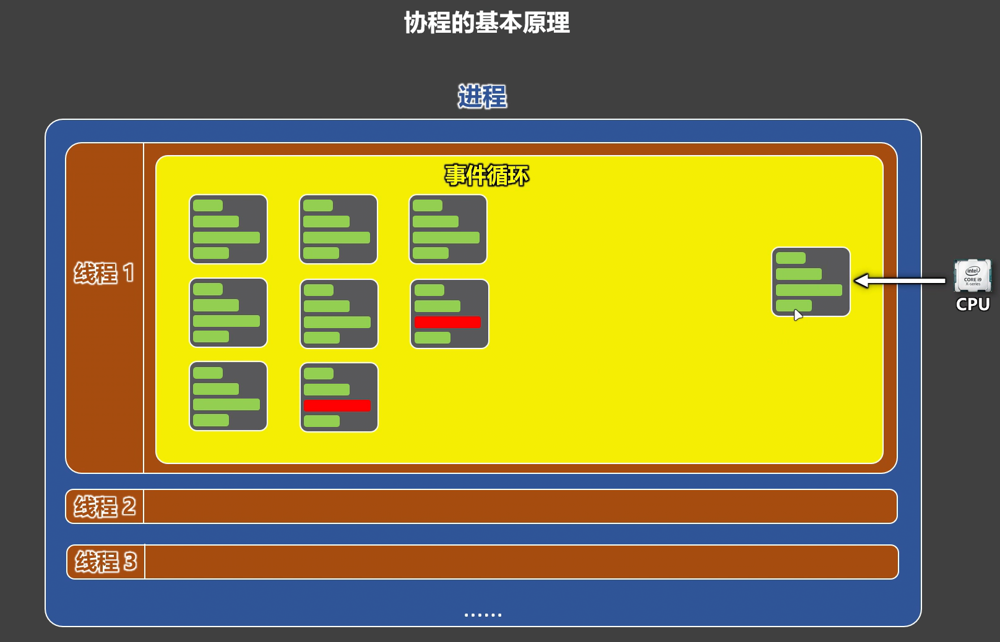

# 第 14 章 协程
## 什么是协程
**概念**：协程（Coroutine），是一种线程内部的任务调度机制，它通过事件循环，在用户态中实现任务的挂起与恢复执行，从而在遇到 IO 操作时，不让 CPU 等待，而是继续执行其它需要 CPU 的任务。

::: info
协程的本质就是：在一个线程里，趁着某些任务在等 IO，把 CPU 交给其它任务去用。

:::




**关键点1️⃣：协程不是线程，也不是进程**

::: info
+ 协程不是操作系统提供的，并且 CPU 看不见协程。
+ 操作系统不知道协程的存在。
+ 协程是程序员在用户态，用代码“设计出来”的任务切换机制。

:::

**关键点2️⃣：协程发生在一个线程内部**

::: info
+ 协程不是线程之间的切换。
+ 而是线程内部多个任务之间的切换。
+ 本质是一个线程里，写了很多任务，由事件循环统一调度。

:::

**关键点3️⃣：协程的核心能力：挂起与恢复**

::: info
+ 当任务 遇到 IO 操作 时：任务会被挂起。
+ 当 IO 操作完成后：任务会被恢复执行。

:::

**关键点4️⃣：协程依赖一个关键角色：事件循环**

::: info
+ 事件循环负责：调度任务、判断是否该挂起、决定何时恢复执行，事件循环是协程系统的“大脑”

:::

**关键点5️⃣：协程的目标是尽量减少线程切换**

::: info
+ 在单线程场景下，最大化 CPU 利用率，特别适合 IO 密集型任务

:::

## 协程函数 vs 协程对象
+ **协程函数(coroutine Function)**：使用『async关键字』修饰的函数，就是协程函数。
+ **协程对象(coroutine Object)**：调用『协程函数』，就会得到『协程对象』。

> 注意：调用『协程函数』，并不会执行『协程函数』中的代码。
>

```python
# 定义一个协程函数
async def work():
    print('work开始')
    print('work执行中......')
    print('work结束')
    return '工作结果'

# 调用协程函数，会得到协程对象
coroutine_object = work()
```

将协程对象交给`asyncio.run()`，`asyncio.run()`会将协程对象包装成一个任务交给事件循环。

```python
# asyncio.run 方法做了3件事：
#   1.创建一个事件循环。
#   2.将收到的协程对象，包装成一个任务（task），交给事件循环。
#   3.启动事件循环。
# 注意：asyncio.run 会阻塞当前线程，直到任务执行完毕，并返回该任务 return 的最终结果。
result = asyncio.run(coroutine_object)
print(result)
```

## await 关键字
await 关键有三个作用：

1. **挂起**：await 会暂停当前协程的执行。
2. **等待**：遇到 await 关键字，事件循环会立即安排 await 后面的对象去执行，并等待该对象执行完成，并且可以拿到执行结果。

::: info
**💡关键点**：在执行 await 后面的对象时，会出现两种情况:

+ **情况一**：如果在执行该对象中的代码时，遇到了【await I/O操作】（需要等待外部资源返回结果的操作）例如：网络请求、文件读写等，那 CPU 的控制权就会交给事件循环。事件循环会去调度循环中的其他任务（如果有的话）。
+ **情况二**：如果该对象中的代码，不包含任何【await I/O操作】。例如：print打印、数学计算、逻辑计算等。此时事件循环拿不到 CPU 控制权，无法调度循环中的其他任务，不会发生任务切换。

:::

3. **恢复**：当 await 后的对象执行完毕，事件循环会恢复之前被挂起的协程，该协程会从当时挂起的位置继续执行，并拿到返回值。

**🚨注意**：await 后面只能写『可等待对象』，常见可等待对象有：协程对象、Future对象、Task对象。

```python
import asyncio

async def work():
    print('work开始')
    print('work执行中......')
    # await去等待一个协程对象（靠asyncio.sleep方法，返回一个协程对象）
    res = await asyncio.sleep(2)
    print(res)
    print('work结束')
    return '工作结果'

async def main():
    print('main开始')
    # await去等待一个协程对象（靠自己去编写协程函数，随后调用该函数来得到协程对象）
    res = await work()
    print(res)
    print('main结束')
    return 'main的返回值'

result = asyncio.run(main())
print(result)
```

## 多个任务同步执行
使用 await 实现多个任务同步执行

```python
import asyncio
import time

# 定义一个协程函数
async def work(n, delay):
    print(f'work{n}开始')
    print(f'work{n}执行中......')
    # 模拟一个IO等待
    await asyncio.sleep(delay)
    print(f'work{n}结束')
    return f'work{n}的返回值'

async def main():
    print('main开始')
    start = time.time()

    # 调用三次work函数，分别得到三个协程对象
    coroutine1 = work(1, 2)
    coroutine2 = work(2, 2)
    coroutine3 = work(3, 2)

    # 此处会等待coroutine1执行完成
    res1 = await coroutine1
    print(res1)

    # 等待上面的coroutine1完成后，再等待coroutine2完成
    res2 = await coroutine2
    print(res2)

    # 等待上面的coroutine2完成后，再等待coroutine3完成
    res3 = await coroutine3
    print(res3)

    print('main结束', time.time() - start)
    return '我是main的返回值'

# 将协程对象交给事件循环
result = asyncio.run(main())
print(result)
```

## 多个任务异步执行
使用`asyncio.create_task()`方法向事件循环中添加任务，从而实现多个任务异步执行。

```python
import asyncio
import time


# 定义一个协程函数
async def work(n, delay):
    print(f'work{n}开始')
    print(f'work{n}执行中......')
    # 模拟一个IO等待
    await asyncio.sleep(delay)
    print(f'work{n}结束')
    return f'work{n}的返回值'

async def main():
    print('main开始')
    start = time.time()

    # asyncio.create_task 会把一个协程对象包装成一个可被事件循环调度的任务，并注册到事件循环中
    task1 = asyncio.create_task(work(1, 2))
    task2 = asyncio.create_task(work(2, 2))
    task3 = asyncio.create_task(work(3, 2))

    # 此处会等待task1执行完成
    res1 = await task1
    print(res1)

    # 等待上面的task1完成后，再等待task2完成
    res2 = await task2
    print(res2)

    # 等待上面的task2完成后，再等待task3完成
    res3 = await task3
    print(res3)

    print('main结束', time.time() - start)
    return '我是main的返回值'

# 将协程对象交给事件循环
result = asyncio.run(main())
print(result)
```

## asyncio.gather
`asyncio.gather`方法可以把多个协程对象丢给事件循环，并在全部执行完后，一次性拿到所有结果。

```python
import asyncio
import time


# 定义一个协程函数
async def work(n, delay):
    print(f'work{n}开始')
    print(f'work{n}执行中......')
    # 模拟一个IO等待
    await asyncio.sleep(delay)
    print(f'work{n}结束')
    return f'work{n}的返回值'

async def main():
    print('main开始')
    start = time.time()

    # 把多个协程对象同时丢给事件循环，并在全部执行完后，一次性拿到所有结果。
    result = await asyncio.gather(work(1, 2), work(2, 2), work(3, 2))
    print(result)

    print('main结束', time.time() - start)
    return '我是main的返回值'

# 将协程对象交给事件循环
result = asyncio.run(main())
print(result)
```

## 下载图片案例
1️⃣使用传统方式下载图片：

> 如下代码的特点：图片是一张一张下载的，当前图片没有下载完成，后一张图片的下载就不能开始，这属于典型的同步下载。
>

```python
import requests

def download_picture(url):
    print(f'开始下载：{url}')
    # 发送网络请求，获取这张图片
    response = requests.get(url)
    print('下载完毕')
    # 保存图片到本地
    with open(url[-10:], 'wb') as file:
        file.write(response.content)

def main():
    url_list = [
        'https://n.sinaimg.cn/spider20260129/217/w600h417/20260129/3e26-917ee55a8a42b8626807c332c24981de.png',
        'https://n.sinaimg.cn/finance/transform/97/w630h267/20260129/97c4-b211cc51784830f09ee19e450475c93b.png',
        'https://n.sinaimg.cn/spider20260129/539/w1439h700/20260129/e09a-cc2ca319e00f701ccfca3ebc62aa8772.png'
    ]
    for url in url_list:
        download_picture(url)

main()
```

2️⃣使用协程方式下载图：

> 如下代码的特点：多张图片会几乎同时发起下载请求，当某一张图片在等待网络数据返回时，其它图片的下载任务并不会被阻塞，而是可以继续执行，这属于典型的协程并发下载。
>

```python
import aiohttp
import asyncio

async def download_picture(session, url):
    print(f'开始下载：{url}')
    # 发送网络请求，获取这张图片，请求发出去后，要等待服务器把数据返回，等的这段时间就是IO等待
    response = await session.get(url)
    # 等待数据（图片数据可能分多次传输，需要等待数据全部读完，等的这段时间也是IO等待）
    content = await response.read()
    print('下载完毕')
    # 保存图片到本地
    with open(url[-10:], 'wb') as file:
        file.write(content)
    # 释放连接资源（告诉 aiohttp，这个连接我不用了，你可以回收了）
    await response.release()

async def main():
    url_list = [
        'https://n.sinaimg.cn/spider20260129/217/w600h417/20260129/3e26-917ee55a8a42b8626807c332c24981de.png',
        'https://n.sinaimg.cn/finance/transform/97/w630h267/20260129/97c4-b211cc51784830f09ee19e450475c93b.png',
        'https://n.sinaimg.cn/spider20260129/539/w1439h700/20260129/e09a-cc2ca319e00f701ccfca3ebc62aa8772.png'
    ]
    # 创建会话对象（发请求的工具）
    session = aiohttp.ClientSession()
    # 创建多个协程对象
    coroutine_list = [download_picture(session, url) for url in url_list]
    # 将多个协程对象交给事件循环
    await asyncio.gather(*coroutine_list)
    # 关闭会话
    await session.close()

asyncio.run(main())
```
